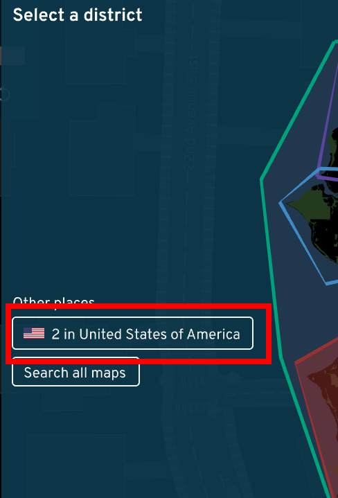
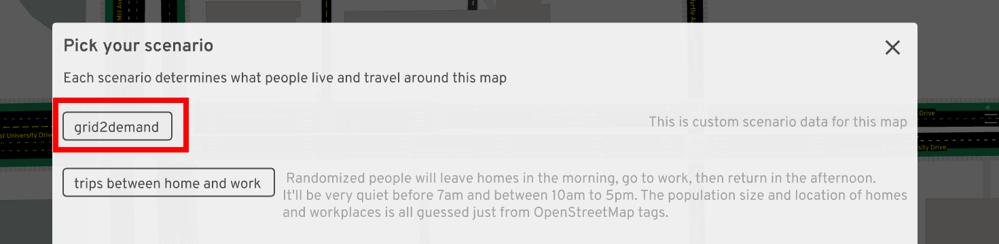
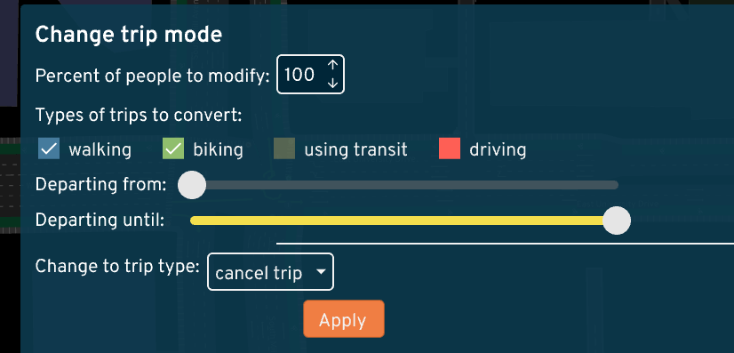

# Instructions for ASU collaborators

These instructions are tailored to the
[ASU Transportation AI Lab](https://github.com/asu-trans-ai-lab/).

The most important tip: ask questions!
[File an issue](https://github.com/dabreegster/abstreet/issues/), email
<dabreegster@gmail.com>, or ask for a Slack invite.

## Installing

A new version is released every Sunday, but you probably don't need to update
every week.

1.  Go to <https://github.com/a-b-street/abstreet/releases> and download the
    latest `.zip` file for Windows, Mac, or Linux.

2.  Unzip the folder and run `play_abstreet.sh` or `play_abstreet.bat`. If you
    get security warnings, see [here](README.md#installing-the-game).

3.  On the main title screen, click `Sandbox`. This starts in Seattle by
    default, so change the map at the top.

4.  Choose USA, then Phoenix.

5.  You'll be prompted to download some files. It should be quick. After it's
    done, click Phoenix again.

You've now opened up the Tempe map!

### A shortcut and improving the simulation in Tempe

On Windows, edit `run_abstreet.bat` and change the last line to:

`game.exe --dev data/system/us/phoenix/maps/tempe.bin --infinite_parking 1> ..\\output.txt 2>&1`

On Mac, edit `run_abstreet.sh` and change the last line to:

`RUST_BACKTRACE=1 ./game --dev data/system/us/phoenix/maps/tempe.bin --infinite_parking 1> ../output.txt 2>&1`

`--dev data/system/us/phoenix/maps/tempe.bin` will skip the title screen and
start on the Tempe map by default; this will save you lots of time.

`--infinite_parking` disables the parking simulation. By default, there's an
unrealistic amount of people walking around Tempe just to reach the spot where
their car is parked. We don't have good data yet about on- and off-street
parking, so it's best to just make driving trips begin and end at buildings or
off the map, without a step to search for parking.

There are a bunch of other
[startup parameters](../dev/index.md#development-tips) you can pass here too.

## Importing a Grid2Demand scenario

When you run <https://github.com/asu-trans-ai-lab/grid2demand>, you get an
`input_agents.csv` file. You can import this into A/B Street as a scenario.

1.  Change the traffic from `none`

2.  Click `import Grid2Demand data`

3.  Choose your `input_agents.csv` file

4.  A new scenario will be imported. Later you can launch this from the same
    menu; the scenario will be called `grid2demand`

Grid2Demand needs a .osm file as input. The extract of Tempe that A/B Street
uses is at
<https://abstreet.s3.us-east-2.amazonaws.com/dev/data/input/us/phoenix/osm/tempe.osm.gz>.
Note the file is compressed.

## Modifying a scenario

You can transform a scenario before simulating it. This example will cancel all
walking and biking trips from the scenario, only leaving driving and public
transit.

1.  After loading a scenario, click `0 modifications to traffic patterns`

2.  Click `Change trip mode`

3.  Select the types of trips that you want to transform, and change them to
    cancel. Click `Apply`.

