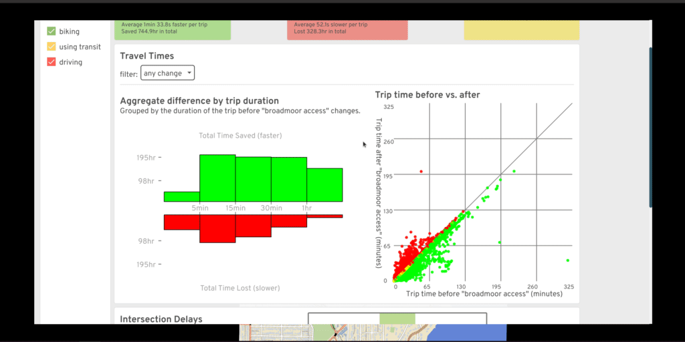

# The A/B Street "Almost" Postmortem

This was written September 2021, originally meant as a project postmortem.
(Spoiler alert: we're still alive and kicking)

<!-- toc -->

## Technical accomplishments & challenges

### The map model

To support a traffic simulation, A/B Street's map model isn't just a graph. It
represents the physical geometry of roads and intersections and includes
land-use semantics, like estimates of residential units and commercial spaces
within each building.

One thing that's surprising to people with a GIS background is how from-scratch
everything is. There's no QGIS, Leaflet, PostGIS, or map tiles. The map is just
a single file with simple data structures and a clipped study area.

#### Render OSM in gory detail

OpenStreetMap represents streets loosely as a graph, with road center-lines and
a pretty free-form key/value tagging system. It was designed for ease of mapping
certain features, not for maintaining data quality, representing roads as
physical space, or describing semantics of movement along the transportation
network.

But A/B Street needed lots of this, and OSM is the most enticing data source
available, so I wrote aggressive heuristics to extract meaning from the formless
chaos. Perfect results are unattainable, but I'm quite proud of how far it's
come and how robust it is to most cities I've imported.

- [transforming road tagging into lanes](https://github.com/dabreegster/abstreet/blob/master/map_model/src/make/initial/lane_specs.rs)
  - The tagging schema described by the OSM wiki is complicated to begin with.
    But real mapping still diverges from this. I wound up fixing many
    discrepencies in Seattle, and made
    [a dedicated tool](../../software/osm_viewer.md) to help other mappers
    validate their work.
  - Because of A/B Street, I've mapped OSM tags that're just proposals or not
    widely used -- like [street parking](../../software/parking_mapper.md) and
    [cycleway:separation](https://wiki.openstreetmap.org/wiki/Talk:Proposed_features/cycleway:separation).
- [Creating geometry from roads and intersections](../../tech/map/geometry/index.md)
  - I believe A/B Street has the most advanced handling of complex OSM
    intersections of anything that's public
- OSM doesn't directly encode what movements are possible through each
  intersection. A/B Street generates this for vehicles and pedestrians with
  aggressive heuristics.
  - OSM turn lane tagging is often flat-out wrong (not matching the lane count)
    or broken when ways are split before an intersection
  - OSM has turn restriction relations that can span multiple road segments.
    This impacts graph pathfinding and traffic simulation in subtle ways.
    <!-- link pathfinding article -->
- OSM includes parking lots and aisles, but A/B Street needs to know capacity,
  which is rarely mapped. So it procedurally generates individual stalls fitting
  the geometry.
- A traffic signal is just a node in OSM -- or worse, a bunch of individual
  nodes for a complex junction. There's no way to describe its timing.
  - A/B Street has reasonable heuristics for grouping movements together in
    stages for many different shapes of intersections. (I never did much work on
    automatically improving the timing, though.)
  - I invented a
    [JSON interchange format](../../tech/dev/formats/traffic_signals.md)
    referencing OSM IDs to describe signal configuration.
  - I worked with Dr. Xuezong Zhou's ASU group to import
    [GMNS signal timing](https://github.com/asu-trans-ai-lab/Vol2Timing) and
    match the movements to A/B Street's representation.
  - The city of Seattle has still yet to release any public data about how
    signals are really timed, so for a while, I was
    [manually mapping them](https://docs.google.com/document/d/1Od_7WvBVYsvpY4etRI0sKmYmZnwXMAXcJxVmm8Iwdcg/edit?usp=sharing)
    with a notebook and stopwatch, and even convinced a few other people to
    join. (Of course this was futile; most interesting intersections depend on
    actuators, which can't be observed directly.)
- Built pathfinding into the map model for vehicles and pedestrians.
  <!-- article -->
  - Funded the creation of a new
    [Rust contraction hierarchy library](https://github.com/easbar/fast_paths)
    to achieve the performance necessary for a traffic simulation
  - Some complex features: responding to map edits (that might reverse roads,
  close things off to some vehicles), handling complex turn restriction
  relations, modeling private neighborhoods and streets with no through-traffic,
  turning left or right out of a driveway, and elevation-aware cost functions
  for vehicles, pedestrians, making unprotected turns, etc
  <!-- Snapping -->

 _Do you have any idea what's on these roads?_

 _A/B Street shows the bus lanes and guesses road
width._

 _An arterial road with light rail crosses a minor
road in OSM_

 _In A/B Street, one consolidated traffic signal
represents this situation_

 _A parking lot in OSM_  _The
same lot in A/B Street -- 1500 spots, based on geometry_

 _Is turning traffic backing up here?_

 _Add some protected left turns!_

#### Joining data sources

A/B Street brings in other public data for some cities, joining it with the
OSM-based map model.

 _Blockface data in Seattle describes street parking
restrictions... in theory. Many segments disagree with OSM's splitting of roads,
and many blocks have incorrect data._

 _LIDAR elevation data overlaid with the bike network
shows why Aurora would be such a nicer route to bike north from downtown than
Fremont_

 _The sad blue sea of single-family parcels, from King
County parcel data_

#### Map editing

It would be so simple if that map model representation was nice and immutable.
But the whole point of A/B Street is to explore changes to the built
environment. Aside from the UIs for this (which themselves went through many
design iterations and usability studies), supporting this in the map model layer
has been tough.

- Representing edits durably, even when a map is rebuilt from updated OSM data.
- Handling undo/redo. When you change the lanes of one road, it might invalidate
  the traffic signal policy nearby.
- When you widen or shrink a road, it affects intersection geometry. Especially
  when that intersection has been consolidated from several in OSM, there are
  some edge cases...
- Applying edits has to be fast -- jokes on loading screens are hard to write!

#### The map importer

At first, I was just importing a few parts of Seattle, so running a little tool
was fine. But as word of the project spread, of course people wanted to see it
in more places. (And in fact, the most solid audience for the project has been
the OSM community -- mappers tend to already be very invested in OSM as a hobby,
so they're willing to get past any clunky UX hurdles in order to play with
something cool!) By now, I'm importing ~130 maps from ~80 cities. Anytime I
update the OSM import code, I've committed to regenerating everything and at
least not totally breaking a city!

I've [only barely managed](https://github.com/a-b-street/abstreet/issues/326) to
stay on top of this growing scale. My faster laptop died for a few months and I
scrambled to parallelize the import process in the cloud just to survive.
Something that I haven't solved is expressing the complex importing process as a
proper pipeline. Ideally it's a DAG of tasks depending on each other, with clear
logging, progress tracking, parallelization, and error handling. One reason this
is hard is expressing which parts of the graph to invalidate and recalculate.
Should we grab new upstream OSM data? Just recalculat scenarios, leaving the
maps alone? Only re-run one stage of the map import?

I'm pretty happy with how easy it is to
[import a new city](../../user/new_city.md). Originally you had to email me a
boundary or compile the project yourself, but now the UI just asks you to draw a
GeoJSON boundary, uses Overpass to grab fresh data, and runs the importer for
you.

### Software engineering

#### Testing

A huge challenge to maintaining maps over time is not breaking things, either
from my own importing code or when grabbing new OSM data upstream. Writing tests
to guarantee some kind of invariants in the map model layer (like no two roads
overlapping each other, no disconnected bits of the graph, minimum road length,
etc...) was something I wanted to do, but all of those are pretty impossible
targets to meet with the messiness of OSM data. So I settled on regression tests
and manual tool-assisted diffing. Screenshot diffing is one trick -- inspect an
imported map once, take screenshots of it, then later compare to manually
validate changes. There are also tests that re-run a full traffic simulation on
maps known to work. They ensure gridlock isn't re-introduced, that overall
travel time patterns don't change radically, etc.

There aren't tons of unit tests. Usually expressing the input and expected
output for any of the interesting problems is just too hard manually. There are
some hybrid solutions, like generating turns at an intersection. The input (a
map's roads) isn't easy to understand by looking at some text encoding, but
viewing in the UI is. Likewise, a human can't glance at output like "left turn
from lane #5 to lane #84" and hope to understand it. But we can store the text
output as goldenfiles and, when there's a diff, again use the UI to inspect the
change.

#### Releases

At my previous job, there was quite a bit of hassle maintaining a production
service without downtime. It was initially very freeing to just write software
quickly without worrying about breaking people, but of couse that didn't last
long after I started releasing public builds every week. The
[release process](../../tech/dev/release.md) is mostly automated.

At first, I just shipped all map and scenario data with the .zip releases and
bundled this in one big .wasm blob (yes, really). Of course this didn't scale as
we increased the number of imported cities. So eventually I made the UI download
each city only when needed. This required
[versioning the data](../../tech/dev/data.md) -- the code in a release from
weeks ago is probably binary incompatible with the current map data.

Originally I just threw all the files in my personal Dropbox, but moved to S3 at
some point (every single public file in Dropbox needs its own URL, and I broke
the Python tool spamming it with requests for hundreds of files...). I really
wanted to just re-use some existing tool to sync with S3 (both for me uploading
and for people downloading), but never found anything that met all my needs --
cross-platform without system dependencies, grouping files into per-city data
packs, gzipping. So I rolled my own
[updater](https://github.com/a-b-street/abstreet/blob/master/updater/src/main.rs).

I'd still love to conceptually use real version control; maybe Git LFS is worth
another try.

### Simulation

#### Discrete event traffic simulation

Read the [full article](../../tech/trafficsim/index.md).

Although there's lots of academic papers out there describing car-following
models and other "microscopic," agent-based traffic models, it's always seemed
to me that they omit details about how to actually implement them. So, I rolled
my own. Not claiming this is a good approach -- simulation results have to be
met with **much** more skepticism -- but I'm very proud of the model.

A/B Street simulates the movement of individual people walking, biking, and
driving. It doesn't do so in fixed time-steps (every 0.1 seconds, update
everything). It uses a "discrete event" approach. Each agent is in a state, like
traveling along a lane or waiting at an intersection, for some amount of time.
Updates only happen when that state possibly transitions to another one, like
when a vehicle reaches the end of a lane or a traffic signal "wakes up" people
on a green light. Instead of updating every agent every 0.1 seconds, we just
"skip ahead" to the next interesting time, per agent.

Actually making this work with on-demand rendering at any moment in time is one
of the more clever things I've come up with. The model is quite fast (until
gridlock happens...) and looks reasonably realistic in aggregate. Things like
smooth acceleration are missing, but few people have seemed to notice. Making
vehicles change lanes and over-take is one of the main limitations -- this is
very hard to squeeze into the discrete event model, and only half-done.

 _Drivers, cyclists, and pedestrians negotiate the traffic
signal at Greenwood and N 87th_

#### Parking

Some traffic simulators out there are only focused on highways, not even
inner-city driving. Many don't include pedestrians and cyclists, or bolt them on
as an after-thought. But I'll bet A/B Street is one of the only ones including a
detail crucial to the experience of driving:
[parking](../../tech/trafficsim/parking.md). How many times have you heard a
friend complain that it took 10 minutes to drive over, but 15 to find parking?
Exactly.

Except in some maps that disable it, every driving trip in A/B Street begins and
ends with somebody walking between their actual endpoint and a parking spot with
their car. There's lots of estimation with the capacity along streets, in
parking lots, and especially with private residences and businesses, but at
least A/B Street tries. Maybe this pushes the rest of the field towards a bit
more realism. Abstractions matter! Parking occupies a huge amount of space, and
when your phone says driving somewhere is 20 minutes faster than taking a bus,
it may not be giving you the full picture -- are you sure you won't circle
around a dense neighborhood for 10 minutes finding that free spot? Abstractions
matter. I hope I've done justice to Donald Shoup.

 _Darker red dots are vehicles
parked farther away from their final destination_

#### Gridlock

In both the real world and in a traffic simulation, vehicles get a bit stuck. In
the real world, this is usually resolved by humans slightly breaking strict
abstractions like usage of distinct lanes, slowly creeping into a partially
blocked intersection, or deciding to detour around a problem last minute. I've
had a hard time capturing that robustness in simulation, so well, in most
simulations on larger maps, vehicles get stuck. Like, permanently.

This has so many causes -- broken intersection geometry causing impossible turn
conflicts, weird lane-changing behavior, vehicles being too cautious about
partially blocking an intersection, pedestrians darting into non-existent
crosswalks, hilariously Byzantine traffic signal timing, travel demand models
sending all 80,000 trips to UW campus to a single tiny building... and so I've
dumped countless hours into trying to fix them, with only very modest success.
Sometimes it's trying to fix the data, or improve signal timing heuristics.
Sometimes it's building in complex cycle detectors into the simulation to figure
out when vehicles in a roundabout are all waiting for each other. Sometimes it
works. Usually it doesn't.

 _Traffic Seitan spreads from one broken Fremont bridge_

#### Travel demand models

You can't run a traffic simulation if you don't know where people are going,
when they're leaving, or how they're trying to get there. The naive approach of
uniformly distributing some number of trips between all possible buildings is
hilariously unrealistic. And the amount of complex modeling and
[specialized knowledge](https://www.psrc.org/sites/default/files/soundcastdesign2014.pdf)
needed to properly do activity modeling or something simpler is overwhelming.
I've tried as much as possible to punt on this -- importing Soundcast data for
Seattle, relying on collaborators like
[grid2demand](https://github.com/asu-trans-ai-lab/grid2demand) and
[abstr](https://a-b-street.github.io/abstr).

But inevitably, A/B Street has wound up with its own simple travel demand
models. Mateusz started the
[proletariat robot model](https://github.com/a-b-street/abstreet/issues/154),
using naught but OSM tags on buildings to estimate the number of people living
and working, and using simple matching to send people to and from work, and
nothing else. Such robots.

Then during the [Actdev](https://actdev.cyipt.bike/) work, it became necessary
last-minute to generate traffic using UK census flow data, which describes the
number of people commuting between different polygonal areas for work, broken
down by mode. The
[pipeline](https://github.com/a-b-street/abstreet/blob/master/popdat/src/od.rs)
is simple.

We've also done a fair bit of work into data visualization to understand the
outut of these travel demand models. Part of this even includes heuristics that
automatically group buildings into "neighborhoods" -- roughly, tracing along
arterial roads and finding everything in the middle.

 _Where do trips starting from Broadview go, according
to Soundcast data?_

### UI

#### widgetry: a UI + dataviz library from scratch

This is probably one of the more ridiculous things that's happened.

In ~2018 when I started, all of the rendering and GUI libraries for Rust
appeared to not do what I needed. So I started with
[raw window event handling](https://github.com/rust-windowing/winit) and OpenGL
and... just went for it. It's not hard to start drawing a big
[slippy map](https://wiki.openstreetmap.org/wiki/Slippy_Map) with zooming and
panning, nor is it tough to wire up a basic clickable button. But...
[widgetry](../../tech/dev/ui.md) has turned into something quite feature-full
and has a decent API.

The journey there was quite circuitous. Most of the difficulty was not even
knowing how the UI should work (or even having a clear picture of what the app
was supposed to do...). But once Yuwen joined the project, this library started
shaping up very quickly. And Michael has dumped in countless work into adding
complex features to it, polishing the APIs and style, implementing massive
design changes from Yuwen like the buttons...

The end result is pretty impressive -- it works on native and web (no system
dependencies), everything's an infinitely scalable vector (including text), and
it has loads of interactive dataviz widgets.

 _A quick preview of interactive line plots, draggable
cards, and a canvas filled with vector goodies_

#### Native and web

I never intended to target mobile or the web. But in January 2020ish, winit
support for web landed, so I thought... why not? Initial support was
surprisingly easy, but properly dealing with asynchronous file loading, loading
screens, progress bars, and detangling native-only dependencies has been quite
tough.

## Design accomplishments and challenges

I think it's safe to say my own design skills are somewhat lacking:

 _A/B Street as of September 2019_

A/B Street has lots of complex information to convey and data to visualize, and
getting people excited about a vision for a more sustainable transportation
system requires beautiful design. So... it's quite awesome that
[Yuwen](https://www.yuwen-li.com/work/abstreet) joined the project at the right
time. Thanks to [Michael](https://github.com/michaelkirk) and feedback from
dozens of people from OpenStreetMap, Github, Twitter, and user testing studies,
A/B Street today is quite aesthetic and functional.

### Color schemes

One of the puzzles I struggled with from the very start was how to communicate
both lane types and road types at the same time. Unzoomed, a simple color scheme
distinguishes highways from major and minor roads:

 _I5 is distinguishable from arterial and residential
roads in Seattle, and the Burke Gilman trail is also visible._

But zoom in, and we use coloring to distinguish regular lanes, parking, and
sidewalks. It's still useful to distinguish major and minor roads, though! Most
maps cheat with road width and use that, but there are many cases where
arterials are just as wide as residential streets.

 _Can you spot the arterial?_

But inspired by designs from
[Streetcomplete by Tobias](https://github.com/westnordost), we found some shades
of grey that convey the difference quite effectively, as well as slightly convey
the curb height:

 _There it is!_

Also, we have a pretty fantastic night mode, although I'm still holding out for
something more cyberpunk.

 _Both the UI and map have colors to show when the
simulation is after-hours_

### Road editor

A/B Street's ability to edit roads started simple, but today is quite powerful.
Inspired by [Streetmix](http://streetmix.net), you can modify lanes however you
want:

 _Drag-and-drop, spear-headed by Michael, is key to this UI
working smoothly._

We arrived at this design only after many rounds of designing, implementing
prototypes, and gathering feedback.

### Traffic signal editor

Most people experience traffic signals from the ground, not the sky -- they
think about just the direction they want to go, not how the entire intersection
behaves over time. At any point in time, a particular movement could be
protected by a green arrow or light, permitted after yielding to oncoming
traffic, or not allowed. After many iterations, I think we represent and allow
changes to this quite well:

 _Left turns should be protected here. So first we remove
the left turns from stage 1, where they were just permitted. Then we add a new
stage, protect the left turns, and adjust its timing to end early if there's no
traffic._

### Data visualization

A/B Street measures all sorts of things -- travel times, delays, throughput, a
biking route's steepness, exposure to risky events. All of these things can be
understood at the level of individual agents, roads, and intersections, or you
can explore aggregate patterns and finder larger trends. You can view the data
in absolute terms based on the current simulation running, or if you've edited
the map (and the map is one of the lucky few that doesn't gridlock), then you
can compare the results to the baseline simulation without edits -- the essence
of A/B testing.

Here's a very incomplete sampling of our work:

 _Diving into one person's route_

 _Watching a live scatter plot of delays through an
intersection, broken down by mode_

 _The red roads have higher foot traffic, due to
converting Broadmoor to a Stay Healthy Street_

 _Using a sortable table of all trips to find individual
people whose journey got much faster due to map edits_

 _Understanding how short and long trips got faster or
slower due to map edits_

### Road labels

Placing road labels on a map is quite a design and implementation challenge, but
Michael and I cranked out something decent in a few days:

 _Labels aren't too densely clustered, but they still appear
to help orient by major roads._

### Charm

Some design decisions in A/B Street are a love story to the city that started
it:

 _The cycletrack may not be snapped to Broadway
properly, but we do have the rainbow crosswalks on Pike_

We tried to create a narrative around the game's challenge modes, with character
art from a [college friend](https://hollarity.com/):

 _The Boss doles out assignments and placates irate
citizens_

One of the first things people point out about A/B Street is the unusually bendy
buses:

 _"This frustrated tension and brief relief I can’t
articulate / oh, but the bus can." - from
[public transit](https://dabreegster.github.io/poetry/adult/public_transit.html)_

For the record, this started because the simpler alternative is much worse. If
you draw a long bus as a straight line and use any one point to determine the
angle, the bus will pendulum around tight curves, happily smashing into anything
in the way. Snakes are a slightly better approximation of reality. (I think the
bendy buses have been called some less polite, but more hilarious, things
too...)

## Project management

Here's the section where I feel like the challenges have swallowed me, with very
little success.

### Collaborations

I was pretty quiet the first year, but then I started actively looking for
people interested in working on this. I've lost track of all the people I've
spent at least an hour talking to and seriously trying to set up some sort of
collaboration -- at least 100? I've tried everything I can to attract
[contributors](../contributing.md) for programming, design, business, outreach,
writing. Many start, but wind up vanishing. It's exhausting for me; I get
emotionally invested in everybody who wants something from A/B Street. Running
an open source project is really hard. **But I want to emphasize it has partly
worked -- I'm super thankful for the ~dozen people who have stuck around and
really made working on this project a true pleasure.** I probably need to learn
to filter better, fail-fast, and put some barriers up before I invest.

There were a few low moments that stand out. Accidentally CC'd on an internal
email literally stood the question, "It's open souce, why pay him anything?"
when I was trying to set up a small consulting deal. There was also a group that
was too cheap to hire somebody for their own idea, so exploited the fact that
this is a passion project for me and for a while, somewhat successfully coerced
me to work on their quasi-startup. There were also some highlights, especially
when butting heads philosophically. Not everybody understood my
[mission](../motivations.md) before reaching out. I'll never forget one video
call with a company that was going splendidly, until I explicitly stated all
work I do will be open source -- watching the other person scramble to control
their plummeting facial expression was perfect. And once I got the most Silicon
Valley-ish email ever that started, "I'm the founder of a XYZ billion dollar AV
startup." After thinking a moment, I led back with, "Well I think your XYZ
billion dollar startup is a reasonable stepping towards car-free cities, but AVs
aren't part of the world that I ultimately want to build towards."

These moments still bring me strength.

#### The success stories

I want to particularly thank Robin for his involvement with A/B Street. He
fought to make it a part of [ActDev](https://actdev.cyipt.bike), a really neat
data science tool studying how people living in new residential sites in the UK
are likely to commute. This integration provided a strong push to solidify the
web deployment of A/B Street.

 _You can explore mode split patterns and other data in
the ActDev site_

 _and then just click to simulate the site at an
agent-based level, and edit the cycle network_

Robin has also massively helped evangelize the project and network with possible
users. Along with Nathanael, they've made A/B Street more accessible to the data
science community, creating an [R package](https://a-b-street.github.io/abstr/)
to transform travel demand models into individual trips to simulate. Robin's
enthusiasm for open source and reproducible research is infectious.

### Project scope

Traffic simulation is such a massively broad endeavor, and because I dabble in
so many parts of it, people really brought strong expectations about what they
wanted it to be. What about Monte Carlo simulations? Or gondolas? (No, really.)
Why not build a city from scratch, just merge with Citybound? Oh, there's no
lane-changing? Not calibrated to real traffic volume data? Well then it must be
useless.

I tried my best to balance all of that input with establishing boundaries and
pursuing MY vision.

... But what exactly was my vision? I said early on, "this is an identity crisis
between a game and a serious planning tool." At first that was a way to punt on
the realism and calibration problem -- I couldn't hope to alone compete with
industry standard simulation software. It was also a way to engage the general
public, or at least the percentage that plays games.

### Teasing apart the monolith

The scope of A/B Street is **way** too broad. Early on, all of the new
experiments were just crowded onto the title screen, but at some point, we split
out more tools with more focused purposes.

The "main" app is A/B Street -- that thing that lets you simulate traffic and
edit roads. Part of it still tries to act like a computer game, but we haven't
put much effort into this in quite a while. It does have a tutorial and a few
challenge modes with particular objectives (and even a narrative with some
characters!). But I wouldn't call A/B Street as a game "fun" -- one of the
challenge modes is impossible to win, because we picked too large a map to ever
hope to get past the gridlock bugs. We could chop up the challenges into much
smaller "levels" and properly tune the difficulty curve, but it would honestly
take somebody dedicated to game design to spearhead that.

 _The user interface can be overwhelming, but the tutorial
slowly introduces and motivates different features. The more ambitious idea was
always to have the player slowly "unlock" more of the tools as they complete
challenges._

Instead, most uses of A/B Street are in the "sandbox" mode, where no specific
objectives exist. Instead, this is a place to edit the map, explore all the
different data visualizations, and try to inch towards completing a full
simulation without gridlock.

I feel bad that A/B Street as a properly fun game was never realized, but I'm
proud of [15-minute Santa](../../software/santa.md). By no means is Santa
attempting to split the difference between serious planning and entertainment;
it's just a silly arcade game that loosely involves transportation and land use.

 _Paperboy modernized with OpenStreetMap, a Santa sprite, and
plenty of silliness_

We also made a tool to explore
[15-minute neighborhoods](../../software/fifteen_min.md). The isochrones are
hopefully useful to understand what parts of a city have good or bad access to
different types of shops, and how hills and slow traffic signals affect walk or
bike-sheds. Editing the map -- particularly to modify land use -- and checking
out the differential isochrone would be the ultimate use for this tool, should
we ever revive it.

As I realized the most active audience for A/B Street is the OpenStreetMap
community, I spun out some tools to
[validate lane tagging](../../software/osm_viewer.md) and
[tag street parking](../../software/parking_mapper.md).

After some feedback from advocacy groups and people who felt overwhelmed by the
broad scope of A/B Street, we created a
[simple interface for sketching and evaluating a bike network](../../software/ungap_the_map/index.md).

And now we're spinning up a dedicated tool for
[low traffic neighborhoods](../../software/ltn/index.md).

### Marketing

The successful marketing basically came for free. A single bold post to
[r/seattle](https://old.reddit.com/r/Seattle/comments/hdtucd/ab_street_think_you_can_fix_seattles_traffic/)
was magic. Someone "leaked" the project to
[Hacker News](https://news.ycombinator.com/item?id=23605048). I think the
[alpha launch trailer](https://www.youtube.com/watch?v=LxPD4n_1-LU) got the
point across.
[The Stranger](https://www.thestranger.com/slog/2020/06/29/43999454/ab-streets-game-lets-you-create-the-seattle-street-grid-of-your-dreams)
made a shocking connection between my childhood with Banjo Kazooie and my
current fascination with multi-modal travel.

But I've also hustled near-constantly online and in-person, at countless
hackathons and [conferences](../presentations.md). I've cold-emailed so many
companies trying to set up collaborations.

### Community

The A/B Street Slack has a sense of home to me; it might've started for work,
but I've forged friendships there.

I think I did a reasonable job amassing a small army of people interested in
open source transportation software. Some of the academic and data science
communities weren't talking to each other before I got people into the same
(virtual) room.

### Money

I self-funded from savings from my previous big tech job. I feel super fortunate
to have had zero pressure to make money with A/B Street, letting me prioritize
what really matters to me. I've even personally funded a few people to create
[new open source libraries](../funding.md) that I needed.

But not starting a business, even some kind of consulting firm, was likely a
mistake. Many of the groups I tried to collaborate with probably had no idea how
to deal with me. There's no legal entity for the project, I'm not in academia,
I'm not even calling it a startup.

# The problem

That thing I've poured 3+ years of my life into? Nobody's using it.

(Except maybe a few members of the OSM community, in a way I mostly don't hear
about.)

## Advocacy groups

For a long time, I've insisted that either advocacy groups who fight for
biking/walking-friendly changes in cities or individual Twitter urbanists with
large followings would find some use for A/B Street. Maybe the traffic
simulation stuff is overwhelming and not trustworthy, fine. But at least the
top-down road visualization and editing is better at communicating an idea than
some squiggly lines on top of Google Maps? Surely groups pushing for a better
bike network want to see how elevation and collision data relate to their ideas?

And the more I understand about how advocacy groups (at least in Seattle) work,
the less I have faith in them to avert the climate crisis. I seriously respect
their longevity and determination, but fighting for years to get only the
slightest improvement isn't a time-scale I believe in. Cities need a massive
culture shift. I want to find and work with the people who have some sense of
urgency, even if that's not realistic.

## The public

The thesis behind A/B Street is that ordinary citizens are experts in some small
slice of the city that they interact with. And so when they see a problem, A/B
Street is a tool for them to explore and express ideas for changing it. But I'm
beginning to believe I'm wrong about this -- because, where are they? If
somebody's only casually interested, they're not going to dedicate their time to
fighting for a real change. And if somebody really does care enough, they'll...
possibly wind up working for a city government, where they actually have power
to change things (and slowly have their spirit crushed by bureaucracy).

I had many goals with A/B Street that are about sparking culture shifts:

1. Pushing people towards sustainable car-free cities
2. Getting more ordinary citizens involved, in a productive way
3. Getting different parties -- government, citizen, advocacy group -- on the
   same level, communicating in a standard way
4. Promoting open data and open source software for use in government planning
   -- why trust the traffic analysis that you can't read and reproduce yourself?

I don't feel I've budged the needle on any of these.

## Who's our audience?

I've tried to avoid actually advocating myself for specific changes in Seattle.
Partly this is because there are well-established groups here that do this
already, and I want to spend my energy doing what I enjoy more -- creating
software to empower them. Partly I'm afraid of promoting ideas that're tied to
my own biases and wouldn't serve everyone in Seattle well -- I have a
conspicuous gap of knowledge about biking in South Seattle, a place with much
more traffic violence and much less cycling-friendly infrastructure. And partly,
I'm just lazy and avoiding writing -- I can do it, but it's so draining --
writing this document was quite difficult for me. As a team, we have published
[one simple advocacy piece](../../proposals/broadmoor.md) -- written by Michael
-- more to experiment with the format than to push for a real change (although
the idea would be fantastic, asking to open up private roads is a non-starter).

I don't have a good understanding of politics or how to actually help advance
real changes on the ground. But since we've failed to find users for A/B Street
that're advancing some cause, then... there is one last thing we could try. Will
I rip off such an adhesive bandage before it's too late?

## What this project means to me

I try to inject my humor into A/B Street wherever I can. When I skim through the
[release names](https://github.com/a-b-street/abstreet/releases), I remember the
story of my life that week, or something bizarre I cooked/ate/"foraged" --
ajitummy, twice-dumpstered anything, beef welldoneington, tostonical vows, the
rise of Fridgehaus, rubducks in the laptub, taro bingsoothsayer, Hausbroken.

After weeks of sweating over what the 15-minute neighborhood tool is supposed to
do and just one stout, I exploded out of my room and drunkenly pitched
[15 minute Santa](../../software/santa.md) to my bewildered housemates. Then
Michael and Yuwen and I made it (thank you for putting up with me).

A/B Street is my self-expression. Its origins are tangled in a mess of
bittersweet memory (I wasn't the one who thought a game should be about traffic)
and near-misses with trucks passing too closely on Boyer. I used it to pull out
of a nose-dive of depression -- that's a story I'm still trying to write. I
broke my fear and landed some of the largest jumps of my life (I do
[parkour](http://dcarlino.org/parkour)) as an escape from constantly thinking
about A/B Street. I've worked on this project for the entirety of COVID. I've
coded while taking the shinkansen from Tokyo to Miyazaki and the TGV from Paris
to Berlin. I pushed code the morning of my ACL surgery, and reviewed a PR when I
got home (and was remarkably lucid). It's safe to call me obsessed. I quit my
job to do this. I've worked on it basically every weekday and weekend for 3
years, and thought about it constantly for at least 6 months before starting the
project full-time.

A/B Street lets me take a bird's eye view of the messy world I move through,
imagine it a bit differently, and try to convince others to see it the same way.

If anybody wants to convince me to do something else instead, now you know what
you're up against. And if you succeed, you know how important your idea must be
to me instead.

# Epilogue

(November 2021, a few months after this article was first written.)

After a rocky few months, I've decided to continue this "passion project," but
with some changes and a much more clear understanding of what I want out of it.
Stay tuned.
