# Vision and validate -- a reflection on 2022 and a lookahead

I wrote such a dramatic [almost postmortem](../retrospective/index.md) last
year; this one doesn't live up at all! I blew past 5000 words, sorry. Please
just skip around to sections or look at pictures.

For context to the unfamiliar reader, I joined the
[Alan Turing Institute](https://www.turing.ac.uk) a year ago, so I'll often
refer to "Turing projects."

<!-- toc -->

## A reflection on 2022

### What I worked on

Let's start with the easy stuff.

People often ask me, "do you still spend most of your time working on A/B
Street?" That was already hard to answer last year, with the original vision of
a traffic simulator getting stretched into "side projects." The line has only
been gettier fuzzier, with some pieces being split into standalone projects. I
consider most things I do to be under the A/B Street umbrella, but it sure is a
wide one.

#### The low-traffic neighbourhood tool

I started this tool right before the move to London, and in some sense, it took
until October to feel properly useful. That seems like a long time for such a
technically simple tool, but I also haven't focused on it constantly.

The [LTN tool](../../../software/ltn/index.md) is tremendously important to me
because it's what I consider the first big success of A/B Street in the real
world. I wrote last year about how frustrating it's been to work hard on other
parts of the project, but never see them get used. I really can't overstate how
happy I am about working with Bristol City Council to use the LTN tool in their
public consultation. I had the immense pleasure of attending a few of their
workshops in person and meeting residents who had used the tool on their own and
who tried it out for the first time there. I heard great feedback, and watched
some people get totally sucked into it. This is what I've been trying to achieve
for four years. It took
[so many pivots](https://www.youtube.com/watch?v=4Tg3Fc2J3MI&t=1356s) to carve
out this niche, but it's been so worth it.

Lots of feedback about the LTN tool has been quite skeptical. Some groups are
afraid the public will misinterpret the tool as over-promising an easy solution.
Their concerns are often about how an LTN will affect the wider area. Very
importantly, the LTN tool does **not** try to say anything about that. (The
"predict impact" mode is hidden behind a screenful of warnings!) I think this
comes down to a bit of a philosophical difference -- I'm not trying to
outcompete the existing traffic modeling world with all of its calibration,
rigor, and complexity. I'm trying to inspire people, start conversations about
what's possible, and help them make more informed decisions. Demanding
perfection and rigorous modeling for everything is a delay tactic. We don't have
time to incrementally decarbonize transportation, improve air quality, or make
streets safer. Rapid prototyping is A/B Street's niche.

So much of the development time for the LTN tool has been attempts at design.
There were many rounds of feedback from about a dozen groups using the tool. I
still feel very slow without a UX designer's help, so it's awesome that I got
help from my colleague Fernando on cartography and from Madison on many parts of
the tool's UI. Things have really changed over a year:

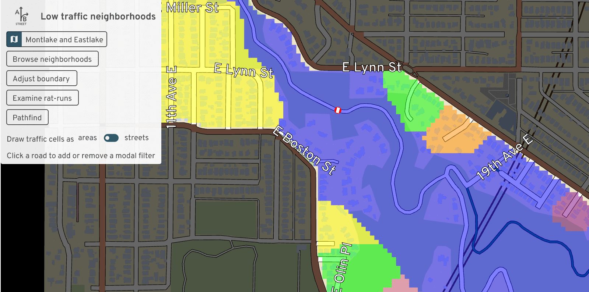 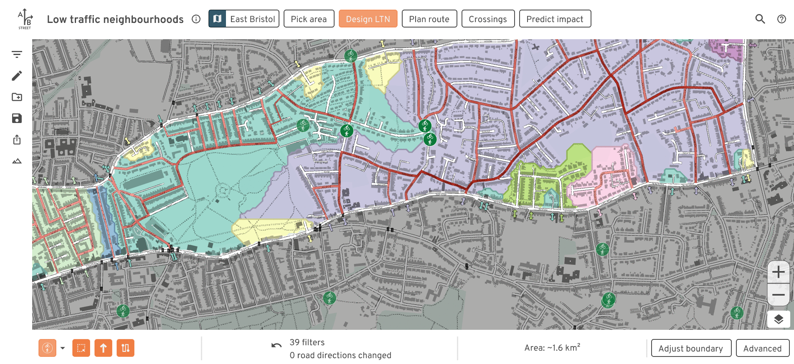

#### Calibrating travel demand models

One of my Turing projects has been to use real traffic count data to calibrate
travel demand models to current conditions. This took me far out of my comfort
zone; I avoid calibration because it involves a level of statistics that I'm
neither comfortable in nor really interested in learning. I'm surrounded by
people who're experts in this stuff; I'm happy specializing in adjacent
problems.

This project didn't feel like a success to me. As expected, the existing demand
model produced from ancient 2011 census data -- and that only covers a fraction
of all trips by purpose -- doesn't match up at all with real counts from 2021
and 2022. I'm no closer to knowing what parameters to adjust to try to make
things match up.

But many people keep asking for something like this, so I think 2023 will
finally have to be the year to give it proper attention.

#### Pedestrian simulation

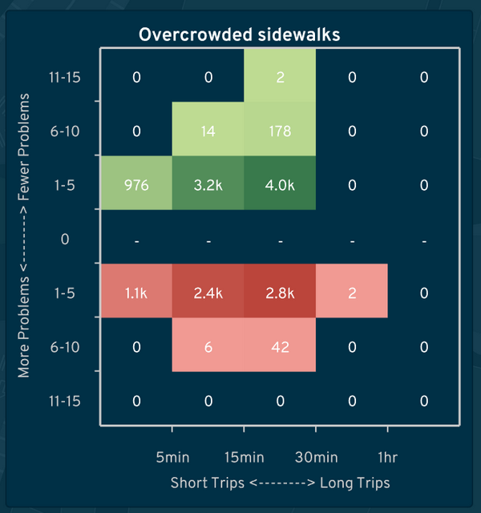

I also worked on a project to study
[overcrowded sidewalks in Brazil](https://docs.google.com/document/d/17fO0HZ1fen0qHFjpEjQ9BuIZv1xXMjUL9RV2YQVKmRY/edit?usp=sharing).
The A/B Street model is fairly coarse-grained: check how many pedestrians are on
a sidewalk at the same time, and compare the count to the total area of that
sidewalk. When some density is exceeded, slow down the speed of people crossing
the sidewalk, and record an event about overcrowding. Then someone can use A/B
Street's lane editor to mimic a real proposal to widen sidewalks, repeat a
simulation, and compare the frequency of overcrowding.

This was much more complicated than I expected, due to two problems. First,
[spurious diffs](https://github.com/a-b-street/abstreet/issues/868), where a
tiny change to the map causes huge cascading effects. Second is unrealistic
behavior of
[when people will cross a street](https://github.com/a-b-street/abstreet/issues/517).
Lots more work is needed both in the traffic simulation and map importing to
handle marked and unmarked crosswalks realistically.

#### osm2lanes

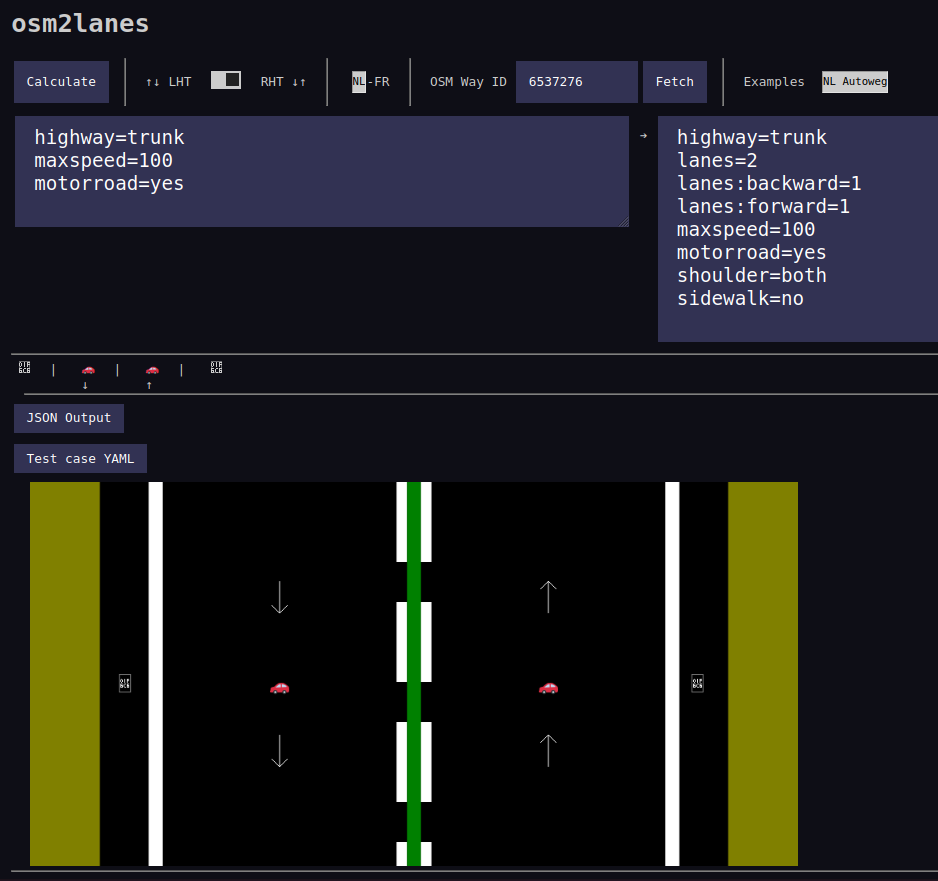

Early in the year, I got sufficient interest from a few other OpenStreetMap
people to split out one "simple" piece of A/B Street code -- the bit that looks
at one OSM road object and
[figures out what the lanes are](https://github.com/a-b-street/osm2lanes). At
first we tried to keep parallel implementations going in Rust, Python, and
Kotlin, with shared unit tests. But interest in Python and Kotlin faded away,
and we could generate bindings for other languages anyway.

Michael Drooglever drove this project forward for a few months, but
unfortunately it's at a bit of a stand-still right now. The new implementation
introduces some excellent ideas, like splitting the problem into two stages.
First parse messy OSM tags into a higher level structure describing something,
like the presence of bus lanes on each side of a road (from **three** different
OSM schemas, which're often tagged simultaneously and in contradictory ways!).
And then update an overall list of lanes based on that summary. But the new
implementation also brings much more complexity and difficulty implementing new
features, and produces very different results in many cases.

So for the moment, osm2lanes is in limbo. The original lane parsing code,
slightly cleaned up, is still the production version.

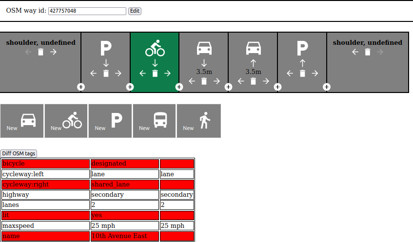

One experiment we started here was a simple Javascript editor to visually
describe the lanes along one road, based on the universal Streetmix-style
cross-section view. To make this work, we'll eventually need to implement
"lanes2osm" -- overwriting or modifying the tags already on a road.

#### osm2streets

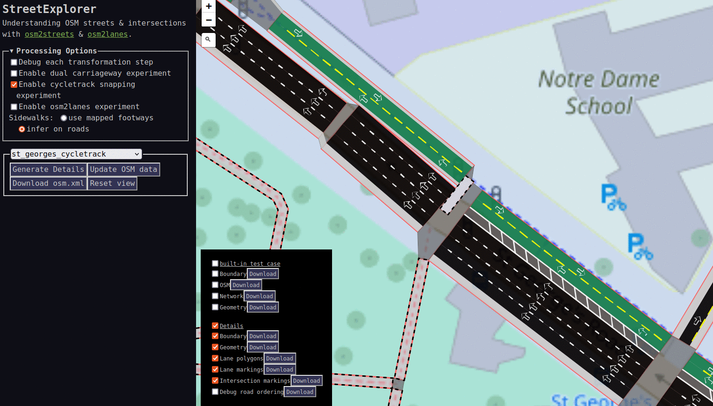

[osm2streets](https://github.com/a-b-street/osm2streets) feels like the huge
technical accomplishment this year -- not one breakthrough, but a bunch of small
ones adding up. It's been awesome working with Ben Ritter, who brings fresh
perspective and experience with the JOSM lanes plugin. Just in the last few
weeks, we've totally rewritten the intersection geometry, road trimming, and
boundary clipping code, easily some of the most complex things I've ever worked
on.

Why has the OSM importing code been split out from A/B Street? At first I was
nervous about the maintenance overhead and still validating changes all the way
in A/B Street. But we created StreetExplorer, a Leaflet-based UI to import data
from Overpass and rapidly iterate on test areas we've clipped out. It's so much
faster to work with better tests and a faster compile cycle. Another advantage
is to be free from old assumptions in A/B Street -- namely that the traffic
simulation is the highest priority. And most importantly, a more focused
codebase lets more people get involved, like Jake and the new
[vector tileserver integration](https://github.com/jakecoppinger/osm2streets-vector-tileserver).

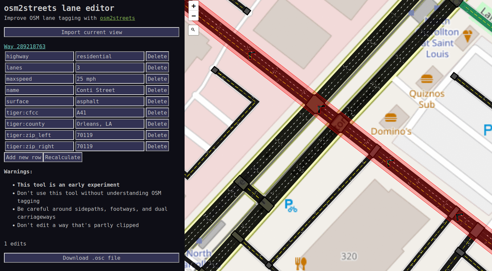

Another "breakthrough" happened in just one day. The visual lane editor in
osm2lanes has a number of unsolved design problems -- how do you see the lanes
in context on a map, even just to understand forwards and backwards? It turns
out the osm2streets web UI is already pretty much usable as a tag editor. You
still have to understand the tagging schema, but now at least you can
immediately visualize the results of a potential edit.

#### SPC and ASPICS

I swear I haven't just been working on A/B Street-related things all year! My
first project at Turing was to help a project originally called
[RAMP](https://github.com/Urban-Analytics/RAMP-UA/tree/Ecotwins-withCommuting).
RAMP combines a bunch of UK-specific census and survey datasets to build a
detailed synthetic population for England. Each "person" has income and an
employment sector, pre-existing health conditions, and a daily schedule of
activities. Using a model called QUANT, the people visit different venues every
day, spending some amount of time in a particular building. From time spent in
shared spaces, a COVID transmission model predicts the spread.

(This was awfully nostalgic to see -- well over a year prior, Orestis added a
[pandemic simulation](https://github.com/a-b-street/abstreet/pull/46) on top of
A/B Street, based on people spending time in the same building!)

Since I joined Turing in late December 2021, the team wasn't around, and all I
had was the RAMP codebase and some complaints about runtime performance. It was
treachurously difficult code to decipher -- many acronyms undefined,
inconsistent terminology, made liberal use of numpy with
[intense index manipulation](https://github.com/Urban-Analytics/RAMP-UA/blob/Ecotwins-withCommuting/coding/initialise/population_initialisation.py),
had several people rotate in and out of the project previously, and was itself a
port of an earlier attempt in R. I poked at a few glaring issues, and, without
further direction from vacationing colleagues, decided to understand it in depth
the way I do best: by
[rewriting it](https://github.com/alan-turing-institute/uatk-spc).

... Of course I chose Rust. It was a fairly quick job -- unburdened by the
meetings that would start in the new year, about a week to port the data prep
stage. Seeing how normal it was to work with dataframes with 100 untyped
columns, I made careful use of Rust's type system, demonstrating the strengths
of things like type-safe IDs for people and venues. Absolutely no index mangling
left!

We've wound up using this Rust port, and calling it the Synthetic Population
Catalyst -- the idea is that it can be generally useful to other projects that
need detailed synthetic population data. It's been successful in speeding up and
solidifying the first half of the COVID project. But the real experiment I tried
was to teach my colleagues some Rust, sell them on the idea of using types to
clean up messy data once and work with stronger assumptions elsewhere. I've
failed on that front; it's too big a leap from Python and R to be worth
learning.

So something I still want to experiment with is a way to get the best of both
worlds, and do something like embed an interactive Python shell in the middle of
a Rust pipeline, letting someone poke around with some half-assembled but
type-safe structures with a familiar REPL.

#### A foray into public transit

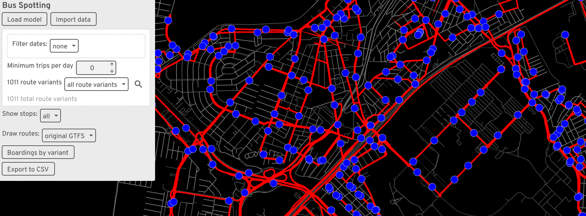

I've avoided focusing on buses and public transit in A/B Street for a few years
now, always trying to
[lure someone else into it](https://github.com/dabreegster/abstreet/issues/372).
The reasons are simple: it's an absolute minefield of new complexity, RAPTOR
pathfinding algorithms, new messy GTFS datasets to deal with, and a host of new
UX/design challenges. It's not a small side-quest, and it's something that
commercial software probably handles pretty well (if you can afford a Remix
license).

But I got caught up in a particularly convoluted Turing project, and the
end-result was spending 2 months on a project called
[Bus Spotting](https://github.com/dabreegster/bus_spotting) (for lack of a
better name). The project had two aims. First was to just interactivly explore
GTFS data in certain ways. Drawing route shapes is misleading. What's the
service look like on Saturday evenings? What if you only want to see routes with
some minimum hourly or daily frequency? And exactly what stops do the five
identically named variations of "Route 123" visit?

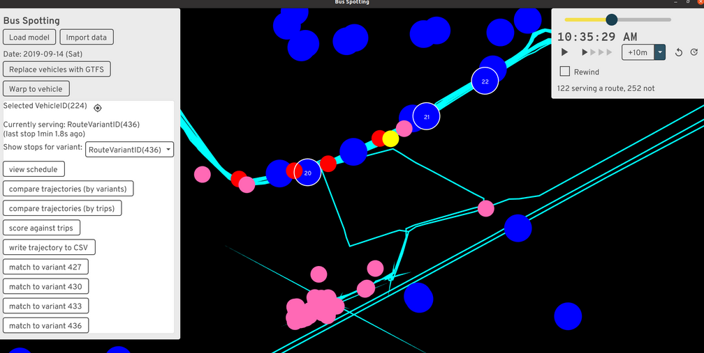

The second goal was much harder -- given real bus GPS traces and data from
people tapping onto a bus, derive a bunch of useful dashboards to help bus
operators. This sent me down the absolute rabbit-hole of matching up bus
trajectories with GTFS routes. The trajectory data only hints at some possible
GTFS route IDs the bus could be serving at the time; how to resolve them to
specific GTFS trips (scheduled runs of a route variant)? The answer I came up
with requires looking for when the trajectory passes close to the stops along a
candidate route, then trying to stitch together stop times in a reasonable
sequence. The result somewhat works, but in practice, some scheduled trips are
skipped entirely, extremely delayed, or buses silently skip stops in the middle
or end of a route.

I implemented the project on top of widgetry, the from-scratch UI library A/B
Street uses. This was frustrating; it wasn't designed to do things like this, I
dumped time into (unsuccessfully) making huge scrollable tables work properly,
and the compile times were painful. Something with an interactive REPL would've
been much easier to use. But while I worked on it (before summer 2022), I didn't
know how to do anything on the web.

#### Technical reflections

I put off trying web dev for way too long. Part of the fear was all the
frameworks and build tools -- there's no consensus what to use, everything is a
[little broken](https://github.com/nshen/vite-plugin-wasm-pack/issues/20), and
Googling anything turns into an afternoon of deciphering outdated StackOverflow
answers.

But thanks to Ben walking me through the basics of vanilla Javascript in
osm2streets, I've become comfortable enough to crank out a few simple web
projects. I feel I've gotten my head around JS -- the DOM and being able to
disorganizedly stick state anywhere felt very odd coming from a solid few years
of Rust and Scala and "owning" the full-stack down to the event loop. CSS
continues to mostly elude me; I'm clumsily stitching together examples I've seen
before. I've just now started playing with Svelte and using pre-made component
libraries, so maybe I'll never have to really figure out CSS!

Growing my toolbox like this lets me pick the right tool for the right job, and
to make tools that more people are likely to use widely. As some of the sections
below show, I think the way forward is to write complicated bits of backend
logic in Rust, compile to WASM, and expose bindings to various places,
especially JS and the web, where frontend logic is particularly fast to crank
out.

#### ATIP and route snapping

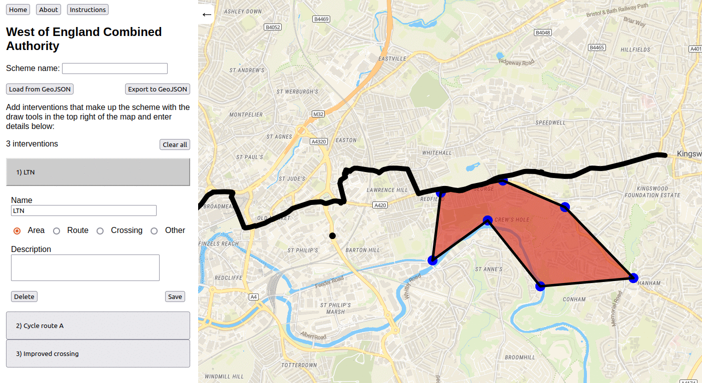

The [Active Travel Intervention Platform](https://github.com/acteng/atip),
co-produced with Robin, is my biggest web project so far. It's a very simple
tool for data entry about new walking and cycling infrastructure. You can sketch
a polygon and say there'll be some kind of LTN here, draw a crossing as a point
or line, and so on. It's mostly just MapLibre with a drawing plugin and some
convenience around auto-saving to local storage. ATIP will gradually introduce
detail -- first get someone to sketch an intervention in 30 seconds, no effort.
Then get more specific, possibly leveraging existing tools -- load that area
polygon into the LTN tool and get specific. Or chop up a route and show specific
changes to lanes / existing road-space, or where raised pavement will go for
side roads.

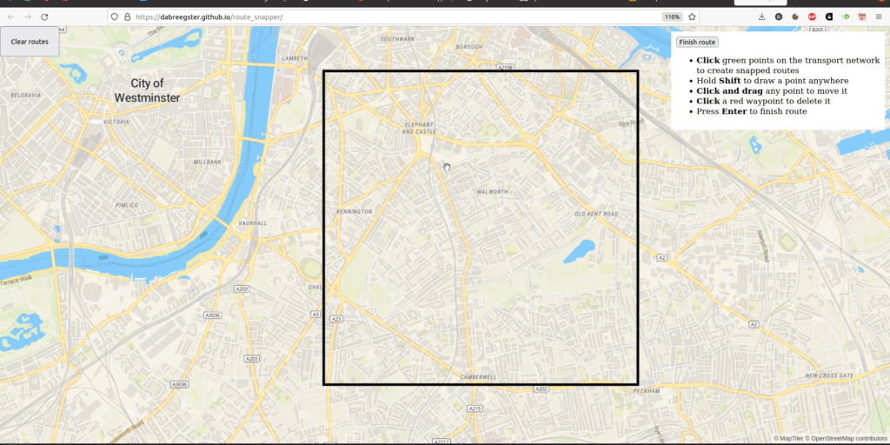

The really fun new piece is
[route snapping](https://github.com/dabreegster/route_snapper/). Drawing lines
manually to trace along existing roads is tedious. I made a simple tool to do
this in [Ungap the Map](../../../software/ungap_the_map/index.md) last year, so
at a hackathon one afternoon in Leeds, I split it out into its own simple Rust
library and glued it up to MapLibre. (It's had considerable polish after that
afternoon!) It's conceptually very simple, but I've not seen anything similar
before. All other route drawing tools, like in Felt, work by repeatedly querying
a server to calculate routes. If your connection is slow, it's a choppy
experience. My plugin folows the A/B Street "everything is a file" approach and
just loads once, then runs locally. Of course the study area is fixed, but... I
have some ideas about that.

In late November, I joined a one-day hackathon by Department for Transport, and
with a small team cranked out a simple web frontend to a new API they're
developing. It was a great test of my comfort with webdev, to get something
working in a day. I'm hoping to support its development going forward, by
splitting out any hard problems into new modular libraries, like the routing
tool.

### New job

Alright, onto other reflections about this year. Taking a job at Turing was a
huge (but very calculated) gamble on my part, after the freedom of working for
myself for three years. I'm pleased how well it's turned out, and very excited
at how the job is evolving. I'm very lucky to have found a program like Urban
Analytics that so closely matches my interests and ethos.

One thing I really wanted to gain by taking a job and moving to London was
recapturing the experience I once had at Google of working on a daily basis with
people on the same project. Remote work has become normal for everyone, though,
and my team is scattered around the UK. I _have_ met so many awesome new people
at the office and wound up collaborating with some of them, like
[Jennifer Ding](https://jending.com).

I've had to get used to near-constantly attending conferences and having
meetings; it's really worn me down a few points in the year. A few events this
year have really stood out as worth the stress of preparing --
[Geomob](https://thegeomob.com/) and finally meeting much of the OSM community
at State of the Map.

### Personally

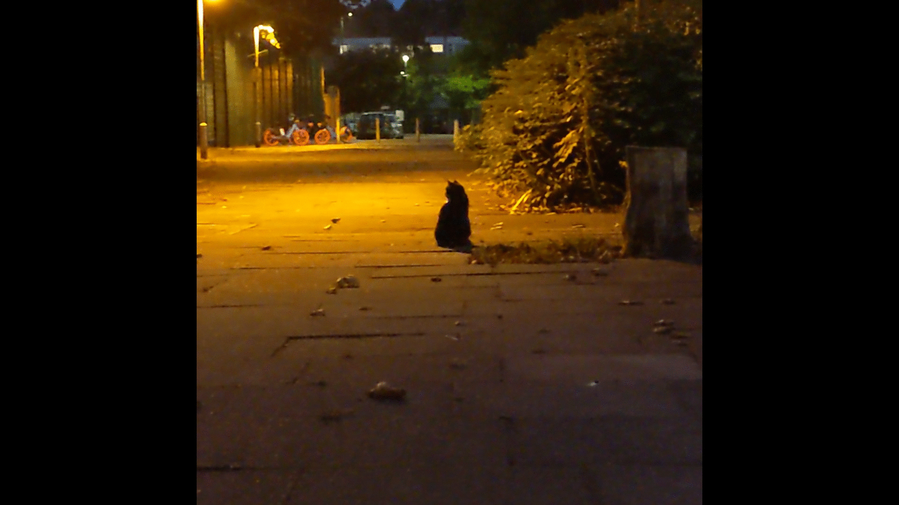

I've wanted to move to London since December 2017 when I first visited with my
sister. (That was the trip that [started A/B Street](../backstory.md), by the
way.) I was very wary of hyping it up too much in my head and being disappointed
when I got here. After a year, I can firmly say that fear hasn't manifested. I
love living here. It's an unusual day if I don't hear a few different languages
spoken walking around. I think I've fleshed out my mental map of haunts around
Lambeth and Southwark thoroughly enough, but every week or so, still manage to
get lost in some previously hidden estate. Walking around assaults my mind with
new ideas for maps, for art, for things to notice. And the weather is far
superior to Seattle. Making friends took more effort than I anticipated, but
it's turned out quite alright.

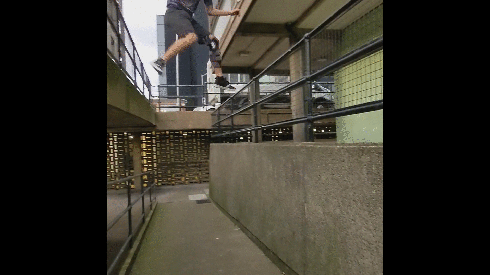

I've struggled through a few things the past year, and one of the more visible
is my off-and-on relationship with parkour. I moved to London about a year after
my ACL surgery, and after a few cautious months of re-introducing bigger
movement, tore again in March. That was a huge reset and sudden new demand of
time and money to work on rehab and conditioning. I diligently did that for
months and months, and... tore it again in early December. I really need
something physically demanding in my life to balance all the computer work, and
parkour so perfectly scratches itches for socializing, creativity,
introspection, and exploring the nature of fear. But my knee hasn't keep up.

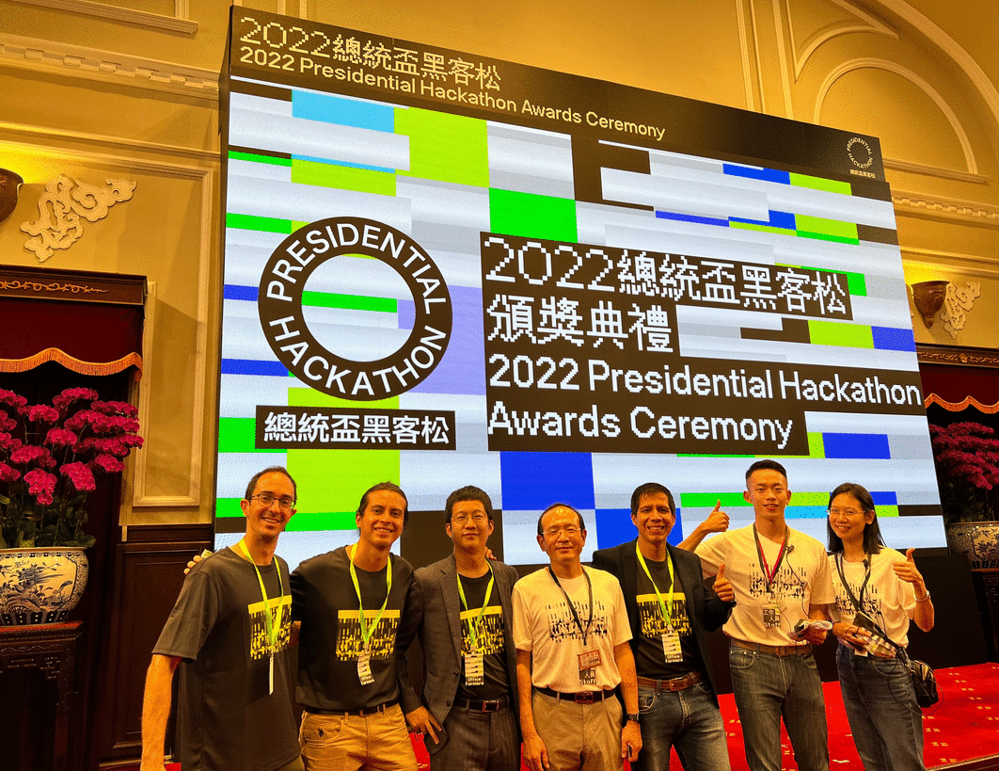

I also took a few trips this year. Visiting Taiwan was utterly fantastic. Last
year I entered the
[Presidential Hackathon](https://presidential-hackathon.taiwan.gov.tw/en/international-track/),
and against all odds the in-person ceremony happened in October. This isn't the
place to elaborate on that trip, but the ease with which I made new friends,
wandered into bits of architecture that ensnarled me, and had ideas about
transforming streetspace... I definitely want to spend much more time there.

### Retrospective on the retrospective

I wrote last year's [~postmortem](../retrospective/index.md) in a state of high
emotion, while I was deciding whether to take a job that would've meant the
effective end of A/B Street. I've become very accustomed to listening to my gut
about decisions (and rationalizing later), but that one stumped me for a long
time, because I didn't have enough information about the possible futures. The
postmortem was a reflection on what I had experienced for 3 years, and in
writing it, I realized how impossible it was to let go.

One of the main frustrations expressed last year was wanting real-world impact,
users who very actively care about the project. Thank you so much to Sam and the
rest at Bristol for finally offering that. If I have to wildly pivot 5 more
times for the next such experience, that's fine, I'll have plenty of fun on the
way.

## What's next for 2023

And now for the ideas I'm excited to start soon! Aside from working on all these
things myself, I also anticipate some logistic/organizational changes coming,
but won't speculate much here. (Besides to say that capacity building in people
around me and aggressively networking is a strategy that pays off more and more
with time.)

Also, feedback welcome -- if you think I should be focused on something
different, let's talk about it!

### Technical debt

It's only natural that A/B Street has accumulated a bunch of technical debt --
the idea/goal has changed many times, I've learned a bunch in 3 years, and I
don't really take an approach of polishing before moving on. But now it's
worthwhile to whittle down some problems that keep resurfacing. We've been doing
this in osm2streets and it's really paid off there.

Most urgent is the
[save file format](https://github.com/a-b-street/abstreet/issues/995). When you
edit something in A/B Street and try to load the edits many months later with a
new version of the map, it often breaks. I hoped matching to OSM IDs would
suffice and that upstream roads wouldn't be split that often, but that's just
not true at all. A better strategy would be something like
[SharedStreets](https://sharedstreets.io/), identifying roads with GeoJSON
coordinates and always doing map matching/snapping. There are other
complications when lane data being fixed in OSM, but someone's edits being based
on older, incorrect basemap data.

The second ever-growing problem is
[blockfinding](https://dabreegster.github.io/talks/aiuk_ltn/slides.html#/blockfinding),
the process that partitions a map into 2D polygons in between roads. The LTN
tool only works when you can define neighbourhood boundaries the way you want.
Bridges, tunnels, and splitting a boundary based on water and large parks all
cause complications. I want to overhaul this idea and just treat everything as
planar graphs, letting people draw boundaries however they like.

The `geom` library is also increasingly problematic. It's somewhat based on
[georust](https://github.com/georust/geo), but adds a bunch of poorly tested and
frequently buggy behavior on top. It also attempts fixed-precision math poorly
by trimming floating points, and this doesn't interact well with validity
requirements for line-strings to not repeat points.

There are also smaller refactoring ideas that, if solved reasonably, could
vastly simplify lots of code:
[updating the URL across apps](https://github.com/a-b-street/abstreet/issues/766),
[handling interactive object on the canvas](https://github.com/a-b-street/abstreet/issues/763),
and
[letting users manage saved objects consistently](https://github.com/a-b-street/abstreet/issues/765).
These're things that an opionated web app framework or game engine might solve.
A/B Street effectively acts a bit like both, and so needs to help with these.

### Polishing / reviving existing apps, not starting new ones

Last year, there was an obvious new niche to leap into -- designing LTNs. I
don't think anything's "missing" from A/B Street right now -- aside from public
transit (but again, I'm not touching that yet). Instead, I want to refine
existing ideas.

Ungap the Map and the LTN tool provide complementary ways to improve cycling. An
LTN is limited without main road interventions and new crossings. And sometimes
cycle routes need not follow the main road. Maybe the two apps should be
combined?

I'd also like to revive the
[15-minute neighbourhood tool](../../../software/fifteen_min.md). I thought it'd
be less relevant in the UK, where mixed-use zoning and higher density are
normal. But Turing has a few people calculating connectivity and accessibility
to various resources (green-space, jobs, hospitals, schools). I see the same
types of technical problems being solved repeatedly, and am curious about
potentially generalizing the 15m tool to help.

Notably absent from this section is the traffic simulation. I
["deprecated"](https://github.com/a-b-street/abstreet/issues/996) it a few
months ago. I don't really want to touch it again until the map model is much
more accurate (osm2streets) and travel demand models are decent see below).
Eventually I'd like to revisit many ideas in the simulation -- coarse-grained
turn conflicts, lane-splitting and "ghost bikes", lane-changing, priority
between pedestrians and vehicles -- but not anytime soon.

### Improving OSM data

A/B Street is very much bottlenecked on what OSM contains. osm2streets is
evolving to work around limitations in the representation (things like fake
geometry where dual carriageways split), but lane tagging also needs to be
improved. I want to polish the lane editor and incorporate the idea in existing
editors like iD and JOSM, to make it easy to visually edit lane configuration.

There are other types of data important to A/B Street, like crossings. Inspired
by the [MapComplete](https://mapcomplete.osm.be) and
[Every Door](https://every-door.app/), simple new editors dedicated to correctly
tagging other pieces of active travel infrastructure might be the approach.

### ATIP and OSM conflation

In many ways, ATIP is a much less detailed version of A/B Street, designed for
large-scale areas. This project will evolve and morph quickly next year as
requirements change, so I won't speculate much about it.

But there is one really hefty technical challenge I'm excited about. Government
authorities need a verified source of infrastructure data, and in many cases
maintain their own separately from OSM. At the same time, they want to leverage
the power of OSM. There are projects like
[this in London](https://github.com/cyclestreets/tflcid-conversion) to conflate
datasets, generate understandable diffs, and assist humans in fixing errors in
either direction. These're problems related to
[brittle savefiles](https://github.com/a-b-street/abstreet/issues/995). I have
some ideas in this space.

### Scaling everywhere

The A/B Street ecosystem is predicated on using a single file that covers some
specific study area. That approach mostly works, but there's more friction as
people just rely on the web version. Importing dynamically on the web is
possible, but it'll be a slow experience. I'd like to continue some
[initial experiments](https://github.com/a-b-street/abstreet/issues/1009) around
tiling and lazily importing and caching areas.

### Census and travel demand models

In March I gave a
[talk](https://dabreegster.github.io/talks/tds_seminar_synthpop/slides.html)
about ideas for producing reasonable demand models for anywhere in the world,
starting with widely available data. 2023 is finally the time to start working
on this.

The first piece is
[aggregating census data](https://dabreegster.github.io/talks/census_pitch/slides.html)
from various sources -- WorldPop as a fallback anywhere in the world, more
specific datasets in some places. Then to distribute the 500 people to specific
origins within a zone, using some basic guesses from OSM building tags. And in
some places, configure better guesses with
[Colouring London](https://colouringlondon.org/),
[OpenAddresses](https://openaddresses.io/), or similar.

A second piece is extracting weighted destinations for trips for various
purposes. Something like [osmox](https://github.com/arup-group/osmox/) might
already get the job done. Sometimes there might be region-specific data, like a
number of students per school, or trip rate tables that've been calibrated.

Besides producing travel demand models for A/B Street, these two components have
wider uses. A typical analysis of a new bus route will ask how many people (with
certain occupation and vehicle ownership characteristics) live near bus stops?
Half of this question is about isochrones and the street network, and the other
half is about the population.

In the same way OSM makes it possible to get a transportation network of decent
quality _anywhere_ in the world, I want the same for population data. Plugins
are the key. Somebody can do the work of finding, cleaning, and converting data
for some particular country once, and just hook it up to common infrastructure
for visualization and analysis. Over the past year, I've met different groups
with expertise in calibrating demand models to real traffic count data, modeling
future population growth, and statistically assigning individual-level
attributes from census data. Many of these groups are duplicating part of their
effort. I want to bring them together and let people specialize on their
strengths.

### Experimenting creatively

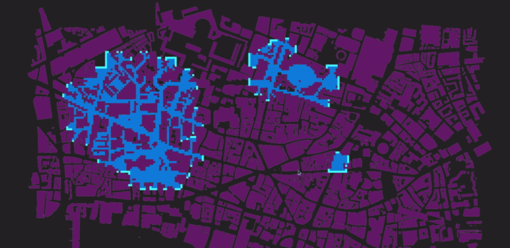

I originally learned programming by making games, and I'm still convinced I need
to scratch creative itches that build up. Even if nothing comes from it, I
really enjoy experimenting with something new with zero pressure to make
something "useful." I've been playing around with Bevy recently to explore some
old ideas about 3D map rendering. Maybe some of that could transfer over into an
existing project someday. (My interest in Bevy was sparked when Matthieu started
[porting part of A/B Street](https://github.com/a-b-street/abstreet/pull/1038)
to it!)

Some more stray thoughts: just using building data and road center-lines,
approximating road width is possible in some places. I enjoy discovering narrow
little footpaths around Lambeth, and figuring out how to chain together the
longest possible circuitous route without seeing a busy road -- maybe there's a
variation of Dijkstra's algorithm to automate this? When I visit new places, I
try to just navigate intuitively and by direction, but sometimes small streets
force me out onto main roads and I check my phone. Is there a graph theoretic
property formalizing this? How many variations of quiet routes are possible in
very gridded cities, and what're the bottlenecks that all routes are forced to
cross? And inspired by [Footways London](https://footways.london/map) and
[Nate Wessel's maps](https://github.com/Nate-Wessel/bike-map/blob/master/prospectus/prospectus.pdf),
I have some ideas for maps that emphasize what's important for people moving
around without a car.

I don't know if these are useful diversions, but I'd like to spend a bit of time
on them and see what happens.

## Conclusion

This retrospective took me a month to write, and I'm glad it's over, so I can go
jump into some subset of the ideas outlined. I'm really thankful to everyone
I've met and worked with this year, and look forward to the next steps.
