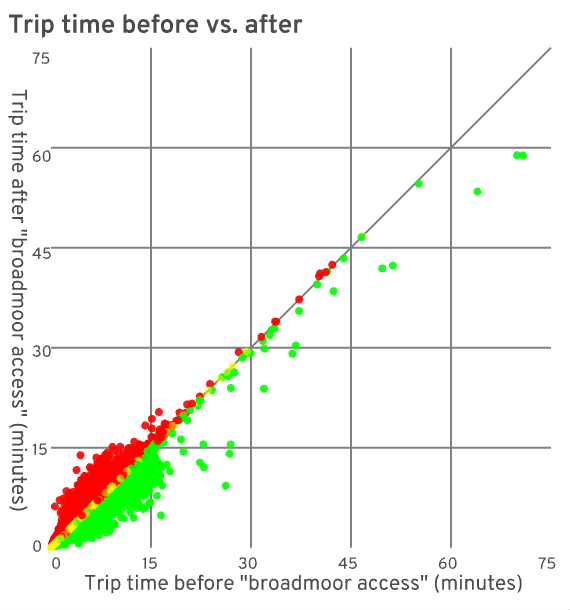
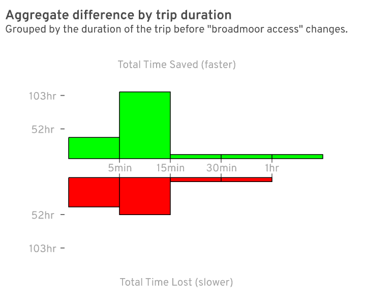
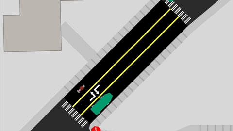

    

        

            <h1 class="post-header-text">Liberate Broadmoor</h1>
        

    

# Allow bike and foot traffic through Broadmoor

_posted July 1, 2021 by [Michael Kirk](https://twitter.com/ikawe)_ &mdash;
[meet the A/B Street team](../project/team.html)

You could be forgiven for not knowing much about the Broadmoor neighborhood in
Seattle &mdash; that's kind of by design. Using the
[A / B Street](../software/abstreet.html) travel simulation game, we're going to
explore how it could become a valuable link for people walking and biking in
Seattle.

Broadmoor lies a few miles northeast of Downtown Seattle, sandwiched between the
[delightful Washington Park Arboretum](https://botanicgardens.uw.edu/washington-park-arboretum/)
and the Madison Park neighborhood.

Adjacent to Broadmoor, the Madison Park and Washington Park neighborhoods offer
grocery stores, a hardware store, dining, and recreational destinations.

Madison Park Beach on Lake Washington is another notable neighborhood
destination.

<em class="photo-attribution">photo courtesy of the City of Seattle</em>

If you were headed to one of these destinations today, and coming from, say
Montlake or from the University District via the University bridge, it would
almost certainly require you to take a long stretch walking or biking down East
Madison Ave. This particular stretch of road is known to be
[high stress for people on bikes](https://www.seattle.gov/transportation/projects-and-programs/safety-first/vision-zero/resources/bicycle-level-of-traffic-stress),
and can be an equally harrowing walk for those on foot.

If people were instead allowed to walk or ride through Broadmoor, they could
expect shorter trips on quieter streets.

In addition, the elevation gain encountered along each route is quite different.

Part of the route along Madison climbs up 8% grade -- quite steep!

The route through Broadmoor side-tracks that hill entirely.[^elevation data]

So why don't people take this seemingly superior route through Broadmoor?
Apologies if you already have the context, but a greatly abridged history lesson
is in order for those who don't.

Up until about 200 years ago, what we refer to as Broadmoor, like much land near
the Puget Sound, was a forest inhabited by the Duwamish people. And, like much
land near the Puget Sound, it was cut clear, and the timber sold off by a mill
company. The owners of this particular parcel were the Puget Mill Company. After
logging the parcel, they split it, not quite in half. The smaller western half
was given to the city, and gardened into what is now enjoyed by the public as
the Washington Park Arboretum. The General Manager from the very same Puget Mill
Company was then allowed to develop the larger eastern half of the parcel into
that venerable American trifecta: a golf course / country club / private gated
residential community.[^madison_park_remembered]

So, Broadmoor was initially built as a gated enclave impassible to all but a
select few of the leisure class. A century later, how much has changed?

Try to walk through or around Broadmoor today, and you'll find yourself
repeatedly redirected or inexplicably dead-ended.

There are gates on the north and south ends of Broadmoor. Both are guarded by
uniformed security.

Broadmoor is an obstacle to people walking and biking to desirable destinations
on either side of it. What if things were different? What if we allowed people
on bikes, on foot, and in wheelchairs _through_ Broadmoor rather than diverting
them down Madison Ave?

### Cui bono

To get an intuition for the benefits that opening up Broadmoor might have, we
turn to [A/B Street](https://abstreet.org). If you have an idea for a change in
your city streets, A/B Street can visualize that change and measure its impacts.

If you've never seen A/B Street before, here's what it looks like:

A/B Street uses public data sources, like
[OpenStreetMap](https://openstreetmap.org) and Seattle's
[Soundcast Travel Demand Model](https://www.psrc.org/activity-based-travel-model-soundcast)
to simulate travel in the city. You can gain insight into your proposal by
comparing metrics like travel duration and risk exposure as they are affected by
your proposal.

In A/B Street, allowing people to walk and cycle through Broadmoor, is a matter
of clicks. A/B Street simulates how this change affects people's travel. You can
watch as each individual person goes about their day. If given new
circumstances, people will be able to make new, hopefully better, choices for
themselves.

To gain a little intuition for the benefits of our proposal, let's follow one
person in A/B Street on her morning walk from Madison Park to the University
District, comparing the trip before and after being allowed to walk through
Broadmoor.

<!--
Encode the aspect ratio of the video in "padding-bottom" value. Otherwise it'll
show up letter boxed.
-->

  <video controls alt="A person from the simulation exits their house in Madison park for a long walk towards the Montlake Bridge. Two routes are shown, the original route down Madison shows busy streets and several alerts as the pedestrian walks down a long stretch of Madison. The new proposed route, through Broadmoor is much calmer. The two routes converge just south of the Montlake Bridge, where the trip ends.">
    <source src="../assets/broadmoor/individual-trip-comparison.mp4" type="video/mp4">
    <source src="../assets/broadmoor/individual-trip-comparison.webm" type="video/webm">
    Sorry, your browser does not support this website's videos.
  </video>

Some of the highlights of her trip include a much calmer walk through Broadmoor
as opposed to crossing along the many busy intersections on Madison Ave.

### Beyond Anecdotes

The morning commute shown above is good for story telling. It's an intuitive
anecdote for why this could be a worthwhile proposal. However, travel behavior
is highly interdependent. Every choice one person makes has potential ripple
effects for others.

We need more than a handful of individual examples. This is why A/B Street
includes tools for quantifying overall travel experiences &mdash; allowing us to
see beyond anecdotes to visualize trends across the map. Let's take a look at
how overall trip times and some safety metrics are affected by this proposal.

### Trip Durations

  <h4 class="chart-header">Cars: Individual Trips</h4>
  

For people driving, some trips were a little faster, while others a little
slower.

Overall it's a wash for drivers, which is expected, but a useful validation.

  <h4 class="chart-header">Walking and Biking: Individual Trips</h4>
  

It gets more interesting for people walking and cycling. Especially for longer
trips, people get where they're going more quickly after being allowed access
through Broadmoor.

Apart from the benefits conveyed to pedestrians and cyclists, these charts also
nicely show the interdependent nature of travel. Even though overall travel time
and the routes available to drivers didn't change at all, individual drivers did
experience downstream effects of pedestrians and bicyclists making different
choices. This interdependence is fertile soil for unintended consequences, which
is why having tools to measure _overall_ impact is essential.

<h3 class="chart-header">Time Saved / Lost</h3>

The dot charts are helpful for seeing the shape of some trends, but it's hard to
quantify the improvements. These next charts compare the total amount of time
saved with the total amount of time lost.

  <h4 class="chart-header">Cars: Overall</h4>
  

Once again, car traffic is mostly a wash. About as much time was lost as was
saved by others, implying a neutral change for people driving.

  <h4 class="chart-header">Walking and Biking: Overall</h3>
  

A clearer trend emerges for people walking and biking &mdash; many long trips
were substantially faster given access to Broadmoor.

Trip duration was worth considering as a gut check to make sure a proposal seems
reasonable, and this proposal indeed has some favorable evidence for faster
trips, but trip duration shouldn't be the only, or even most important, effect
to consider. In particular, there are important safety metrics we can measure
with A/B Street which we'll dive into next.

## Safety

All people should be able to get where they're going safely. As our most
vulnerable road users, people walking, bicycling, and those using mobility aids
deserve extra consideration.

There is an increasing effort to not only look at previous crash sites, but also
to consider the _types_ of places where crashes are likely to occur. By
prioritizing places based on their similarity to crash sites, we can prevent or
mitigate future crash sites before they happen. In this vein, last year Seattle
DOT released a
[safety study](<https://www.seattle.gov/documents/Departments/SDOT/VisionZero/SDOT_Bike%20and%20Ped%20Safety%20Analysis_Ph2_2420(0).pdf>)
analyzing which physical roadway features that are associated with an increased
risk of traffic-related death or serious injury.

For example:

> Right hook crash risk tends to be higher on arterial streets. [...] This could
> be due to the overall complexity of the intersection and/or the width of the
> intersection.[^sdot safety study]

By classifying these risky features, A/B Street can keep tabs as people in the
simulation are exposed to these risks. You can follow an individual's trip and
see what risks they are exposed to. For a macro view, you can aggregate and
identify map-wide hot spots for specific problems. Using A/B Street, you can
compare how a proposal affects these metrics.

<h4 class="chart-header">Identifying Hotspots</h4>

South of the Montlake bridge, crossing Highway 520, has complex arterial
intersections _and_ relatively high bike and foot traffic, meaning many people
are exposed to these risks.

<h4 class="chart-header">Walking: Arterial Intersections</h4>

In the simulation, opening Broadmoor to pedestrians allowed about 200 people,
over the course of the day, to pass through fewer arterial intersections. Longer
walks were especially affected.

<h4 class="chart-header">Biking: Car Wants to Overtake</h4>

In shared lanes, a common risk is that faster moving cars pull up too close
behind a cyclist. This is uncomfortable for both the person on the bike and the
person driving. Having the option to ride through Broadmoor gives some cyclists
the option to avoid sharing a lane with cars on busy Madison.

<h4 class="chart-header">Biking: Complex Intersections</h4>

Simple intersections are where just two roads cross. Passing through a complex
intersection, where more than two roads cross, has an increased risk of death or
severe injury for people on bikes[^sdot safety study]. Being able to cycle
through Broadmoor was a strict improvement for this metric.

This was a quick overview of some of the tools A/B Street has for measuring
baseline safety metrics and seeing how your proposal affects them. We're
continuing to add metrics and visualizations, but we'd love to know if there are
any you'd specifically like to see.

### What's Next?

Using a tool like [A/B Street](https://www.abstreet.org) is absolutely not a
definitive evaluation. It's intended to get you started tinkering.

By identifying and measuring things we care about, and simulating how they
change, we can quickly gain some visual intuition and quantified evidence to
validate (or refute) assumptions in our proposal, and hopefully it's a little
fun too.

Here we've shown there is at least some evidence that letting people walk and
bike through the Broadmoor neighborhood in Seattle could result in faster,
safer, and more pleasant trips without unduly impacting other traffic.

<!-- TODO: it'd be nice to link to something like `https://abstreet.org/web` or even http://abstreet.s3-website.us-east-2.amazonaws.com/latest/abstreet.html rather than a specific version -->

If you'd like to see for yourself what the Broadmoor proposal looks like, give
it a try,
[you can run A/B Street in your browser](http://abstreet.s3-website.us-east-2.amazonaws.com/0.2.49/abstreet.html?--dev&system/us/seattle/scenarios/arboretum/weekday.bin&--edits=broadmoor%20access)
or [download the desktop client](../user/index.html).

Or, if you have a different idea for improving how we get around, in Seattle or
elsewhere, give it a go! Please contact us on
[twitter](https://twitter.com/CarlinoDustin) or
[github](https://github.com/a-b-street/abstreet/issues/new) if you have any
questions or issues.

## Caveats

It bears repeating: A map is not the territory. The signifier is not the
signified. A simulation is not, and can never be, the actual world.

But like a good map or a good metaphor, a good simulation can be a useful tool
for learning and advocacy. Beyond the shortcomings inherent to any such semiotic
excursion, there are a couple of limitations we wanted to call out in this case
study in particular.

### Data Sources

The underlying road network is inferred from
[OpenStreetMap](https://www.openstreetmap.org/#map=14/47.6337/-122.2941).
OpenStreetMap (OSM) is a global community of mapping enthusiasts whose software
and data is freely available. Using OSM, A/B Street is already usable in cities
all over the globe. However, as a freely available community maintained project,
OSM comes with no data quality guarantees, and local mapping conventions can
vary. Not everyone using OSM is interested in the incredible level of detail
required to run a travel simulation. This situation is ever improving though,
and we'd love to have you give A/B Street a try, wherever you are.

A/B Street leverages Seattle's
[Soundcast travel demand model](https://www.psrc.org/activity-based-travel-model-soundcast)
to generate the list of trips for each person in A/B Street. Specifically, for
each person, Soundcast is responsible for saying where they need to be and at
what time. Soundcast is also responsible for what mode the person takes -
whether they walk, drive, cycle, etc.

### Modeshift

Intuitively if you make driving more attractive, more people will drive.
Similarly if you make a mode like cycling, walking, or transit more attractive,
more people will choose that mode.

A/B Street doesn't currently account for this shifting of modes. It naively
assumes that people will go about their day, always choosing to drive or walk or
cycle regardless of what changes you make to the city. Mode shift is a real and
important behavior that we are excited to implement and measure in A/B Street in
the future.

There's tons of other improvements in the works. Follow
[@CarlinoDustin](https://twitter.com/CarlinoDustin) for updates, and let us know
what you'd like to see.

## Footnotes

<!-- prettier-ignore-start -->
[^madison_park_remembered]: Jane Powell Thomas, Madison Park Remembered (J.P. Thomas, 2004)

[^sdot safety study]: Seattle Department of Transportation's safety study:
[City of Seattle Bicycle and Pedestrian Safety Analysis Phase&nbsp;2](<https://www.seattle.gov/documents/Departments/SDOT/VisionZero/SDOT_Bike%20and%20Ped%20Safety%20Analysis_Ph2_2420(0).pdf>)

[^elevation data]:
Elevation data from [King County LIDAR](http://pugetsoundlidar.ess.washington.edu/lidardata/restricted/projects/2016king_county.html). Thanks to [Eldan Goldenburg](https://github.com/eldang/elevation_lookups) for processing this data.
<!-- prettier-ignore-end-->
