# Dustin's vision for Seattle's bike network

I've been commuting almost exclusively by bike here since 2014. I've had too
many close calls and plenty of frustrating moments when it feels like the design
is trying to discourage this mode of transport as much as possible. I want to
see a network tht encourages as many people as possible to choose biking over
driving, for [these reasons](../../software/ungap_the_map/motivation.md).

So many times, I wish I had a magic wand that could just fix things. I don't,
and it takes years of concentrated effort to campaign and push for redesigned
streets, and I'm impatient -- so I (along with [my team](../../project/team.md))
built that magic wand: software to sketch out my vision for biking in Seattle.
My hope is that if people can more easily imagine and visualize things like the
[bike master plan](https://www.seattle.gov/transportation/document-library/citywide-plans/modal-plans/bicycle-master-plan),
they'll debate more effectively about them, proposals will be funded more easily
and with greater participation from more people.

The vision here will just be limited to adding bike lanes, protected by planter
boxes or just paint, to existing road-space, usually by sacrificing street
parking or an extra driving lane. There are plenty of other changes I want to
see involving light rail, bus frequencies, Stay Healthy Streets, and zoning
changes... but that's not the focus here.

## Disclaimer

This is what I personally want to see, based on where I live and commute. I'm
very much bringing all of my biases into the proposal. You'll notice much less
focus in South and West Seattle, because I don't happen to spend much time
there. Of course I think they also deserve great bike infrastructure, but I'm
not experienced enough to talk about it.

Because of this, I'm not very attached to this specific proposal. What I
_really_ want is for _you_ to try out this software yourself and share your own
vision. This write-up just serves as an example use of the tool. Please give it
a spin and blog or tweet about it, so I can go back to writing code, not
English!

<!--
link to alt plans, like near-term / in progress builds, and the basic bike
network master plan -->

## The network

Follow along in your web browser. Most of the changes are around
[Central Seattle](http://play.abstreet.org/0.3.33/abstreet.html?--ungap&system/us/seattle/maps/central_seattle.bin&--edits=dustin_bikelino)
and
[South Seattle](http://play.abstreet.org/0.3.33/abstreet.html?--ungap&system/us/seattle/maps/south_seattle.bin&--edits=dustin_bikelino).
If you have trouble using the tool, check the
[user guide](../../software/ungap_the_map/user_guide.md) or send feedback.

### Boyer / Fuhrman

This is practically the origin story of A/B Street; it only takes one truck
passing super close and almost pancaking me into the line of parked cars...

Swapping parking for some dedicated lanes is a really tough sell between the
university bridge and 520 underpass, though. Having lived in the area for a few
years (when I still had a jeep to park), I can confirm how low the area is on
street parking. Although the area's strategically close to UW and downtown for
biking, nearby transit connections are a bit of a walk. Also, Fuhrman has a
bunch of curb bulbs and traffic islands that would force bikes to merge back
into the main lane every few blocks, so this would probably be a bigger paving
project.

The alternative route is to cross the University or Montlake bridge and take the
Burke, or take the scenic route through south campus. But depending which way
you're going, this is a long detour, and probably forces you over the Montlake
bridge, meaning navigating the absolute mess of Montlake/520. It's possible the
[the lid](https://wsdot.wa.gov/projects/sr520/montlake/home) will make this area
less terrible, but... not sure how. (There are some tricks like the Bill Dawson
trail that slightly ease the pain, depending where you're going.)

It's possible there's some
[plan](https://twitter.com/typewriteralley/status/1445922612421402626/photo/1)
for Fuhrman with RapidRide J?

### NE 45th St

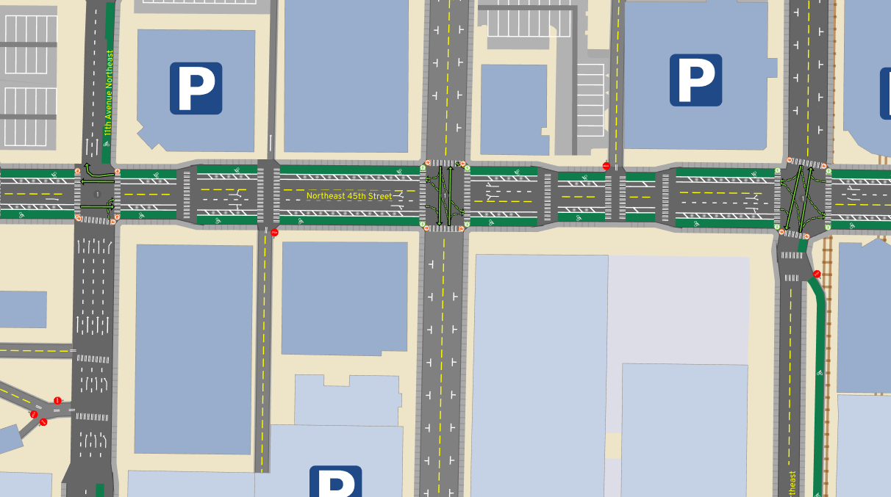

[Joe Mangan](https://www.theurbanist.org/2021/01/27/reclaiming-ne-45th-street-from-cars/)
presents this vision way more eloquently than I could. Another organization has
called for better facilities on
[the I5 bridge](https://www.glwstreets.org/45th-st-bridge-overview), but I'd
personally like to make the connection all the way from the U-district to
Wallingfjord, patronizing all the shops along the way without hustling to keep
up with traffic.

I thought about 50th as an alternative, but it's farther from the action in the
U-district (including the brand new Link station!) and would skip the
Wallingford business district.

### Aurora Ave

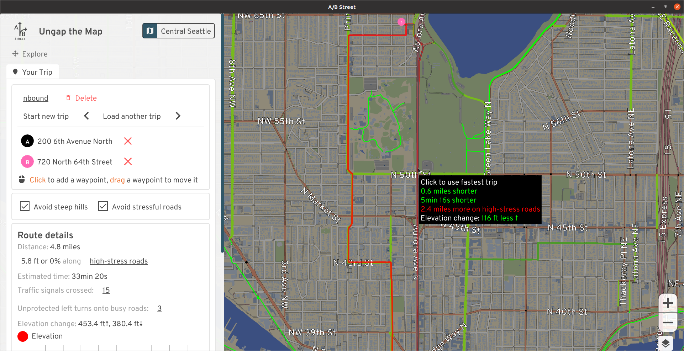

This is a trivial argument by checking elevation. If you're going north from
Fremont, climbing Fremont Ave, then Phinney and Greenwood Ave at least has some
paint. But just look at how gentle the elevation using Aurora would be! Looking
the other direction, it could be a straight shot -- a bicycle superhighway --
from all of north Seattle right to downtown.

I would sometimes brave biking the bus lane when I lived in Lichton Springs. If
you've got your wits about you and don't mind cars flying by at 50mph, it's, uh,
fine, until somebody wants to use the bus lane to accelerate or turn right
quickly. The right-of-way is utterly massive; there's many ways to squeeze in a
cycletrack of some sort.

See [Aurora Reimagined Coalition](https://www.got99problems.org) and
[Complete the Loop](https://www.glwstreets.org/complete-the-loop) for some
ongoing advocacy efforts in the area.

### Rainier Ave

The most direct connection between the International District and Colombia City
is straight down Rainier, a nearly flat route:

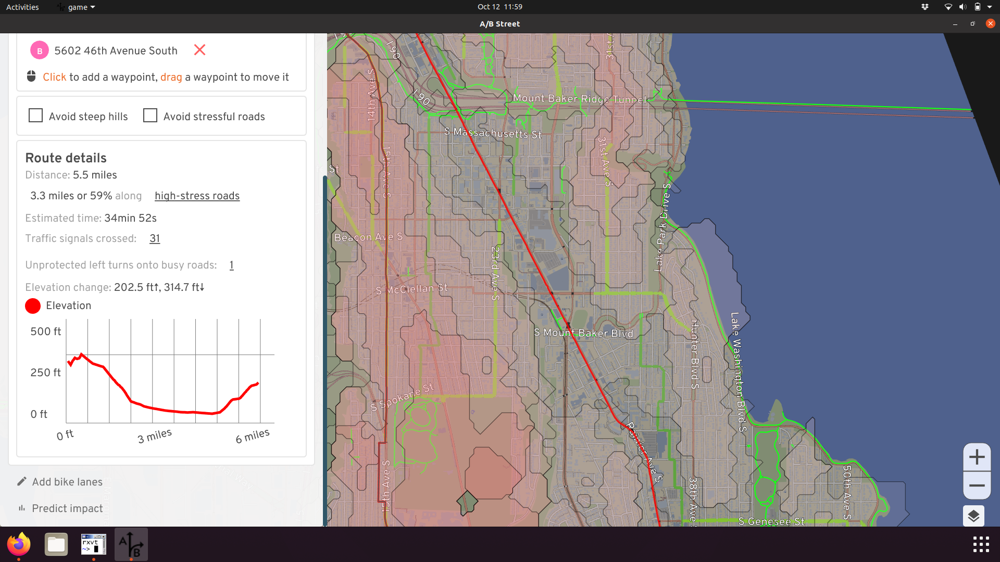

The quiet route takes longer, is steeper, and doesn't bring you past any
businesses:

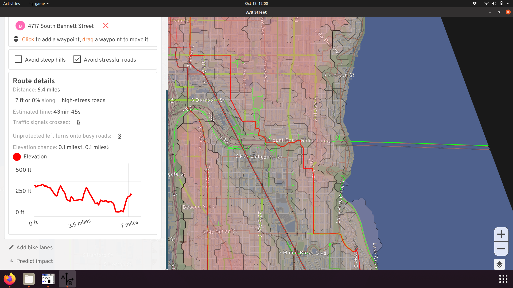

I've biked on Rainier before,
[fully aware it's called Seattle's most dangerous road for a reason](https://www.seattlebikeblog.com/2020/09/10/seattle-knew-5-years-ago-that-a-rainier-ave-safety-project-would-save-lives-but-is-just-now-starting-work/).
In most places, it's a massive 5 lanes, meaning there's plenty of room to add
some protected lanes, giving more people easy access to the many businesses
along the corridor:

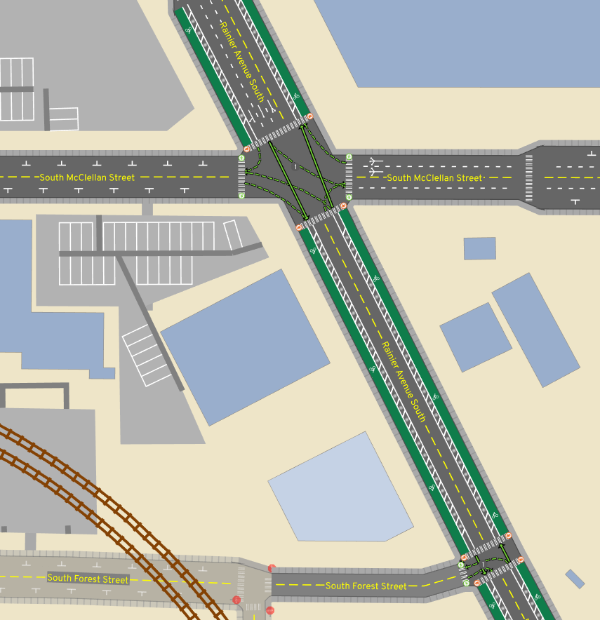

I've ended the changes at Orcas, since I'm not familiar with what's south of
that and might be a useful connection.

For more ideas about the current gaps in South Seattle, see
[this list](https://twitter.com/Zee_Shaner/status/1433630099924946962).

### Eastlake Ave

Eastlake would be the de facto route between the university district and
downtown, if it weren't for the intermittent mess of parked cars currently.
Shoulder space to avoid traffic appears and disappears, and some of the parking
is even supposed to be banned during rush hour. I believe as part of the
RapidRide J plan, Eastlake is supposed to get some dedicated lanes! Until then,
we can imagine how awesome it'll be:

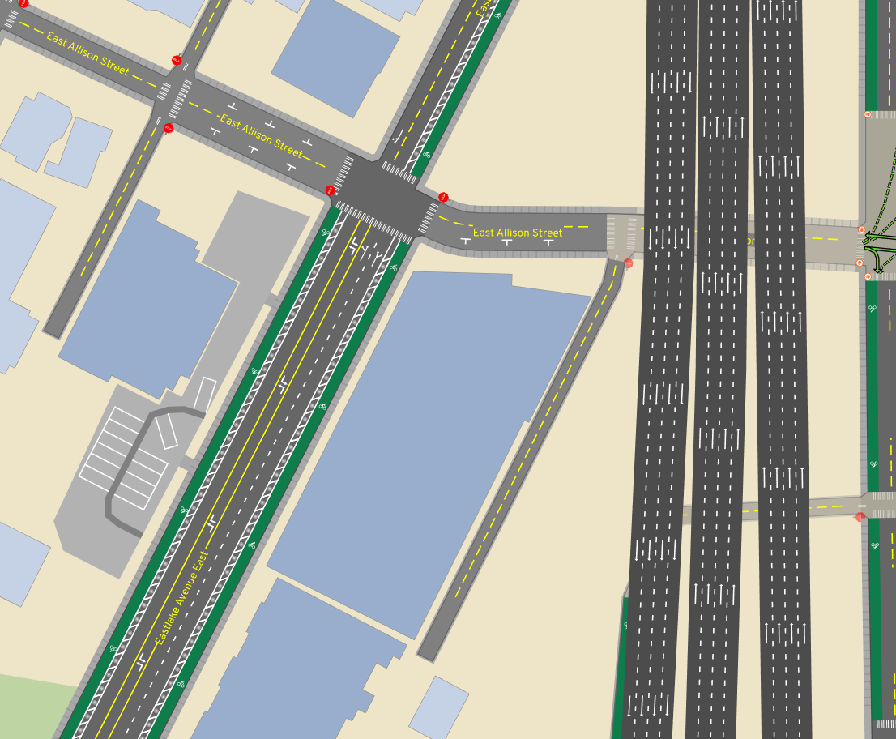

Of course, RapidRide J will bring bus lanes,
[here's a more accurate future](https://twitter.com/SD70MACMAN/status/1446148993042423813/photo/1).

The alternative today is following the Cheshiahud Loop loop through
neighborhoods. It's nice and scenic, but weaves through steep alleyways -- not a
commuter route.

### Lakeview

One reasonable way to access lower Capitol Hill or downtown from the university
district area is along Lakeview. This makes use of a nice bike-only connection
near Melrose, and pops you out right into the heart of a commercial area. The
gap is near the I5 colonnade. Currently this is one lane each direction, with
parking usually on both sides. There's an I5 exit in the middle. So in practice,
[this nonsense](https://twitter.com/CarlinoDustin/status/1416988865844240386)
happens:

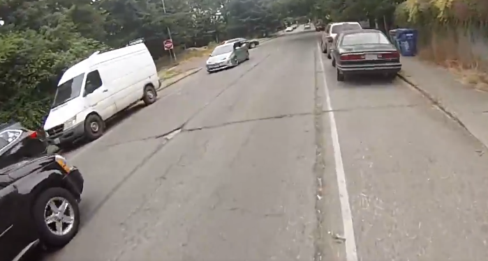

Just nuke the parking and add bike lanes. I'm not sure what to do with the
Boylston Ave portion. There's a physical median there today, making the lane
pretty narrow, and I've heard stories about really aggressive cars squeezing
past at high speed. There is parking on the west side of that street, so
potentially that could be sacrificed and the median shifted over, to dedicate
shoulder space for biking on both sides.

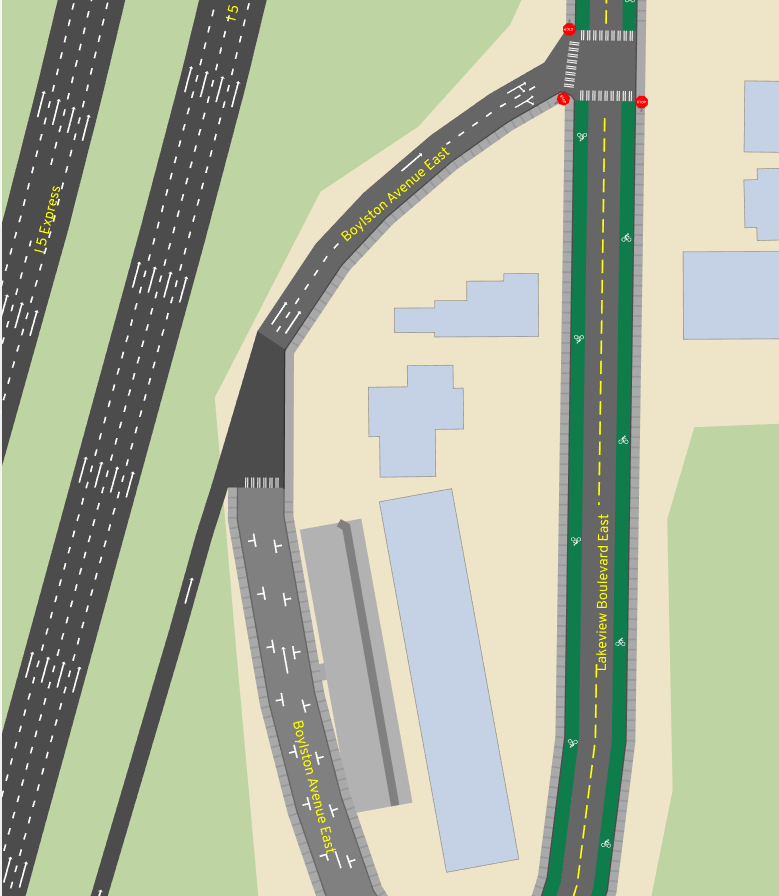

### Harvard from Shelby to Roanoke

If you're crossing the university bridge and want to go to Capitol Hill, you're
probably taking Harvard to Roanoke to Broadway:

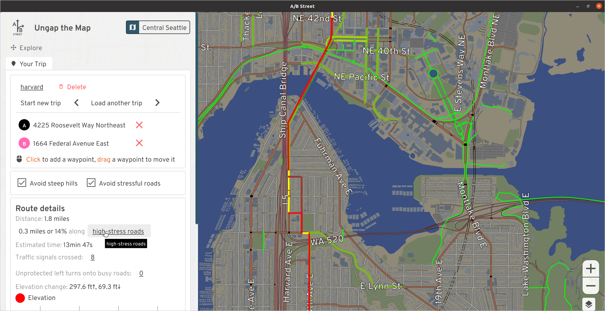

There's a climbing lane up Harvard, but it just gives up at Shelby. There are
two full lanes at this point and is usually OK, but I've had a few stressful
experiences with aggressive vehicles. There's just one driving lane uphill
before Shelby, so why not just keep it that way, or make it a bus/bike lane for
Route 49?

The quieter route is to cut into the neighborhood and make use of the diagonal
diverter at Broadway and Edgar. You'll have to press the beg button at the south
end of Roanoke Park to continue up the hill.

### Broadway between Highland and Denny

South of the light rail, Broadway has a protected two-way cycletrack and north
of Highland, there are painted lanes. But inexplicably they vanish between
Highland and Denny. If you want to dodge less cars, you can cut onto Harvard, a
much bumpier street without any businesses along it. Why not take out the center
lane and extend the cycletrack or the painted lanes on both sides?

The street parking along this stretch is usually pretty full, and often trucks
use the center lane as a makeshift loading zone. This is a commercial hub and
should still have a way to drive and park here, but given how well-connected the
area is by public transit, I don't think prioritizing parking makes sense.

### The Missing Link

The Burke Gilman trail, which is probably the highest-traffic walking/biking
path in Seattle, has had a
[missing link](https://www.seattle.gov/transportation/projects-and-programs/programs/bike-program/ballard-multimodal-corridor)
literally since the 90's. I'm not going to weigh in on the debate on exactly how
this should be fixed; I've just put it on Shilshole. Maybe we'll see it
completed in another 30 years.

### Airport Way S

Once upon a time, I made the mistake of biking to Fedex in SODO during afternoon
rush hour (the narrow window when you can retrieve packages). I took Airport
because it's flat and direct, and there was plenty of room for cars to pass --
there's a pretty generous shoulder. But even though I was gunning it and keeping
pace with the stop-and-go traffic, there were still some vehicles that insisted
on flying across the 15-foot lane and almost swerving into me. So, I'd like to
add a protected lane here:

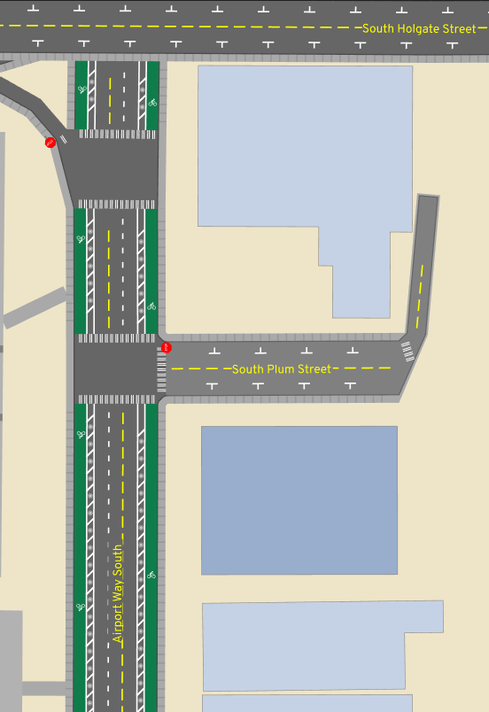

Note the edits show a driving lane taken away, but that's just because we don't
have accurate road width data. There's enough room to keep all the lanes, and
add some paint and barriers to the shoulder.

Why didn't I take the SODO trail and 6th Ave S? (Well, I certainly did on the
way back!) Honestly, I was just following Google Maps routing (which doesn't
have an option to avoid high-stress roads), and getting to the SODO trail from
the international district is more confusing than following the natural path
onto Airport. Maybe some wayfinding could help.

### Others

This has been a very modest "vision" map. Part of me wants to just add lanes on
every arterial, but then I'd have to write about the nuances of each of these
cases. Nonetheless, a few other areas I considered:

How're you supposed to comfortably go east/west in north Seattle? After living
in Lichton Springs for a while, I probably cut through different sequences of
residential streets every single ride. Looking at a contour map, 75th looks like
a candidate, but I'll have to go try it out.

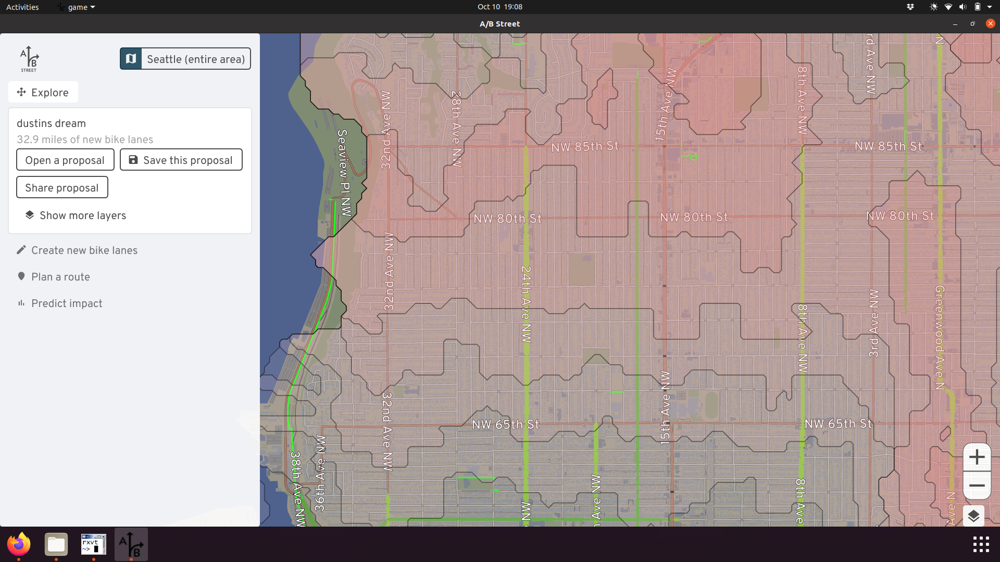

It's ridiculous to me that Lake Washington Blvd from Montlake all the way to
Seaward isn't better designed for biking; it's part of the Lake Washington loop,
and loads of people ride it. Greenways successfully fought for a
[Keep Moving Street](http://stayhealthystreets.org/streets/lwb/) that had loads
of usage, but it ended after September.

Going from Ballard to downtown, normally I'd just take the scenic Elliot Bay
trail through to Centennial Park, but once I had an errand somewhere around 15th
Ave NW and Elliot. That's another huge road through a commercial area that
probably deserves some protected lanes.

## Estimating how much these might help

The software includes a tool to
[predict the impact](../../software/ungap_the_map/user_guide.md#predict-impact)
of all of these changes to the region's current travel patterns. There's lots of
assumptions and limitations with the calculation that you should read and mutter
quietly to yourself about, but nonetheless, what's the verdict?

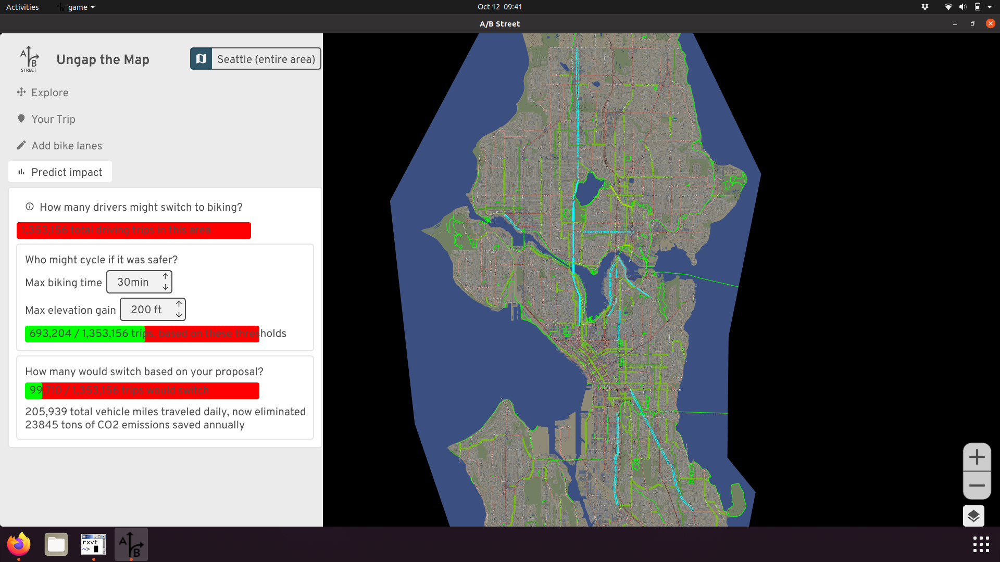

These 30 miles of new lanes could sway about 100,000 daily driving trips (about
7% of trips that stay within this part of Seattle and don't just pass through)
to bike instead. That's assuming people will only tolerate up to a 30 minute
ride with no more than 200 feet of elevation gain. If these driving trips all
choose a more sustainable mode every weekday for a year, that's roughly 23,000
tons of CO2 emissions saved. It's a start.

Thanks for reading this far. Please share your feedback about these ideas and
the new tool, and more importantly, your own vision for what biking in Seattle
could be!
