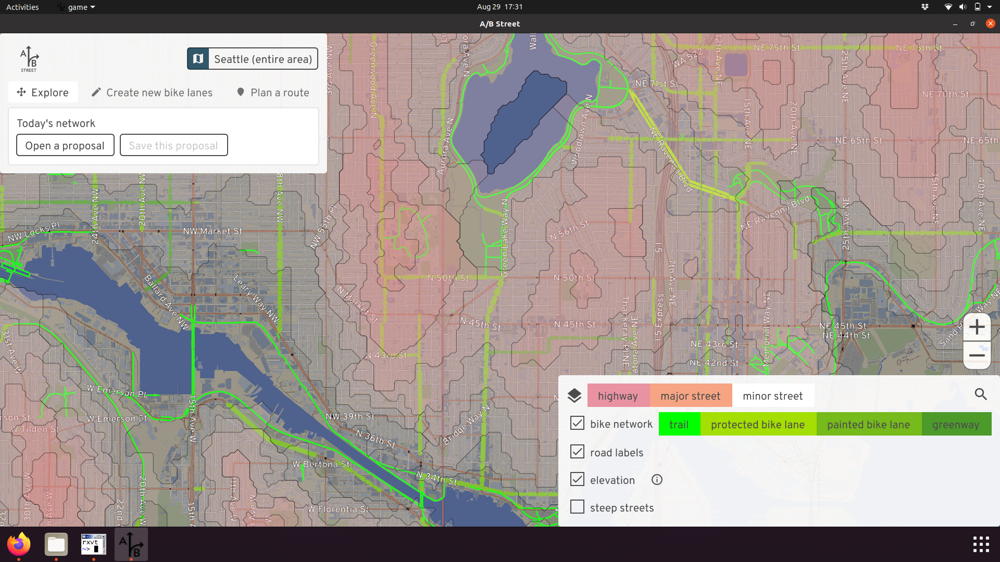

# A/B Street

- [Download](../user/index.md)
- [Play on the web](http://play.abstreet.org/0.3.27/abstreet.html)
- [Github](https://github.com/a-b-street/abstreet/tree/master/game/src)

## Overview

A/B Street is a traffic simulation game exploring how small changes to roads
affect cyclists, transit users, pedestrians, and drivers. In other words, you
can transform that street parking into a bus lane or fix that pesky left turn at
a traffic signal, measure the effects, then
[propose actually making the change](../proposals/index.md).

A/B Street uses game-like elements to gradually introduce all of the features of
the simulation, with a tutorial and a few challenge modes. But just becaused
it's called a "game" doesn't mean it's not trying to model the real world as
accurately as possible from open data. (Keep in mind it's impossible to simulate
all complexity in the real world of people moving around a city. Every traffic
model makes lots of assumptions and trade-offs, including A/B Street.)

## Explore

A/B Street gives you a 2D representation of roads, with as much detail about
bus/bike/turn/parking lanes, transit stops, traffic signals, and parking lots as
possible, all from OpenStreetMap.

Depending on elevation data availability, some areas let you visualize steep
streets -- because your bike network should be planned accordingly.

Using external travel demand models, you can explore patterns of where people
live, work, and shop.

## Simulate

Using some external data about what trips people take on a typical day, you can
simulate drivers, bicyclists, and pedestrians moving around. (Public transit and
scooter/bikeshare micromobility planned.)

You can follow individual people and watch them wrestle with problems, or get a
bird's-eye view of how everything is moving.

Every driving trip begins and ends with
[parking](../tech/trafficsim/parking.md), which might be easy in suburban areas,
but hard in cities.

Some details:

- People will take the best route available, **not** accounting for current
  congestion. Drivers prefer the fastest route (shorter distances, higher speed
  limits). Pedestrians and cyclists also factor in elevation changes.
- Vehicles
  [instantly accelerate and stop](../tech/trafficsim/discrete_event/index.md).
  This is a useful simplification to speed up the simulation, but of course, you
  shouldn't use A/B Street to simulate jam waves on freeways.
- Vehicles stay in the same lane once they pick it, and sometimes they choose
  their lane really poorly. We're working on improving this.
- We don't simulate accidents -- but we do measure "risk exposure" where a
  collision may be likely.

## Edit

A/B Street lets you change how road space is divided up. You can create regular
vehicle lanes, bus-only lanes, bike lanes, street parking, and new sidewalks.
You can either transform existing lanes, or slightly widen/shrink the road. You
can reverse the direction of lanes, or close them down to simulate construction.

You can also change speed limits and restrict access to an area. Only trips that
start or end in a private area can use the roads within, modelling gated
communities. Or you can allow through-traffic for people walking and biking, to
create low-traffic neighborhoods.

You can also change how traffic signals work. You can modify the timing if you
notice left turns need more time, or set up actuated timing, so that the green
light lasts longer when many vehicles are waiting. You can also change which
movements are allowed each stage, so you could try out a dedicated left turn
stage or a pedestrian all-walk/scramble cycle.

## Measure

A/B Street lets you tell data-driven stories about both infrastructure and
people.

