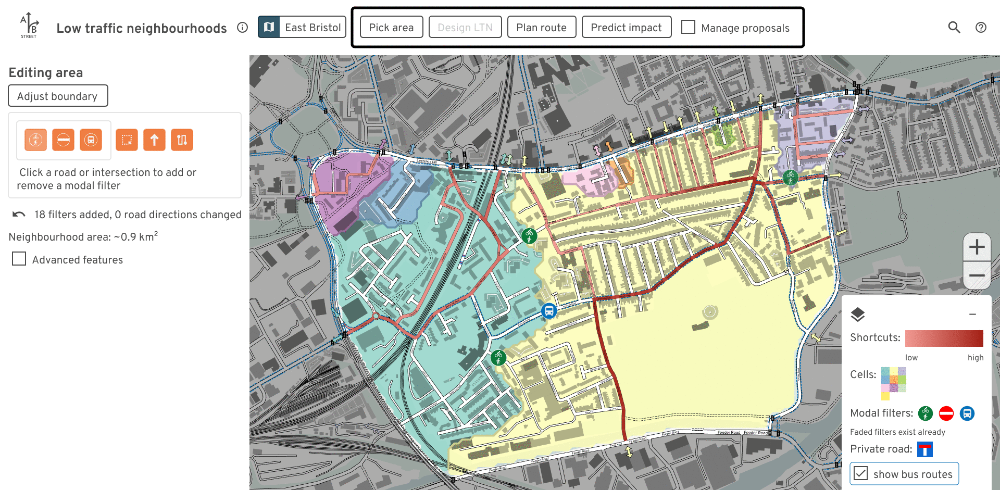
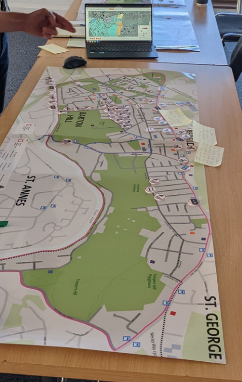
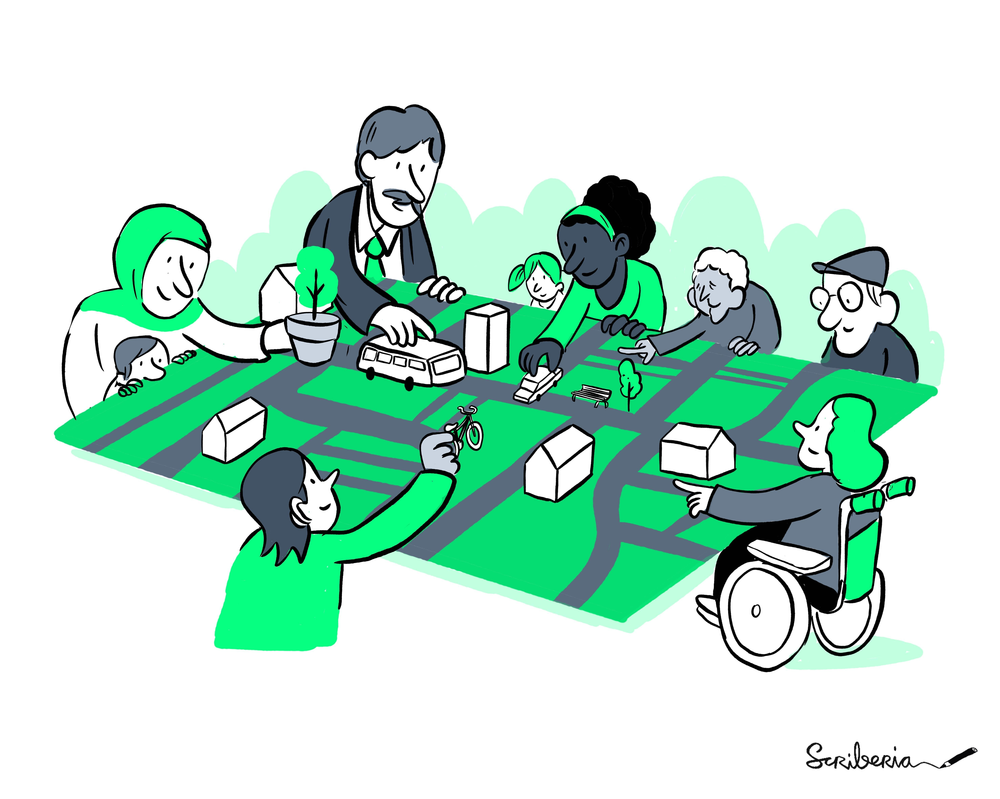

# Low-traffic neighborhoods

[**Launch the tool in your web browser**](https://play.abstreet.org/0.3.43/ltn.html?system/gb/bristol/maps/east.bin)

This free tool lets anybody study existing and proposed low-traffic
neighborhoods (LTNs). Experiment with modal filter placement, and examine the
impacts on drivers trying to cut through residential areas.

- [2-minute introduction video](https://www.youtube.com/watch?v=m22WP62yyZ0)
- [8-minute tutorial video](https://www.youtube.com/watch?v=j64ZtDfGPCY)
- [Written user guide](https://docs.google.com/presentation/d/1vU4xITmd9PMX4QJi0xP5ZJVpuWE9rpE3SvvYdq9_xb8/edit?usp=sharing)

The software runs faster if you install it. No mobile/tablet support. Unzip,
then run `ltn.exe` or `ltn`.

- [Windows](https://github.com/a-b-street/abstreet/releases/download/v0.3.43/abstreet_windows_v0_3_43.zip)
- [Mac](https://github.com/a-b-street/abstreet/releases/download/v0.3.43/abstreet_mac_v0_3_43.zip)
- [Linux](https://github.com/a-b-street/abstreet/releases/download/v0.3.43/abstreet_linux_v0_3_43.zip)

Contact <dabreegster@gmail.com> with any feedback or
[file an issue on Github](https://github.com/a-b-street/abstreet/issues/new).

## Use this in your area

A number of individuals and campaign groups have been using this tool around
Islington, Brighton, Hyde Park, Nottingham, and Lyon. Bristol City Council has
used it in a
[public consultation](https://eastbristolliveableneighbourhoods.commonplace.is/en-GB/proposals/liveable-neighbourhood-interactive-tool/step1)
to co-design a liveable neighbourhood with residents.

Want to start doing the same in your area? You can use the downloadable version
and [import an area](../../user/new_city.md) yourself. If you want help, **or if
you want to deploy the tool for a consultation or campaign**, please email
<dabreegster@gmail.com>. Users will be able to anonymously upload and share
their proposals.

## Videos

How modal filters affect shortcuts and cells:

<video controls>
  <source src="place_filters.mp4" type="video/mp4">
</video>

How filters affect driving routes:

<video controls>
  <source src="plan_route.mp4" type="video/mp4">
</video>

## Credits

Main team:

- [Dustin Carlino](http://dcarlino.org): project lead
- [Madison Wang](https://www.linkedin.com/in/madison-wang-841977bb/): UX design
- [Cindy Huang](https://www.cindykhuang.me): UX design
- [Jennifer Ding](https://jending.com): training material and outreach

Alumni from A/B Street (the LTN tool is built upon past work):

- Michael Kirk
- Yuwen Li

None of this work would be possible without
[OpenStreetMap contributors](http://openstreetmap.org/about).

Inspiration / early testers giving great feedback:

- This tool was initially inspired by Brian Deegan's
  [workshop](https://www.youtube.com/watch?v=pHucS2F33W8&t=1052s) on LTN
  planning. We want to involve communities in planning local schemes, and get
  everybody collaborating to solve the same problems.
- [Cyclestreets LTN map using OpenStreetMap](https://www.cyclestreets.org/news/2021/07/25/mapping-ltns/)
- [Will Petty's QGIS tool](https://twitter.com/Microlambert/status/1454017200004739073)
- [Sustrans LTN guide](https://www.sustrans.org.uk/for-professionals/infrastructure/an-introductory-guide-to-low-traffic-neighbourhood-design)
- Design help from [Duncan Geere](https://www.duncangeere.com/) and
  [Fernando Benitez](https://fernandobenitez.co/)
- Robin Lovelace
- Many others...

This work was expanded from an initial prototype while Dustin worked at the Alan
Turing Institute, where he's funded by the UKRI grant for the ASG program.

### Concept art

Our hope is that this tool makes it easier for communities to come together and
collaboratively design neighborhoods that work well for everyone. Special thanks
to Scriberia for illustrating this idea:

This image was created by Scriberia for The Turing Way community and is used
under a CC-BY 4.0 licence for reuse. Zenodo. DOI 10.5281/zenodo.3332807

### Documentation

- [2-minute introduction video](https://www.youtube.com/watch?v=m22WP62yyZ0)
- [8-minute tutorial video](https://www.youtube.com/watch?v=j64ZtDfGPCY)
- [Written user guide](https://docs.google.com/presentation/d/1vU4xITmd9PMX4QJi0xP5ZJVpuWE9rpE3SvvYdq9_xb8/edit?usp=sharing)
- [March 2022 AI:UK presentation](https://dabreegster.github.io/talks/aiuk_ltn/slides.html)

## Features

- Editing
  - Place new modal filters (including bus gates and diagonal filters)
  - Switch the direction of one- and two-way streets
  - Specify custom neighbourhood boundaries
  - Create new unsignalized or signalized crossings
- Analyze
  - Calculate likely shortcuts drivers may take through an area. Visualize
    individual paths and a heatmap of all traffic.
  - Visualize whether filters successfully split an area into smaller cells,
    making a "water-tight" scheme free from shortcuts
  - See how edits affect individual routes
  - Based on crossings, see porosity between adjacent neighbourhoods
  - Quickly get a sense of where traffic may detour outside the neighbourhood in
    the short-term, using travel demand models. Browse through individual
    example trips that change route due to edits.
- Collaborate
  - Save proposed edits and quickly swap between multiple options, comparing
    them
  - Upload proposals anonymously and share a URL
