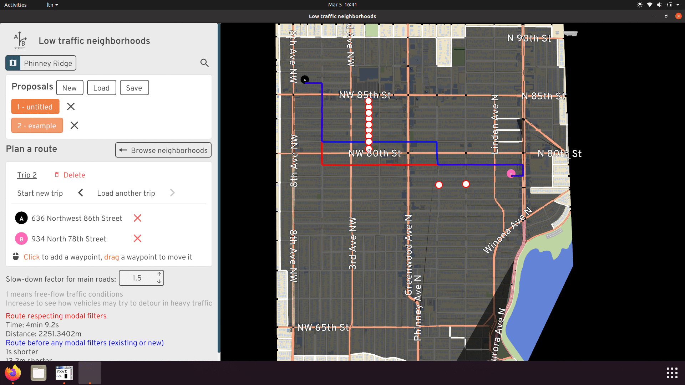

# Low-traffic neighborhoods

[**Launch the tool in your web browser**](http://play.abstreet.org/0.3.29/ltn.html?system/gb/bristol/maps/east.bin)

This tool lets anybody study existing and proposed low-traffic neighborhoods
(LTNs). Experiment with modal filter placement, and examine the impacts on
drivers trying to cut through residential areas.

**NOTE**: A user guide and video tutorials will be available eventually. This
software is updated every few weeks; see
[release notes](https://github.com/dabreegster/abstreet/releases). The best
documentation is currently
[AI:UK slides](https://dabreegster.github.io/talks/aiuk_ltn/slides.html).

The software runs faster if you install it. No mobile/tablet support. Unzip,
then run `ltn.exe` or `ltn`.

- [Windows](https://github.com/a-b-street/abstreet/releases/download/v0.3.29/abstreet_windows_v0_3_29.zip)
- [Mac](https://github.com/a-b-street/abstreet/releases/download/v0.3.29/abstreet_mac_v0_3_29.zip)
- [Linux](https://github.com/a-b-street/abstreet/releases/download/v0.3.29/abstreet_linux_v0_3_29.zip)

Contact <dabreegster@gmail.com> with any feedback or
[file an issue on Github](https://github.com/a-b-street/abstreet/issues/new).

## Features

### Modal filters

You can place new modal filters (planters or bollards) along streets or
diagonally in intersections. Filters will calm traffic along that one street,
but may just find detour around it. Only when you split the neighborhood into
smaller "cells" does the amount of through-traffic in the area get reduced.

<video controls>
  <source src="filters.mp4" type="video/mp4">
</video>

The tool also detects existing modal filters today, based on on OpenStreetMap
data.

### Rat-runs

You can explore individual paths through a neighborhood that drivers may take,
and a heatmap predicting which streets are likely to experience more or less
traffic.

<video controls>
  <source src="rat_runs.mp4" type="video/mp4">
</video>

### Plan a route

If you want to understand how filters will affect your driving commute, you can
explore a route before and after a proposal. Main roads are often the fastest
route anyway, but you can adjust the level of traffic jams to see when it may be
advantageous to take a shortcut through a neighborhood.

### Neighborhood boundaries

The tool starts by classifying everything inside "major roads" as a
neighborhood, where ideally there shouldn't be much through-traffic. But you can
adjust these boundaries however you like, merging two neighborhoods or placing a
local high street in the "interior" of your LTN, even if it serves lots of
traffic today.

<video controls>
  <source src="adjust_boundaries.mp4" type="video/mp4">
</video>

### Proposals

Once you create some filters or adjust neighborhood boundaries, you can save
your proposed changes. You can open and then compare multiple proposals. You may
also export all neighborhood boundaries and filters to the GeoJSON format, and
then work further in QGIS or your favorite tool.

**NOTE**: Proposals are only saved on your computer (in the `data/player` folder
for the downloaded version, or in your browser's local storage). There's no
support yet for sharing proposals online.

**NOTE**: Proposals saved with one version of the software might not work in
future versions. I'll aim to guarantee backwards compatibility by mid-March. In
the meantime, if you ever have trouble loading your previously saved work,
please contact me and I'll help.

### Limitations

The tool traces around areas surrounded by major roads, using this to determine
interior roads that should have minimal through-traffic. You can adjust the
default boundaries. Unfortunately, this feature is broken in some cities,
particularly where bridges and tunnels overlap other roads.
[Track this issue](https://github.com/a-b-street/abstreet/issues/857) for
updates on progress.

There are some advanced / experimental features that don't work yet:

- Automatically placing filters to optimize some definition of a "good"
  neighborhood
- Predicting the overall impact of a proposal on vehicle traffic in the area.
  This requires a high-quality travel demand model to know where people
  currently try to drive, and coming by these isn't easy.

### Other planned features

- Change between one-way and two-ways streets, which is a less common way to
  effectively introduce filters
- Overlay bus routes, and introduce bus gates (filters that buses can pass
  through)
- Visualizing and editing other traffic calming (speed humps, chicanes, curb
  extensions)
- Predict how much traffic will "dissipate" in response to LTNs, as people
  switch their travel behavior long-term.

## Credits

Main team:

- [Dustin Carlino](http://dcarlino.org): project lead
- [Cindy Huang](https://www.cindykhuang.me): UX design
- [Jennifer Ding](https://jending.com): training material and outreach

Alumni from A/B Street (the LTN tool is built upon past work):

- Michael Kirk
- Yuwen Li

None of this work would be possible without
[OpenStreetMap contributors](http://openstreetmap.org/about).

Inspiration / early testers giving great feedback:

- This tool was initially inspired by Brian Deegan's
  [workshop](https://www.youtube.com/watch?v=pHucS2F33W8&t=1052s) on LTN
  planning. We want to involve communities in planning local schemes, and get
  everybody collaborating to solve the same problems.
- [Cyclestreets LTN map using OpenStreetMap](https://www.cyclestreets.org/news/2021/07/25/mapping-ltns/)
- [Will Petty's QGIS tool](https://twitter.com/Microlambert/status/1454017200004739073)
- [Sustrans LTN guide](https://www.sustrans.org.uk/for-professionals/infrastructure/an-introductory-guide-to-low-traffic-neighbourhood-design)
- Design help from [Duncan Geere](https://www.duncangeere.com/) and [Fernando Benitez](https://fernandobenitez.co/)
- Robin Lovelace
- Many others...

This work was expanded from an initial prototype while Dustin worked at the Alan
Turing Institute, where he's funded by the UKRI grant for the ASG program.

### Current users

Planners from these cities are currently using a prototype of the software:

- Nottingham
- Lyon campaigning group

If you're using the tool and are willing to be listed here, please let me know,
so I can make the case for funding further development.

### Concept art

Our hope is that this tool makes it easier for communities to come together and
collaboratively design neighborhoods that work well for everyone. Special thanks
to Scriberia for illustrating this idea:

This image was created by Scriberia for The Turing Way community and is used
under a CC-BY 4.0 licence for reuse. Zenodo. DOI 10.5281/zenodo.3332807
