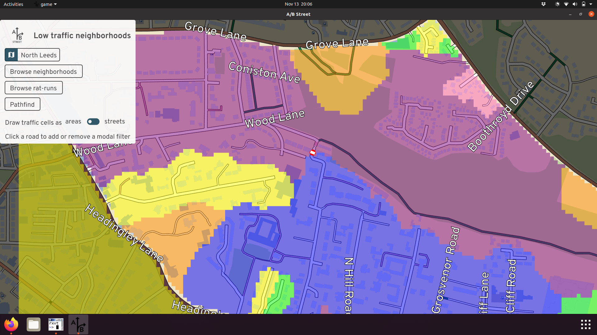

# Low-traffic neighborhoods

A work in progress, as of November 2021.

This tool will allow placing modal filters and understanding the resulting
impacts on vehicle traffic trying to cut through residential areas.

- [Web version](http://play.abstreet.org/0.3.2/abstreet.html?--ltn&system/gb/leeds/maps/north.bin)
