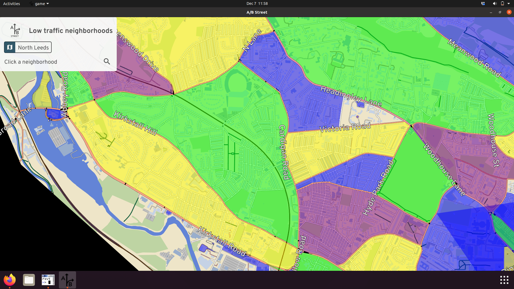
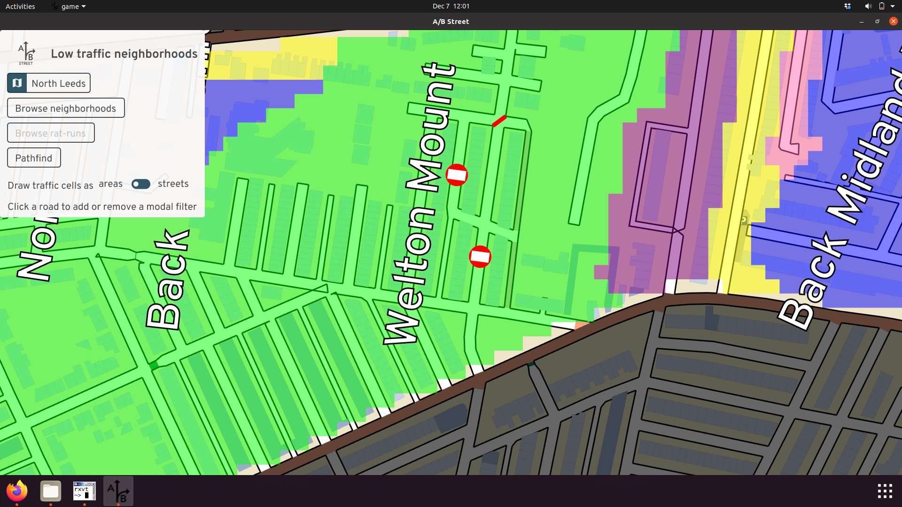
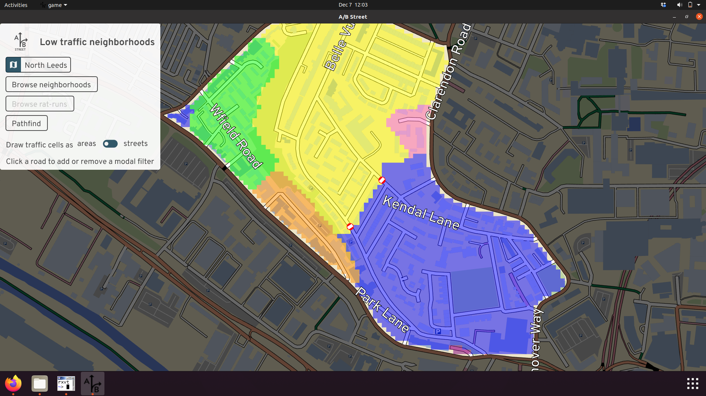
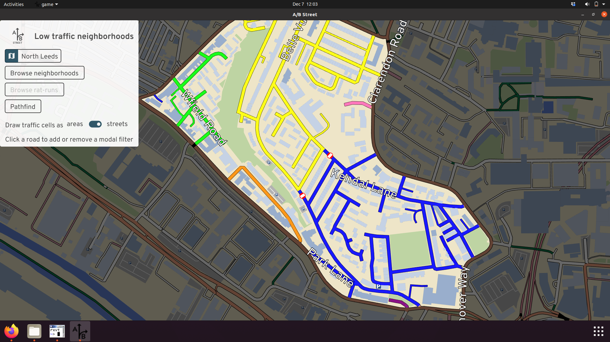
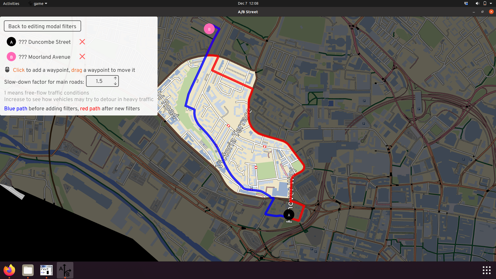

# Low-traffic neighborhoods

This tool lets anybody study existing and proposed low-traffic neighborhoods
(LTNs). Experiment with modal filter placement, and examine the impacts on
drivers trying to cut through residential areas.

WARNING: A work in progress, as of December 2021. Take results with a small
mound of salt.

- Try without installing:
  [web version](http://play.abstreet.org/0.3.8/ltn.html?system/gb/leeds/maps/north.bin)

The software runs faster if you install it. No mobile/tablet support.

- [Windows](https://github.com/a-b-street/abstreet/releases/download/v0.3.8/abstreet_windows_v0_3_2.zip)
- [Mac](https://github.com/a-b-street/abstreet/releases/download/v0.3.8/abstreet_mac_v0_3_2.zip)
- [Linux](https://github.com/a-b-street/abstreet/releases/download/v0.3.8/abstreet_linux_v0_3_2.zip)

Contact <dabreegster@gmail.com> with any feedback or
[file an issue on Github](https://github.com/a-b-street/abstreet/issues/new).

## Goals

Currently you can:

1. Select a "neighborhood," bounded on all sides by major roads. (We're working
   on support for drawing your own boundaries.)

2. Place modal filters (planters, bollards) along streets or diagonally at
   intersections

3. Visualize the connectivity of "cells" within a neighborhood. Where can a
   driver reach without leaving the neighborhood? This can be shown as an area
   or streets.

 

4. See how drivers may detour around new filters. You can adjust for different
   levels of queued traffic on perimeter roads.

### Planned work

- See LTNs and filters that exist today

- Adjust the "neighborhood" boundary however you like. The classification of
  "major road" is fuzzy. And maybe you want to place a local high street in the
  "interior" of your LTN, even if it serves lots of traffic today.

- Easily compare and share different schemes

- View shortcuts through a neighborhood that drivers are likely to take, and
  estimate how quiet / busy streets are today or would be after an LTN

- Model more types of filtering: bus gates and one-way interventions

- Simulate traffic in the area, for visualization purposes. This is tricky to do
  properly, requiring accurate traffic counts, origin/destination data, and a
  model for predicting how traffic will "dissipate" as people switch their
  travel behavior longer-term.

## References

- This tool was initially inspired by Brian Deegan's
  [workshop](https://www.youtube.com/watch?v=pHucS2F33W8&t=1052s) on LTN
  planning. We want to involve communities in planning local schemes, and get
  everybody collaborating to solve the same problems.
- [Cyclestreets LTN map using OpenStreetMap](https://www.cyclestreets.org/news/2021/07/25/mapping-ltns/)
- [Will Petty's QGIS tool](https://twitter.com/Microlambert/status/1454017200004739073)
- [Sustrans LTN guide](https://www.sustrans.org.uk/for-professionals/infrastructure/an-introductory-guide-to-low-traffic-neighbourhood-design)
