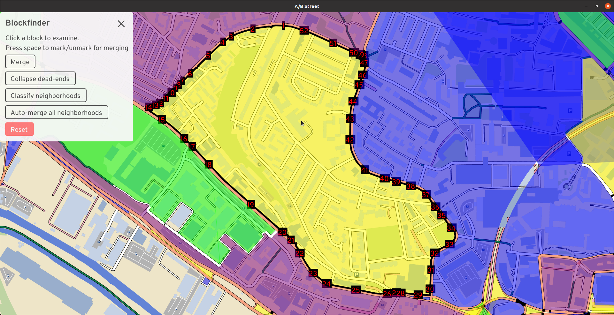
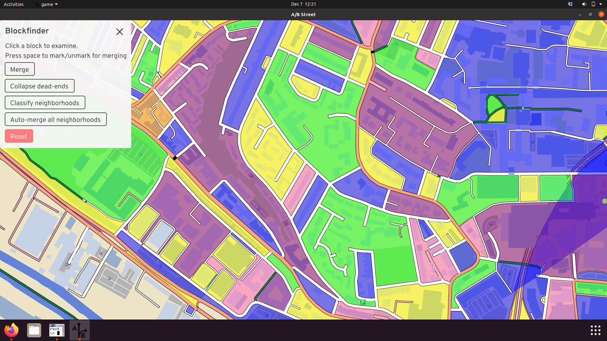
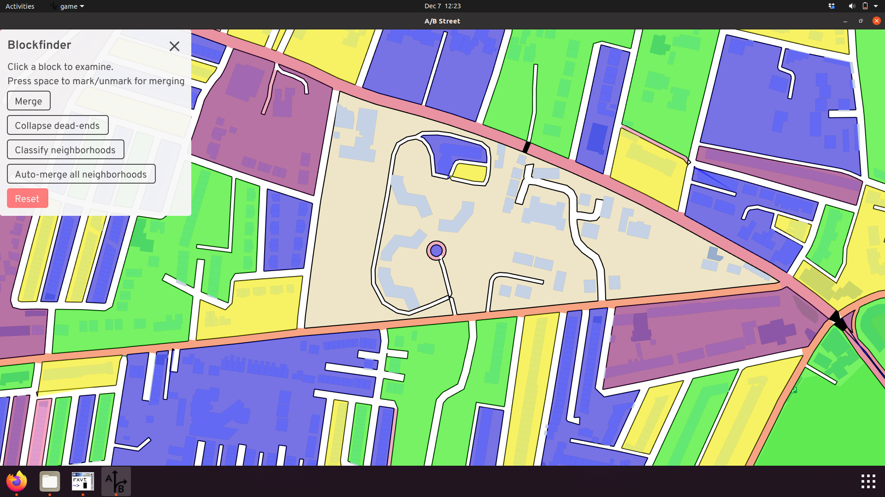
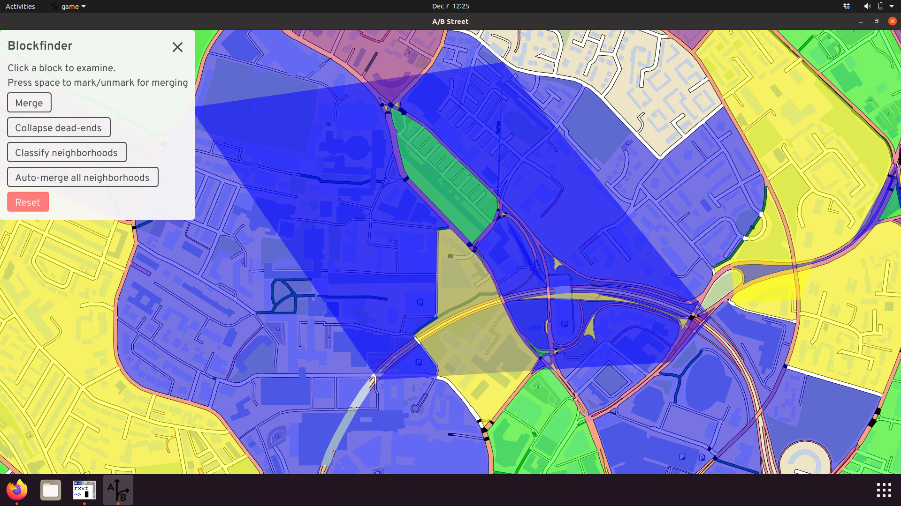
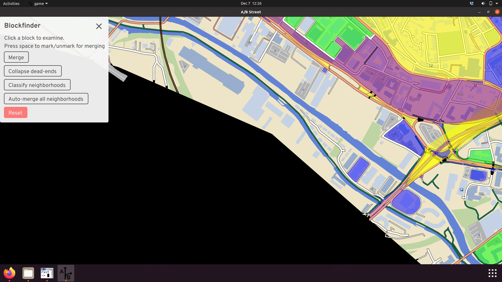
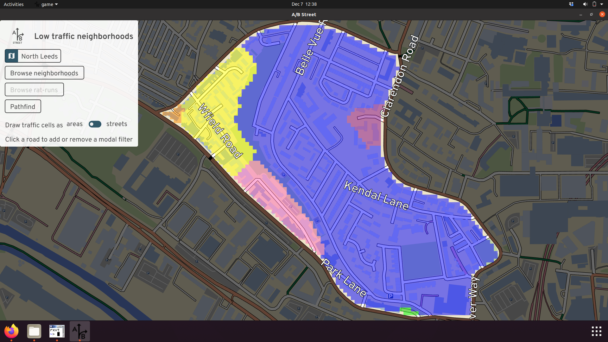

# LTN technical details

Since the tool is in such an early stage of development, this is a mix of "how
things work currently" and ideas for moving forwards.

## Neighborhood selection

The software operates on a single "neighborhood" at a time. This is defined by a
perimeter, which is a contiguous sequence of roads that form a loop, without any
gaps in the middle. This separates the map into an "interior" and "exterior,"
with border intersections connecting the two.

Internally, this is built up from individual "city blocks," that trace around an
area without ever crossing the street.

### Bugs

These underlying blocks have three major bugs currently. Some blocks are missing
entirely, because of internal geometry problems trying to trace:

Bridges, tunnels, and train tracks can produce blocks that appear to overlap in
2D space:

And we don't attempt to build blocks near the boundary of the map. If somebody
wants to study that area, they should import a new map covering more of the
area. We don't know what roads exist just outside the map, so it's not useful to
do any analysis.

### Next steps

We've heard overwhelming feedback that choosing the boundary of an LTN needs to
be much more flexible. Sometimes the software's guesses are flat-out wrong, due
to bugs, or improperly including large parks or lakes. Sometimes the major road
classifications in OpenStreetMap are inappropriate. And often, there are parties
interested in more ambitious schemes to "merge" two LTNs or create large ones.
We don't want the software to be prescriptive at all in this selection of
boundary road; people know best. So the plan is to allow for drawing custom
boundaries. To speed things up, we can also improve the built-in heuristics for
partitioning neighborhoods and let people select which OpenStreetMap highway
types should count as a "major" road.

## Cell connectivity

After picking a neighborhood, the tool groups all of the interior streets by
connectivity for motor vehicles. Within each "cell," a driver can reach all
streets without using a perimeter road. How does this work? Start from any
interior street, and "flood" out from that start position to find all reachable
streets. Don't search past perimeter roads. That's a cell. Repeat until all
interior streets have been visited. The reachability is based on motor vehicle
constraints, so streets classified as pedestrian- or bike-only and new modal
filters can't be crossed.

Initially, a neighborhood might be split into a few cells:

That blue cell is quite large, so drivers may be tempted to cut through to avoid
queues along the perimeter. Let's add a filter to stop them:

The cells didn't change, because there's a parallel street that's still open.
Adding a filter to just one street might not work -- drivers can just detour to
the other option. Let's fix that.

Now the blue cell is split into a yellow piece; the two aren't connected
anymore. The scheme is now "water-tight."

The cells are visualized as colored areas, inspired by many example LTN diagrams
floating around. But if that's confusing, you can just color the cells by street
instead:

The colors aren't meaningful; they're just meant to show different cells. There
may be cases when two adjacent cells have the same color, but they're not
connected -- that's just a bug we're working on.

## Routing

There's a pathfinding tool to see how driving routes will interact with a
neighborhood. The pathfinding itself performs a standard graph search,
respecting any turn and lane restrictions defined in OpenStreetMap. The
[cost function](https://github.com/a-b-street/abstreet/blob/b45bf869b7b037fefc075d19fb9ecd3d7dcacc86/map_model/src/pathfind/vehicles.rs#L271),
expressed in units of duration, is the distance divided by the speed limit. For
drivers, there's just one extra penalty that normally applies -- unprotected
right turns (in the UK) from a smaller to a larger road. This penalty is fixed
at 30 seconds currently.

According to this cost function, often the optimal route for a driver doesn't
even pass through a neighborhood. Major roads tend to have higher speed limits
in OpenStreetMap, so their cost is lower. This may not match reality -- during
peak hours, main roads might have long queues, and a driver armed with satnav
could try to cut through a neighborhood. So there's a toggleable slowdown factor
for main roads, which just multiplies the cost.

Here's an example of the results. With a slowdown factor of 1.5x, the blue route
shows that drivers might try to cut through this neighborhood. After we add some
modal filters, the blue route becomes impossible, and the driver is likely to
try the red route instead -- which actually cuts through the neighborhood on the
north end, because we haven't added filters there.

