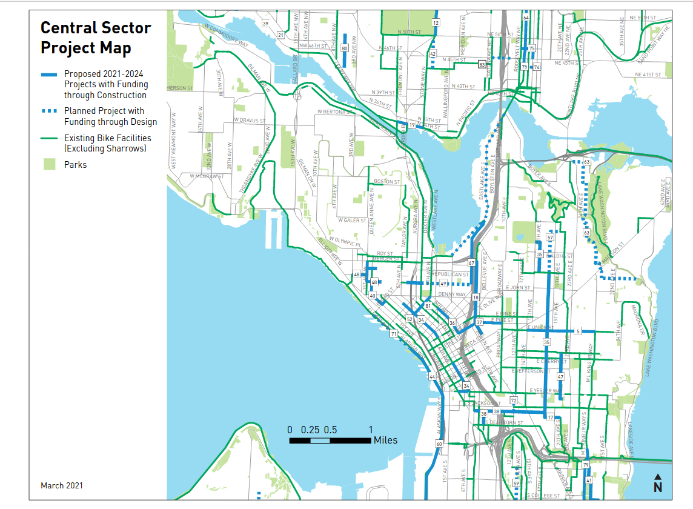
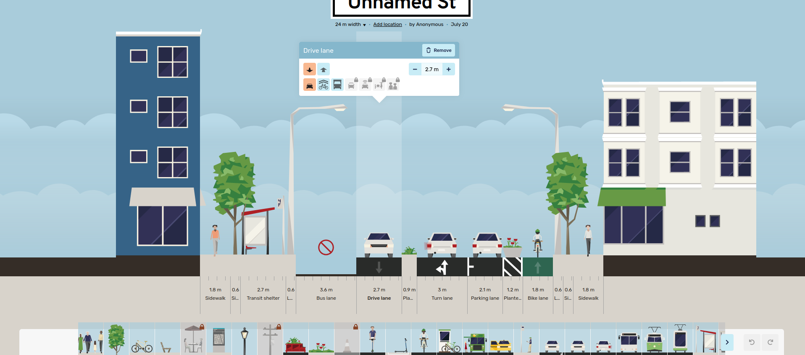

# Project motivation

This document will argue why this bike network software can help achieve the
UN's [Sustainable Development Goal 11](https://sdgs.un.org/goals/goal11) of
improving cities.

The [theory of change](https://en.wikipedia.org/wiki/Theory_of_change) summary:

- **Problem**: Car dependency harms the environment. Biking is one low-cost
  alternative. Cities need to build infrastructure to make it safe. Poor
  communication between stakeholders slows down these changes.
- **Activities**: This new "Ungap the Map" software will help stakeholders
  communicate more effectively.
- **Outputs**: Better plans for bike networks and increased civic engagement.
- **Outcomes**: Bike networks get built more quickly.
- **Impacts**: More people decide to bike, decreasing the environment impact of
  transportation.

## Driving is a problem

According to the EPA,
[29% of greenhouse cases in the USA come from transportation in 2019](https://www.epa.gov/transportation-air-pollution-and-climate-change/carbon-pollution-transportation).
Driving causes many other externalities -- noise pollution, an incredible amount
of space is used for parking, collisions kill many people, and incentivizing
driving reinforces suburban sprawl and unsustainable land use patterns. Even
though less people drove in 2020,
[more people died from car collisions](https://www.nhtsa.gov/press-releases/2020-fatality-data-show-increased-traffic-fatalities-during-pandemic).
Similar statistics can be found across most of the world. Many people have made
strong arguments that cities need to drastically reduce the use of personal
motor vehicles for trips.

A popular deflection currently is that fossil-fuel based cars are the problem,
and that electric vehicles will solve these problems. While they certainly help
with engine emissions, they still pollute due to
[tires](https://epha.org/electric-vehicles-and-air-pollution-the-claims-and-the-facts/)
and do nothing to help with the space consumption or safety problem. And
migrating the majority of gas cars to electric would be incredibly expensive!

Another false promise is autonomous vehicles. The technology is seemingly always
a few years away from wide rollout. Even once it's ready, there's a very real
risk that it'll just exasperate problems with suburban sprawl even more, by
letting people tolerate longer hands-off commutes. As Tom MacWright has
explained,
[beware the ethical car](https://macwright.com/2019/07/27/beware-the-ethical-car.html).

### The alternatives to driving

Major European and Asian cities have effective mass public transit, and some --
the Netherlands being the most famous example -- have a high percentage of trips
done via bicycle. The world isn't missing some new technology like autonomous
cars; car-centric places can just look at these existing places for inspiration
on how to design sustainable transportation systems.

Transitioning away from cars is a very complicated problem, and the solution
probably involves land use changes (allowing mixed commercial/residential use to
create 15-minute neighborhoods, and changing zoning laws to allow mid-rise
residential buildings where only single-family homes exist today), investing in
public transit (both local buses and regional high-speed rail), designing proper
spaces for walking and biking, and encouraging remote working and staggered
commute times. It's also important to discourage automobile use as these
alternatives become available, by ending gas subsidies, implementing congestion
charges around city centers, removing parking minimum requirements, and so on.

Many of these changes are expensive or very complicated and slow to implement.

### The case for biking

This project focuses on a small piece of the solution: biking. Both cost and
benefit motivate this. Amazingly,
[60% of trips in the US are under 5 miles](https://www.bikeleague.org/content/national-household-travel-survey-short-trips-analysis)
-- a range easily covered by a bike or an e-bike.
[This report](https://usa.streetsblog.org/2021/03/30/why-the-u-s-needs-a-bold-2030-mode-shift-target/)
estimates that urban transport emissions could be reduced by 7% if a modest 16%
of trips were shifted from driving to biking. Biking also gets people doing
moderate exercise, and it's even a low-impact activity for people with knee
injuries! The barrier of entry and cost is much lower than driving, making it a
more widely accessible option.

One of the main barriers stopping people from switching to biking is safety.
Most streets are designed for moving vehicles quickly and can be incredibly
unsafe for cycling. Luckily, the cost of reallocating the space on these streets
to separate cyclists from motor vehicle traffic is low, compared to building new
light rail lines or improving bus route frequency. In the extreme case, making a
road more comfortable to bike on can be done with very little money or time, via
techniques of [tactical urbanism](http://tacticalurbanismguide.com/about/). Some
advocacy groups or cities will set up a temporary demonstration of a changed
street by simply using signs and movable barriers for a few days, and in other
cases, these street improvements are even
[installed in the dead of night by citizen activists](https://www.seattlebikeblog.com/2013/04/04/guerrilla-road-safety-group-politely-installs-illegal-bike-lane-protectors-on-cherry-street/).

### Rising momentum

Right now, cities across the world are actively finding ways to reduce car
dependency. This is a ripe time to accelerate this culture shift. Some examples:

- [Paris has installed a huge number of new bike lanes, and seen usage skyrocket](https://archive.curbed.com/2020/1/15/21065343/bike-paris-cycling-anne-hidalgo)
- In the middle of the sprawling Phoenix metro area, the new
  [Culdesac](https://culdesac.com) project is building the US's first car-free
  neighborhood
- Many US cities are attempting [Vision Zero](https://visionzeronetwork.org/)
  plans to reduce the number of traffic fatalities
- [Birmingham](https://covidmeasuresbirmingham.commonplace.is/proposals/kings-heath-low-traffic-neighbourhood)
  is piloting a low-traffic neighborhood
- Advocates are pushing for a massive
  [car-free zone in Berlin](https://www.theguardian.com/world/2021/oct/06/berlins-car-ban-campaign-its-about-how-we-want-to-live-breathe-and-play)
- Many US cities transformed
  [streets into outdoor dining spaces](https://nacto.org/publication/streets-for-pandemic-response-recovery/emerging-street-strategies/outdoor-dining/)
  during COVID. This kind of change would never have happened politically a few
  years ago!
- Some US cities are considering
  [removing highways](https://www.nytimes.com/interactive/2021/05/27/climate/us-cities-highway-removal.html)
  that tear through the city center and have been historically used for
  [redlining](https://en.wikipedia.org/wiki/Redlining)

In short, the public imagination is picking up on these ideas. But this needs to
happen as fast as possible to transform cities into more sustainable places and
mitigate climate disasters.

## Barriers to change

So why isn't every city following Paris and building out a low-cost bike network
to encourage people to stop driving? The issue is often quite political -- if
city leaders build without the support of their constituents, they won't be
re-elected. The public very much are stakeholders. There's often quite fierce
opposition to building new bike lanes. Sometimes the arguments are based on
specifics -- some parking will be lost, and despite studies showing otherwise,
nearby businesses fear losing customers. (But these arguments rarely quantify
how much parking is available nearby -- largely because this data doesn't
generally exist without an on-the-ground survey.) Others make a very short-term
argument that vehicle traffic will be delayed by the reduction in lanes, and
this will actually increase pollution in the area. In other words, the concerns
raised are by individuals who don't buy into the idea of "mode shift" at all --
that the **purpose** of the new cycling infrastructure is to make driving a bit
less enticing and encourage people to move more sustainably. Some people quite
understandably feel "left out" by these transformations -- they've lived in the
city for a long time, moved around it in a certain way, and they feel threatened
by the changes. Making it safer to bike is inextricably tied up in this concern
about gentrification -- driving out long-time residents for younger, often
wealthier people who are seen as the target audience of the changes.

This is a really unfortunate miscommunication. Proper cycling infrastructure and
land use patterns make it very comfortable for all ages, abilities, and
demographics to thrive in a city. If cycling is just for young and athletic
people, why do people in the
[Netherlands between 18 and 75 years all have similar distances cycled per day](https://www.statista.com/statistics/620201/average-biking-distance-per-person-per-day-netherlands-by-age/)?
Driving a car is quite expensive, with insurance and maintenance, and children
or people with vision impairment are totally excluded. Cycling can be more
inclusive.

A strong theme in the rhetoric around resisting change is that "the new
infrastructure won't serve me individually." This view definitely ignores how
many people the changes _will_ serve. But it's also short-sighted -- if lots of
_other_ people switch away from driving, that's less cars on the road and less
traffic for the individual who wishes to continue. We all breathe the same air,
so reducing the vehicles on the road will benefit everyone. This is a
longer-term, broader consequence that's hard to understand.

Another problem with reasoning about incremental changes (often for just a
single stretch of road being redesigned) is ignoring the long-term vision.
Cities use "master plans" and other long-term planning documents to communicate
the overall direction, and may explain the individual changes in context of this
vision. But if that story isn't effectively told, then the public can wind up
arguing too much about the details.

In other words, I'm arguing that one of the biggest problems is around
communication. If city leaders could more effectively market a proposal to their
constituents, and if the public was better educated about the indirect
consequences of these changes, I believe the political will to deliver changes
would gain traction.

Let's look at how this communication happens today.

### Large-scale changes

As a first example, let's look at
[Seattle's bike master plan](https://www.seattle.gov/transportation/document-library/citywide-plans/modal-plans/bicycle-master-plan),
which describes what the bike network will look like by 2024. The official
documents include a
[PDF](https://www.seattle.gov/Documents/Departments/SDOT/BikeProgram/BMP_Imp_Plan_2021_FINAL.pdf)
that has an overview map, which can't even show the road names by virtue of
being a fixed image:

There are maps showing more detail in different areas:

And tables summarizing some new routes:

The official page doesn't link to any web map, but digging around reveals an
[ArcGIS map](https://data-seattlecitygis.opendata.arcgis.com/datasets/f5b80ce716bc437c9a231d8e99f069bb_2/explore?location=47.619800%2C-122.338100%2C11.62):

This is a little better, but it's overall pretty tough to just zoom into a road,
see at a glance what it looks like today, and see what the promised changes
by 2024.

A second example is Seattle Neighborhood Greenways, an advocacy group,
describing which streets they'd like to see changed to prioritize people walking
and biking, as a way to encourage exercise and social distancing during COVID.
Their plans are
[a layer on top of Google Maps](https://www.google.com/maps/d/viewer?mid=1HQMnagRf8EbS1nouqCMLl4LZr0QE8VrC&ll=47.641281552786445%2C-122.31769816918946&z=12):

People are accustomed to interacting with maps by routing, to see what their
particular trip might look like. None of these solutions let you plan a trip and
compare how things might look before vs after the changes. As an individual, I
want to know if these plans will make it safer, let me avoid hills, or let me
comfortably bike past a commercial district. I have to interpret these planned
changes and apply them to my particular situation. Or if I care about broader
impact, these documents fail to sell me on the benefits, "we forecast that
200,000 weekly trips will likely start biking instead of driving if we make
these changes. That could lower PM2.5 pollution by 3%..."

These methods of communication are also very "dry" -- they do nothing to paint a
picture or tell a story about how awesome the city will be once this is built.

### Individual projects

Let's examine plans to
[install a "lid" over the 520 highway in Montlake, Seattle](https://wsdot.wa.gov/projects/sr520/montlake/home).
The plans show a new park where there used to just be a loud, unpleasant road.
This is better in terms of visioning! But advocacy blogs have called out some
important questions about these plans -- how long will it take for a pedestrian
to wait for a light and cross from the west to east side (from a residential
area to a light rail station)? In other words, what's the actual experience of
just moving through the space as a pedestrian? A static map or diagram is going
to have a hard time communicating this.

Visualizations of changes also tend to be very high-level or very low-level, and
switching between the two views is difficult. For
[changes around Green Lake](https://www.seattle.gov/transportation/projects-and-programs/programs/maintenance-and-paving/current-paving-projects/green-lake-area-paving-and-safety-projects),
here's an overview map:

And a CAD drawing:

One of the best examples communicating changes I've found is San Francisco's
[Golden Gate park story map](https://storymaps.arcgis.com/stories/c44dfec403664e0ca3d2af6bd048b2ae):

### Gathering public feedback

Besides just asking people how they feel about some proposals, sometimes
governments directly solicit ideas from people -- a form of crowd-sourcing.
Seattle's
[Your Voice, Your Choice](https://www.seattle.gov/neighborhoods/programs-and-services/your-voice-your-choice)
is an example, where people can drop pins on a map, describe a problem and
possible solution. This program is meant for low-cost, "spot fixes" like making
a certain intersection safer.

Probably the state-of-the-art in public engagement is
[Streetmix](https://streetmix.net), a very easy-to-use and fun website that lets
you rearrange space along a single street. People routinely share ideas through
Streetmix, and public agencies often explain changes using it. The sheer
ease-of-use and strong visuals are keys to its success -- the creators have a
strong design background, and it pays off. Proposals in Streetmix have even
become reality --
[Bogota gathered 7,000 proposals](https://thecityfix.com/blog/how-bogota-is-turning-7000-citizen-proposals-into-a-real-plan-to-redesign-a-major-thoroughfare/)
from the public, then settled on something based on these designs.

Members of the public aren't experts in transportation engineering, so why not
leave the work to the professionals?
[Laura Adler](http://www.govtech.com/data/SimCities-Can-City-Planning-Mistakes-Be-Avoided-Through-Data-Driven-Simulations.html)
writes "Only with simple, accessible simulation programs can citizens become
active generators of their own urban visions, not just passive recipients of
options laid out by government officials.". Individuals _are_ experts at some
slice of the city, since they interact with it every day. It's unlikely city
planners know every corner of the city as deeply as everyone else combined, so
incorporating their experiences is important.

Besides generating better proposals,
[participatory design](https://en.wikipedia.org/wiki/Participatory_design) can
also decrease resistance to change.
[Brian Deegan](http://www.urbanmovement.co.uk/brian-deegan.html), one of the
UK's leading street designers, describes this
[during a workshop for planning low-traffic neighborhoods](https://youtu.be/pHucS2F33W8?t=1684).
When he frames things as a puzzle -- "The number of cars has doubled in the last
few years, they just don't fit, we have to fix this somehow" -- people set aside
their personal biases and just treat it as an abstract problem to solve. As a
result, everyone in the room feels more invested in the ideas produced.
"Gamifying" the planning process could be powerful.

## How this project can help

A/B Street in general and this bike tool in particular are an attempt to:

1. help different stakeholders communicate more effectively
2. visually inspire people to see what their city could become
3. increase public engagement in transportation planning and amplify voices

Some example "success stories" might look like this:

1. City planners use the software to sell the public on existing plans that're
   facing the threat of budget cuts
2. Advocacy groups help amplify that message
3. Support for the plans grows, people vote to fund it

Or:

1. The government is struggling to implement a contentious low-traffic
   neighborhood plan. A vocal minority of the public is demanding the changes
   are cancelled.
2. The city organizes an online "competition" to design the best compromise,
   using the new software
3. People self-organize and debate their competing solutions to a shared puzzle,
   focusing on the details specific to their area
4. The government adopts the winning solution and people accept it more readily,
   **because they've been forced to work through the trade-offs of alternatives
   themselves**

To clarify, A/B Street isn't meant to replace any internal CAD or engineering
processes that the city already internally uses. It's meant for rapid
prototyping and communication; it's a new first step in the design process.

### Prior art

Other software exists for related problems. But nothing other than A/B Street:

- visualizes as much detail about existing street layout and bicycle facilities
- lets users easily mock up changes to a bike network, and route using the
  changes
- works anywhere in the world without substantial setup time
- is free and available to anybody

[Streetmix](http://streetmix.net) is a huge inspiration behind A/B Street. But
it only focuses on an individual street segment; it can't show how bicycle
infrastructure exists in context of an entire city.

[Remix](http://remix.com) has some similar goals, but it's meant for different
city agencies to internally collaborate. It's expensive, unavailable to the
public, and cities are only just starting to use it for public communication.

[PTV Vissim](https://www.ptvgroup.com/en/solutions/products/ptv-vissim/) is an
industry-standard traffic simulator. Many of its customers use it to calibrate
traffic models and plan changes. But it's extremely expensive and very difficult
to use, especially when initially setting up in a new city.

[MATSim](https://www.matsim.org) and [SUMO](https://www.eclipse.org/sumo) are
open source traffic simulators that can run anywhere in the world. However,
they're hard to setup and use, not focused on visualization, and can't easily
prototyping changes to roads. They also don't run in web browsers, a further
barrier towards people that aren't tech-savvy trying them.
