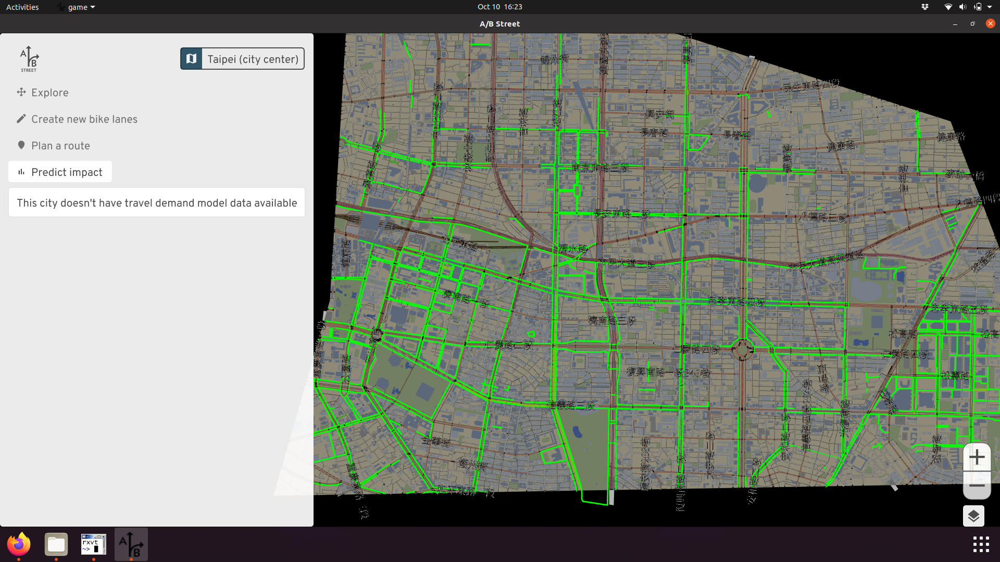
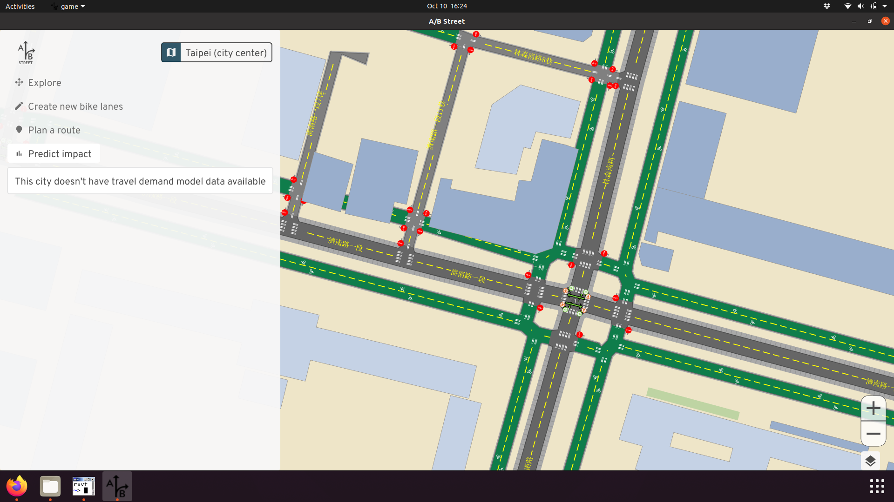

# Technical details

This document summarizes how the Ungap the Map tool works. The tool is just one
piece of the A/B Street platform, which has [much more](../../tech/index.md)
technical documentation.

## System overview

<!-- refactor/lift this -->

A/B Street is generally organized into 3 layers. The lowest is the map model,
which represents the transportation network of some portion of a city. This
model combines the geometry of roads and intersections, routing for different
vehicle types, and semantics like turn restrictions, parking, traffic signal
timing, and land use patterns. In some regions, there's also a travel demand
model describing the trips that people regularly make. Lane configuration,
intersection control policy, and access restrictions can all be changed in
real-time (usually sub-second). You can think of the map model along with the
travel demand as a digital twin of the city, at least from a transportation
perspective.

A map and travel demand scenario are just files covering some manually-drawn
boundary. The map has "borders" along the boundary, and the travel demand model
can describe trips beginning or ending off-map somewhere. There's a complex
process to generate a map, pulling in and heavily processing data from
OpenStreetMap, different travel demand sources, city-specific datasets about
parking, and elevation. All of the datasets are public. This process works for
any city with sufficient OpenStreetMap coverage, but it still takes lots of work
to improve the imported map. Many cities have already been imported and stored
in Amazon S3; most users will never need to perform this process themselves.

The next layer is a 2D rendering and user interface library, written from
scratch on top of OpenGL. These libraries have common code for interacting with
the map in many ways, and managing things like downloading files for new cities.
There's also a traffic simulation in this layer, although the bike network tool
doesn't use it. Everything in A/B Street is written in
[Rust](https://www.rust-lang.org). One advantage of this is that everything can
run either natively on Mac, Windows, or Linux, or be compiled to WebAssembly and
run in web browsers without any installation.

Finally, the third layer consists of user-facing apps that make use of
everything. The bike network tool lives here, alongside tools that're focused on
related topics like 15-minute neighborhoods and low-traffic neighborhoods.

## Sharing proposals

When the user adds bike lanes to some roads, all of the changes are saved
locally as a JSON file. Since the tool's goal is for people to communicate about
their ideas and spread the word, there has to be some way for them to share
these files. This could be done manually by email or something else, but that
would be really painful. So the software can upload the files to a central
server, and people can just share a URL to download the file later.

Ideally, this feature would include a proper user account system, where people
can sign up, modify their proposals, and maybe even share comments or feedback
about other proposals. There are many technical and design challenges with this
-- for example, how to prevent abusive users from posting rude comments? In the
long-term, this is worth tackling, with careful design to facilitate useful
interactions.

But to get something working in the meantime, the JSON proposals can just be
shared anonymously. They're uploaded to a central server, which returns a URL to
share. Somebody else can load the proposal with that URL. Everybody remains
anonymous; it's impossible to prove who uploaded a proposal, or to edit or
delete it. The [central server](https://github.com/a-b-street/yimbyhoodlum) is a
simple Go API hosted in Google App Engine, storing files in Google Cloud
Storage, and using MD5 checksums to identify and de-duplicate proposals.

## Routing

Unsurprisingly, A/B Street uses
[Dijkstra's algorithm](https://en.wikipedia.org/wiki/Dijkstra%27s_algorithm) to
find paths. The interesting details are how the graph's edge weights are set for
bicycles. The weights are expressed in units of time, guessing how long it'll
take the typical cyclist to cross a road or turn through an intersection. This
is usually just `distance / speed`. The speed accounts for elevation, and
[the calculation](https://github.com/a-b-street/abstreet/blob/5f75656cc3760436659eb731106f9f886a6339e2/map_model/src/traversable.rs#L258)
is adapted from the Valhalla routing engine. See the
[vehicle_cost method](https://github.com/a-b-street/abstreet/blob/master/map_model/src/pathfind/vehicles.rs)
for specifics.

Additionally, the user can specify preferences to avoid steep hills or stressful
roads. Steep hills are defined as having over 8% incline, and when one is
encountered, the cost to cross it is multiplied by 2. Note this multiplication
happens _after_ adjusting the typical biking speed to account for the incline.
Stressful roads are similar -- if a road is classified as an arterial or highway
and lacks bike lanes, the edge weight is multiplied by 2. There are many
possible ways to tune these parameters; the current implementation is simple,
but produces results that match personal experience around Seattle.

Note the mode shift calculation instead uses
[contraction hierarchies](https://en.wikipedia.org/wiki/Contraction_hierarchies),
which require an expensive one-time preparation step, but answer queries
**much** faster than Dijkstra's. On most of the Seattle maps, the travel demand
models require at least 100,000 paths!

## Adding bike lanes

The user can edit an individual road segment in detail, configuring individual
lane widths. But of course this is really tedious, so most people will probably
use this tool to automatically add lanes to an entire path at once. This tool
shouldn't require the road to be physically widened -- this is incredibly
expensive, and often there's no room to expand in the middle of a city. So
instead, the heuristics try to replace existing street parking or extraneous
driving lanes. In reality, OpenStreetMap data isn't high-fidelity enough to
capture the real width of a road. Often a driving lane might be 15 feet wide,
and there's plenty of room on the shoulder to at least paint a lane. See the
[heuristics and unit tests](https://github.com/a-b-street/abstreet/blob/5f75656cc3760436659eb731106f9f886a6339e2/game/src/ungap/quick_sketch.rs#L163)
for details.

## Predict impact

This is the most complex piece, due to the number of assumptions made.
Particular thanks to [Robin Lovelace](https://www.robinlovelace.net) for
[lots of advice](https://github.com/a-b-street/abstreet/issues/448) here.

For a planner to evaluate building out a proposed bike network, the key question
is: how many people will use it? This is an incredibly open-ended research
question. For example, there might be some people today who live in an area
where driving is the only reasonable mode of transport, but they don't have
access to a vehicle or have an impairment preventing them from driving. They
might choose (or be forced to) work remotely in this situation, and wait to
car-pool for groceries. If cycling became a cheap and safe possibility, they
might start taking entirely new trips -- this would be a positive instance of
[induced demand](https://en.wikipedia.org/wiki/Induced_demand). Over time, if a
city becomes friendlier to walking and biking and builds more affordable
housing, travel patterns may change dramatically as people decide to live and
work in the city, instead of commuting from the suburbs. This long-term,
region-scale forecasting is the domain of groups like the
[Puget Sound Regional Council](https://www.psrc.org/activity-based-travel-model-soundcast).

### Mode shift: part 1

So let's narrow our focus and just consider "mode shifting" existing trips that
people currently perform by driving. We start with a
[travel demand model](../../tech/trafficsim/travel_demand.md) describing
individual people's typical weekday schedule. The schedule defines a sequence of
trips, with specific locations, departure time, and mode of transport. The tool
first filters these trips to find all driving trips happening entirely within
the map boundary. (If a trip begins or ends somewhere off-map, we don't really
know its full distance and can't evaluate relevant factors along the whole
journey.)

### Mode shift: part 2

Once we've found the initial set of driving trips, we have to figure out which
ones would even consider switching to biking. If somebody drives somewhere in 10
minutes now, it's unlikely they'll be willing to bike for an hour, especially if
they have to climb steep hills. That's the intuition behind the
[Propensity to Cycle tool](https://www.jtlu.org/index.php/jtlu/article/view/862),
which calculates a distance and hilliness decay model to predict the percentage
of trips that would consider biking. Currently the software defines a hard
threshold for these two parameters -- the user can specify the maximum time
someone is willing to bike, and the max elevation gain they'll endure. In the
future, we can change this to use the decay functions from that prior research,
and use data particular to different regions to make this more evidence-based.
For instance, as e-bikes become more popular, hilliness becomes a less important
factor.

### Mode shift: part 3

Based on those settings, the software will calculate all of the biking routes
that the filtered trips would take. The question then becomes, why don't those
people choose to bike today? The barrier this project focuses on is safety --
even if the most direct cycling route isn't long or hilly, many people aren't
willing to risk riding alongside heavy traffic when the street isn't designed
for that.

So the tool first displays a red heatmap showing a count of all of the roads
where trips **would** switch, if it was safer. This guides the user to consider
adding lanes there.

Then the tool calculates if the proposal makes each trip safe enough. Currently
this just sees if even one road segment of the trip now has infrastructure, but
this will be made configurable soon!

### Carbon score

Finally we have an estimate of which trips might switch from driving to biking!
So we can sum up the total mileage of the driving route, multiply by 5 days a
week, and 52 weeks a year. This gives us the annual vehicle miles travelled that
a proposal will remove. Assuming
[404 grams of CO2 per mile](https://www.epa.gov/greenvehicles/greenhouse-gas-emissions-typical-passenger-vehicle#driving)
-- since we don't have more details about the distribution of vehicle types
available -- we can estimate the annual CO2 savings.

## Caveats and assumptions

This software aims to do something pretty complicated, based on imperfect public
data, and was built by a tiny team. So naturally it has many problems, but
hopefully the goal is still achieved. Regardless, let's be clear about some
limitations.

### Map data

First, OpenStreetMap is produced by volunteers. The tagging schemas can be quite
complicated, and detailed lane data is often missing or wrong. Road width is
almost never mapped directly. A/B Street tries to workaround these issues with
aggressive heuristics.

You'll notice many parts of the map look visually broken, especially near major
junctions. That's because
[generating intersection geometry](../../tech/map/geometry/index.md) is
incredibly hard.

One particular problem is how protected bike lanes are mapped. In OpenStreetMap,
these are represented as separate, but parallel, objects from the main street.
This usually appears in A/B Street as the cyclepath just overlapping the road in
a completely broken way. "Snapping" the parallel objects together and treating
as one road segment is the goal, but
[this is very hard](https://github.com/a-b-street/abstreet/issues/330) and
ongoing work. The routing **should** still be able to use the separate
cyclepaths, and so things like mode shift calculations should still be fine.

### Travel demand data

The impact prediction needs to know trips people take in order to guess which of
those trips might mode shift from driving to biking. For Seattle, we use
[Soundcast](https://www.psrc.org/activity-based-travel-model-soundcast), but
notably the model is only available for 2014, which is quite out-of-date!

### Elevation data

A/B Street uses
[this Python library](https://github.com/eldang/elevation_lookups) to process
elevation data and figure out which streets are steep. Currently the results are
quite realistic in Seattle, thanks to King County LIDAR data. Everywhere else,
currently NASA's SRTM is used, and the results don't seem to be working yet.
Additionally, elevation data near bridges is usually messed up, with the bridge
suddenly having the ground or water's elevation, and we're not working around
this problem yet.

### Regional differences

Although A/B Street can work anywhere in the world, its model of roads and
travel behavior along them makes some assumptions more tuned to North America
and the United Kingdom. A notable example where these assumptions break down is
in Taipei. If you look at A/B Street, it seems like there's a phenomenal network
of dedicated cyclepaths along most major roads!

But actually, these are just the sidewalks. Cyclists and pedestrians share this
space, and may come into conflict if many people switch to cycling.

Apparently there were some efforts some time ago to install dedicated bike lanes
on the roads, but not many people used them, because there's less shade from the
sun during summer. In my own research about biking in Taiwan, I didn't discover
anything like this; it took local knowledge from the hackathon organizers to
clue me in! (Later, I found a
[bit more about the history of biking in Taipei](https://www.theguardian.com/cities/2016/mar/15/bicycle-kingdom-reborn-pavement-cycling-taipei-taiwan).)
Barriers to cycling uptake vary across the world. Also, in Taiwan, smaller
vehicles like mopeds and bikes use
[hook turns](https://en.wikipedia.org/wiki/Hook_turn), which should affect
routing and simulation. But A/B Street doesn't model this yet.

### High-stress roads

One of the key metrics for evaluating a cycling route in the software is how
much of it crosses high-stress roads. Currently that's just defined as a "major"
(arterial or highway) classification without any bike lanes. There are much more
rigorous ways to define stress, such as the one by
[People For Bikes](https://bna.peopleforbikes.org/#/places/0ea909ec-0b15-4bae-b593-a40da8a72312/).
Quickly comparing the results from this tool and A/B Street, we mostly agree,
though.
