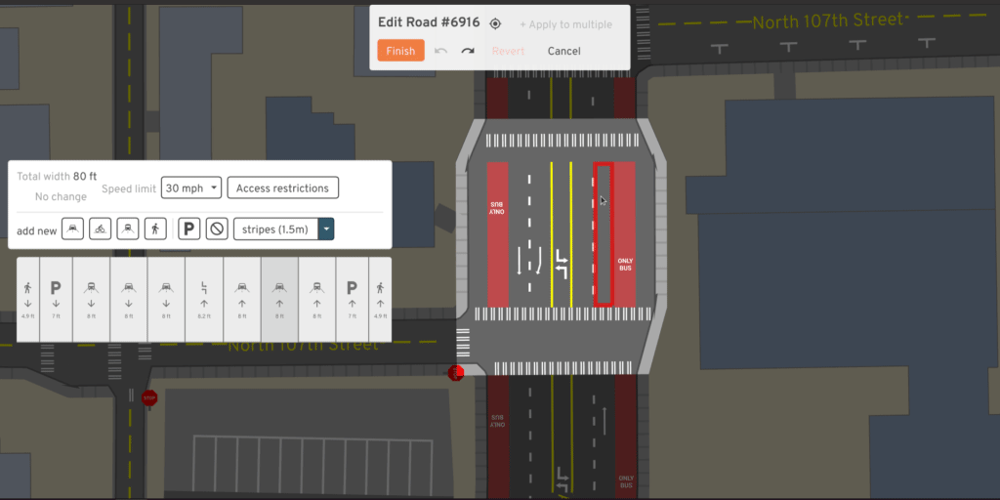

# User guide

You can use the different parts of this tool in any order you like, but the
recommended flow is:

1.  Start by exploring the existing bike network in your city. Try zooming in to
    see detail about how street space is currently used!
2.  Go plan a trip to see what trade-offs between safety and speed you might
    experience biking today. You can save these trips to later evaluate your
    proposal.
3.  Create new bike lanes where you think they should exist!
4.  Check your trips again, to see if the most direct route is now safer.
5.  Use the "predict impact" mode to estimate how many other people might make
    use of your changes.
6.  Upload your proposal, then share on social media or start a conversation
    with your local city government or advocacy groups!

## General tips

This software can run in your web browser without any installation. If the
loading times are slow,
[install and run](https://github.com/a-b-street/abstreet/releases) for a much
faster experience, especially for larger areas. There's no support for mobile
devices yet.

You can move around the map just like most digital maps. Click and drag to pan
around. To zoom in, just scroll with your mouse or touchpad, double click, or
use the buttons in the corner. This map shows much more detail when you zoom in
-- give it a try!

The map works anywhere in the world. You can use the button at the top to change
regions. Many cities have already been set up. If you're using the downloaded
version, you can also import another region yourself. (Sorry, no web support for
that yet.) If you want any help importing your region,
[file an issue](https://github.com/a-b-street/abstreet/issues) or contact
<dabreegster@gmail.com>.

## Exploring the map

### Types of bike infrastructure

If you open the layers in the corner, you'll see that bike infrastructure is
divided into 4 categories. Dedicated trails are usually the most segregated from
motor vehicles, and are often shared with people walking. In most cities, most
bike facilities are directly on the street, alongside traffic. Protected bike
lanes have some kind of buffer protecting cyclists from other vehicles --
sometimes concrete barriers, but often just about a foot of paint and some
flexible bollards. Painted lanes have no protection from traffic; cyclists just
have to trust vehicles not to cross a thin line of paint. Often painted lanes
are located very close to street parking, forcing cyclists to ride in the "door
zone," where somebody in a parked car might suddenly open their door and block
the lane.

Greenways are streets where vehicles and cyclists share the same space. The city
has designated these as low traffic, and there might be small traffic calming
measures to discourage high-speed traffic -- like speed bumps, slaloms, curb
bulbs, small traffic circles, and signage. These routes have different names
across the world -- Stay Healthy Streets, neighborhood greenways, low-traffic
neighborhoods, slow streets, etc. In a place like Seattle, these streets are
very narrow because of cars parking on both sides, so when a cyclist and an
oncoming vehicle need to pass each other, both have to slow down. In the
author's opinion, it doesn't feel like the cyclist really has any sort of
priority here.

Finally, some cities use "sharrows," or painted markings, on general-purpose
lanes to indicate to drivers that they're supposed to share the road. These
aren't reflected in the map at all, because they're not real infrastructure.
Studies have shown they can actually
[make things worse](https://www.bloomberg.com/news/articles/2016-02-05/study-sharrows-might-be-more-dangerous-to-cyclists-than-having-no-bike-infrastructure).

### Understanding elevation layers

Many places are flat or have widespread adoption of e-bikes. But in cities like
Seattle and San Francisco, the city is arranged on steep hills, which can deter
people from cycling for commuting. If you open the layers panel, you have two
ways to understand how the topography affects biking.

The elevation layer draws a contour map, drawing higher elevation in red. You
can quickly get a sense of how the city is arranged, and discover unexpected
flat "shortcuts" when the streets aren't aligned to the hills!

You can also check the incline on individual street segments. The arrows point
uphill.

Note the elevation data is high-quality for Seattle, but has
[issues in the rest of the world](tech_details.md#elevation-data). And the
estimated incline on bridges is usually wrong!

## Planning a trip

Use this mode to plan a cycling trip. Just click the map to add waypoints, or
drag the waypoints to adjust.

### Saving trips

You can name each trip, then save it. This is useful to define "test cases" for
evaluating how well the bike network serves the trip. The sample trips could be
based on your own commute, or trips you know are common -- like from a
university to the popular night-life district.

### Preferences

When you plan a bike route, you usually have to make a trade-off between time,
hilliness, and stress. The fastest, most direct route often forces you to ride
alongside high-speed traffic. Often the safer route will avoid major roads and
take longer, and maybe also force you to climb steeper hills.

By default, the most direct route is shown. You can change your preferences with
the checkboxes. Alternative routes are also shown, and if you hover over one,
you can compare to the direct route.

### Details

Besides showing you the distance and estimated time of a route, the tool also
tells you how comfortable the trip might be. You can see which segments of the
route travel on high-stress roads, which are defined as major roads without any
dedicated bike lanes. You can also explore the elevation profile of your route,
see the number of traffic signals you'll encounter, and check any potentially
difficult turns.

## Creating new bike lanes

Once you know where you'd like to add new bike infrastructure, use this tool to
quickly sketch it up. Click the start and end of the path you want to modify,
then you can adjust by dragging intermediate points.

You can choose what type of bike lanes you want to add. Just painting lanes
takes the least amount of space, but adding some kind of barrier makes them much
safer. The software makes best guesses at the existing width of the road, and
adding bike lanes should never physically increase that width, but there may be
errors. Generally the tool will try to replace street parking first, then
sacrifice a driving lane if there are multiple. If there's no room (according to
the imperfect data) to add lanes, the tool won't make any changes. You can
always use explore mode to edit the road individually to fix up any problems.

Also note some roads fork off into separate pieces when there's some kind of
physical median. When you select a route to modify, this only traces one
direction. You might need to repeat for the other side.

### Proposals

Once you make changes to the map, you can save and load them. Maybe you have a
few different alternatives you'd like to try, or you'd like to compare your
ideas when your city's official plans.

You can also upload your proposal and share the URL with others. Note that
proposals are uploaded anonymously, and when you make any changes, you have to
upload again and share a new URL.

### Editing roads in detail

If you zoom into an individual road, you can click on it to edit. With this
mode, you can customize the width of each lane and other details. If you're
focused only on a small area, this might be useful. But if you're interested in
quickly sketching over a large area, use the "create new bike lanes" mode.

## Predict impact

Evaluating your proposed network against a few sample trips is useful, but from
a planner's perspective, you want to predict how many people will make use of
the new infrastructure. This tool analyzes all short driving trips in the area,
then calculates which of them might decide to switch to cycling. This feature
only works in Seattle or the UK, where we have a travel demand model describing
the population's existing commuter patterns.

There are [many assumptions](tech_details.md#predict-impact) going into this
calculation. You can adjust many of these parameters yourself. The first bar
shows all of the driving trips in the area. First you have to decide which of
them would even consider switching. Based on existing research, the two main
factors are the time the biking trip would take instead, and the amount of hills
encountered. People with a quick, comfortable drive today are unlikely to bike
for a long time up steep hills.

The middle bar changes to show you how many of the trips would consider
switching, based on these settings. Now the question becomes, if these trips
wouldn't be so inconvenient for people to bike, what's stopping them today? Of
course there are many factors, but the one this software focuses on is safety --
the direct cycling route encounters too many high-stress roads without any bike
lanes. The red heatmap shows you these problems, ranking which roads are the
most important to fix, based on the number of trips that're prevented from
switching.

In response to your proposed network, the final bar guesses how many trips would
switch to biking if your changes were built. Then, to quantify the environmental
impact, the miles spent driving currently are added up, repeated every weekday
for a year, and converted to CO2 emissions. If your proposal comes to life, this
is what might be saved.
