# Deep dive into devilish details: Intersection geometry

_By Dustin Carlino, last updated September 2021_

Some of the things in A/B Street that seem the simplest have taken tremendous
effort. Determining the shape of roads and intersections is one of those
problems, so this article is a deep-dive into how it works and why it's so hard.

Note: The approach I'll describe has many flaws -- I'm not claiming this is a
good solution, just the one that A/B Street uses. If you see a way to improve
anything here, let me know about it!

<!-- toc -->

## Trying this out

Originally I wanted to embed code in this article and have interactive demos to
explore each step. That level of ambition fell through, but there is a geometry
debugging tool, running in your browser (with WASM and WebGL required):
<a href="http://play.abstreet.org/dev/map_editor.html?input/us/seattle/raw_maps/aurora_central.bin&--cam=17.39/47.68621/-122.32484" target="_blank">launch
the tool</a>.

The tool wasn't designed for ease-of-use, so some hints on using it:

1.  Click and drag to move, scroll to zoom
2.  Toggle intersection geometry on/off with the right panel or by pressing
    **g**
3.  Click and drag an intersection or an internal point in a curved road to move
    it

## Background

Most street maps you'll find provide a simplified view of streets. Google Maps,
Apple Maps, and most OpenStreetMap (OSM) renderers mostly just tell you the
road's name, color it by type (a highway, major arterial road, minor residential
street), take great liberties with the width, and don't explicitly distinguish
intersections from roads. These maps are used for navigation and drawing your
attention to nearby businesses, so this is quite a reasonable view.

<figure>
  
  <figcaption>From Google, it looks like Rainier is a much bigger road than S Massachusetts</figcaption>
</figure>

<figure>
  
  <figcaption>The roads look about the same width in OSM</figcaption>
</figure>

<figure>
  
  <figcaption>A/B Street reveals the turn lanes and also some bike
lines on Massachusetts!</figcaption>
</figure>

<figure>
  
  <figcaption>Finally, Google's satellite imagery reveals the true
shape of the intersection, though it's a bit hard to tell with the tree cover.
And unless you zoom in, there's no way you'll spot the lane count or bike
lanes.</figcaption>
</figure>

A/B Street is all about imagining how traffic moves through a city and exploring
the effects of redesigning streets. So of course, we need way more detail. To
imagine a bike lane down Eastlake Ave instead of street parking, we need to
first see how the street's space is allocated. To propose a more
pedestrian-friendly traffic signal crossing from Husky Stadium to the UW medical
building, we need to see that huge intersection.

<figure>
  
  <figcaption>Does Eastlake really need to dedicate 5 lanes to
moving cars and 2 to storing them?</figcaption>
</figure>

<figure>
  
  <figcaption>Talking about Eastlake having a safe cycling route is
one thing, but isn't it much easier to imagine when you can just see it?</figcaption>
</figure>

At a high-level, we want a representation that:

1. Clearly communicates how a road is divided into different types of lanes
   (general purpose driving, turn lanes, bike lanes, bus-only lanes, street
   parking, sidewalks)
2. Represents the total road width, which tells us how we might change that lane
   configuration
3. Divides paved area into distinct roads and intersections. This division tells
   us where vehicles stop before entering an intersection, how pedestrians and
   vehicles are likely to move through the space, and what conflicts between
   them might occur.

We're constrained to publicly available, free data sources. Although some cities
have GIS departments with some datasets that might be helpful, we're pretty much
going with OpenStreetMap (OSM), which has decent coverage of most cities
worldwide.

### Desired output

Let's be a little more specific about the representation we want. If you imagine
a city as flat 2D space, roads and intersections occupy some portion of it.
(Let's ignore bridges and tunnels.)

<figure>
  
  <figcaption>Here's a three-way intersection at your typical Seattle
angle</figcaption>
</figure>

We want to partition this space into individual intersections and road segments.
Each road segment (just called "road" for simplicity) leads between exactly two
of those intersections. This partition shouldn't have any ambiguous overlap
between objects.

<figure>
  
  <figcaption>The red part is what we'll deem the intersection. The grey
roads and the intersection now partition the space.</figcaption>
</figure>

A simplifying assumption, mostly coming from OSM, is that roads can be
represented as a center-line and width, and individual lanes can be formed by
projecting that center-line left and right. This means when the road changes
width in the middle (like for pocket parking or to make room for a turn lane),
we have to model that transition as a small "degenerate" intersection, which
connects only those two roads.

<figure>
  
  <figcaption>Two lanes become four -- probably some turn lanes
appearing. The lighter grey is our intersection.</figcaption>
</figure>

Another assumption taken by A/B Street is that roads hit intersections at a
perpendicular angle.

<figure>
  
  <figcaption>Note how the intersection "eats into" Boren, the
diagonal road, more than you might expect.</figcaption>
</figure>

We use this division to determine where vehicles stop, and where a crosswalk
exists:

<figure>
  
  <figcaption>Does it seem like vehicles have stopped too far away from
the intersection?</figcaption>
</figure>

Of course, this assumption isn't always true in reality:

<figure>
  
  <figcaption>The crosswalks across Boren are horizontal!</figcaption>
</figure>

If we allowed roads to hit intersections at non-perpendicular angles, but still
insisted that the stop position for each individual lane was perpendicular, it
might have a "jagged tooth" look:

<figure>
  
  <figcaption>The cyan lines show one way to represent adjacent lanes
that extend different lengths.</figcaption>
</figure>

But for the sake of this article, these're the assumptions we're sticking with.
Pedestrian islands, slip lanes, gores, and medians are all real-world elements
that don't fit nicely in this model.

## The main process

We'll now explore the steps to produce geometry for a single intersection and
its connected roads. The broad overview:

1. Pre-process OSM into road center-lines with attributes, with each road
   connecting just two intersections.
2. Thicken each road
3. Trim back the roads based on overlap
4. Produce the intersection polygon

Let's pick a particularly illustrative
[five-way intersection](https://www.openstreetmap.org/node/1705063811) as our
example.

### Part 1: Thickening the infinitesimal

OSM models roads as a center-line -- supposedly the physical center of the paved
area, not the solid or dashed yellow line (at least in the US) separating the
two directions of traffic. The schema, and how it gets mapped in practice, is
fuzzy when there are more lanes in one direction than the other or when roads
join or split up for logical routing, but... let's keep things simple to start.

<figure>
  
  <figcaption>5 roads meet at this intersection. The white lines
are OSM's center line.</figcaption>
</figure>

OSM has a few
[tags](https://wiki.openstreetmap.org/wiki/Key:width#Width_of_streets) for
explicitly mapping road width, but in practice they're not widely used. Instead,
we have a whole bunch of tags that describe the lane configuration of the road.
A/B Street interprets these and produces an ordered list of lanes from the left
side of the road to the right, guessing the direction, width, and type of each
lane. See the
[code here](https://github.com/dabreegster/abstreet/blob/master/map_model/src/make/initial/lane_specs.rs)
-- it's fairly lengthy, but has some intuitive unit tests. This interpretation
of tags is hard in practice because the schema is very confusing, there are
multiple ways of mapping the same thing, people make many mistakes in practice,
etc. <!-- TODO, list some examples like cycleway:left:separator:right. -->

<figure>
  
  <figcaption>A very simple example of OSM tags on the left, and
on the right, A/B Street's interpretation of each lane, ordered from the left
side of the road.</figcaption>
</figure>

So for each road, we estimate the total width based on the lane tagging. Then we
project the center line to the left and right, giving us a thickened polygon for
the entire road:

<figure>
  
  <figcaption>All 5 of our roads, thickened based on the lane tagging.
The red dot is the position of the OSM node shared by these roads.</figcaption>
</figure>

#### Projecting a polyline

Before we move on, a quick primer on how to take a polyline (an ordered list of
points) and project it to the left or right. For a much better explanation, see
[part 1](https://wwwtyro.net/2019/11/18/instanced-lines.html) and
[2](https://wwwtyro.net/2021/10/01/instanced-lines-part-2.html) from Rye
Terrell's blog. I wouldn't call A/B Street's
[implementation](https://github.com/a-b-street/abstreet/blob/91c152c123924d7b8bfa14722d18c652d7e42966/geom/src/polyline.rs#L435)
fantastic, but it's there for reference.

<figure>
  
</figure>

The original polyline is in black. If you can't tell from my quick drawing, it
consists of 3 line segments glued together. We want to shift it to the right
some distance. We start by taking each line segment and projecting it to the
right that distance. That operation is simple -- rotate the line's angle by 90
degrees, then project the line's endpoints that direction. The 3 projected line
segments are shown in blue, green, and red.

There are two types of problems we need to fix for the new polyline to be glued
together nicely. The blue and the green line segment intersect each other, so
we'll trim both segments to that common point:

<figure>
  
  <figcaption>Please forgive my horrid paint editor skills</figcaption>
</figure>

The green and the red line segments are far apart. Let's imagine they keep
extending until they do intersect. If I recall proper terminology, this is a
miter join:

<figure>
  
</figure>

And that's it! Easy.

... Except not really. The real world of OSM center-lines has every imaginable
edge case. When a road is both thick and sharply angled enough, extending those
line segments until they meet works... but the hit might be very far away:

<figure>
  
</figure>

My workaround currently is to hardcode a maximum distance away from the original
line endpoints. If our miter cap reaches beyond that, just draw a straight line
between the two segments. I think this is known as a bevel join.

Just for fun, let's see what happens when a polyline doubles back on itself in
some less-than-realistic ways:

<figure>
  
</figure>

Truly Lovecraftian geometry. I don't think I often see points from OSM totally
out of order like this, but it happens sometimes and is immediately obvious.

### Part 2: Counting coup

For each road, we've got the original center from OSM and our calculated the
left and right side:

<figure>
  
  <figcaption>The left and right sides of the 5 roads are shown -- not the
original centers. I manually traced this; slight errors are visible.</figcaption>
</figure>

Now the magic happens. You'll notice that many of those polylines collide (For
sanity, let's call these "collisions" and not "intersections", since that term
is overloaded here!). Let's find every collision point:

<figure>
  
  <figcaption>Collisions drawn as black dots</figcaption>
</figure>

These collisions represent where two thickened roads overlap. So let's use them
to "trim back" the roads and avoid overlap. For each collision, we form an
infinitely long line perpendicular to the collision and find where it hits the
original center-line. We'll trim the road back to at least that point.

<figure>
  
  <figcaption>The red road's original center is now shown, in a darker red.
The collision between the red and green road is shown, with a yellow line used
to find the position along the original center. We'll trim the center back to
this point, at least.</figcaption>
</figure>

Because we want roads to meet intersections perpendiculously (I'm quite sure
that's the proper term), we want the left and right side of a road to line up.
There's probably a collision on a road's left and right side, and usually one of
them would cause the center-line to be trimmed back more than the other. We'll
always trim back as much as possible.

<figure>
  
  <figcaption>The collision between the red and blue road is shown in
yellow. The corresponding position on the original red road's center line is
found, then trimmed back.</figcaption>
</figure>

If we repeat this for every collision, eventually we wind up with:

<figure>
  
  <figcaption>All roads have been trimmed back, with their left and right
sides projected again</figcaption>
</figure>

Some questions to consider:

1. Why look for collisions between every pair of left/right lines? Couldn't we
   just use the "adjacent" pairs?

2. Is it ever possible for the line perpendicular to a collision to NOT hit the
   original center-line?

(As I'm reviewing my old code and writing this up, these're things I don't
remember, worth revisiting.)

### Part 3: The clockwise walk

We've now trimmed roads back to avoid overlapping each other. We just need to
generate the polygon for the intersection. As a first cut, let's take these
trimmed center-lines, calculate the left and right polylines again (since we've
changed the center line), and use the endpoints for the shape.

<figure>
  
  <figcaption>The red polygon is the intersection shape formed from
these endpoints. The pink portions don't look right!</figcaption>
</figure>

Oops, the polygon covers a bit too much space! Cut red tape, queues, and split
ends, but not corners. What if we remember all of the collision points, and use
those too?

<figure>
  
</figure>

Much better.

#### Sorting roads around a center

I snuck a fast one on ya. When we form a polygon from these left/right endpoints
and the original collision points, how do we put those points in the correct
order? Seemingly innocent question.

There are a few approaches that work fine for the simple cases. First, from OSM
we know the single point where the 5 road center lines meet. After we've
calculated the points for the intersection polygon, we can use that single
point, calculate the angle to each polygon point, and sort. That works fine.

<figure>
  
  <figcaption>The road center-lines all meet at one point, from
the original OSM data.</figcaption>
</figure>

Foreshadowing: But soon, things won't be so simple.

## Interlude: problems so far

That wasn't actually so bad! The results are reasonable in many cases:

<figure>
  
  <figcaption>The curve that resembles a rail-road track is a light rail line, located beneath the road; it doesn't affect the intersection geometry here.
</figure>

<figure>
  
</figure>

<figure>
  
</figure>

But what kind of things go wrong?

### Funky sidewalks

What's going on with the sidewalk in that last example?

<figure>
  
</figure>

### Lovecraftian geometry

Sometimes followers of Cthulu edit OSM, I assume.

<figure>
  
  <figcaption>What... is happening here?</figcaption>
</figure>

<figure>
  
  <figcaption>Even the thickened roads, before calculating intersection
polygons, look broken.</figcaption>
</figure>

<figure>
  
  <figcaption>Before I can investigate, somebody has already fixed the
problem upstream in OSM!</figcaption>
</figure>

<!-- I think there are cases where two thick roads overlap, but don't share an intersection. -->

### Bad OSM data

Often times, the upstream OSM data is just flat-out wrong. Center lines for
divided one-way roads are way too close to each other, so using the number of
lanes with a reasonable guess at width produces roads that overlap outside of
the intersection. This throws off everything we've done!

<figure>
  
</figure>

Another example is people tagging the lane count incorrectly. A common problem
when splitting a bidirectional road into two one-ways (which is what you're
supposed to do when there's physical separation like a median) is forgetting to
change the lane count.
[Here's](https://www.openstreetmap.org/changeset/111311212) a recent example,
where `sidewalk=both` was copied when a bidirectional road was split into
divided one-ways.

An important lesson when trying to write algorithms using OSM data: there's a
balance between making your code robust to problems in the data, and trying to
fix everything upstream. I attempt a compromise. It's a virtuous cycle -- in
trying to use OSM data in this new way, I wind up fixing the data sometimes.

### Highway on/off-ramps

When three nearly parallel roads meet, our algorithm is a bit over-eager with
the size of the intersection:

<figure>
  
</figure>

This case isn't even a real "intersection" -- a one-way highway has two
different off-ramps jut out. At some point, I had some scribbled diagrams in a
notebook somewhere from when I worked on this, but it's lost -- luckily the
[code for this case](https://github.com/a-b-street/abstreet/blob/e2fc59a31aa043a879a372b2350b1f42391ee740/map_model/src/make/initial/geometry.rs#L434)
is pretty simple. This produces much better results here:

<figure>
  
</figure>

OSM has a
[placement](https://wiki.openstreetmap.org/wiki/Proposed_features/placement) tag
that may also be useful here.

## Intersection consolidation

The skeptical reader has noticed the suspicious lack of complex intersections so
far. Time to dive into that.

### Where short roads conspire

In OSM, roads with opposite directions of traffic separated by any sort of
center median -- even if it's just a small raised curb -- are mapped as two
parallel one-way roads. These're also called divided highways or dual
carriageways. When these intersect, we wind up with lots of short "road
segments" and several intersections all clustered together:

<figure>
  
  <figcaption>The simplest case: the east/west road is a pair of
one-ways, and the north/south is a regular road without a median</figcaption>
</figure>

<figure>
  
  <figcaption>In case you were hoping these situations always happened
at nice 90 degree angles, think again</figcaption>
</figure>

<figure>
  
  <figcaption>Sometimes one dual carriageway joins back as a regular
bidirectional road just before intersecting another dual carriageway...</figcaption>
</figure>

<figure>
  
  <figcaption>Why not 4 parallel one-way roads? Can't forget
street cars!</figcaption>
</figure>

<figure>
  
  <figcaption>And every time I think I might've handled most cases,
I'm humbled by Taipei.</figcaption>
</figure>

But wait, there's more. How about "dog-leg" intersections, where one road shifts
over slightly as it crosses another?

<figure>
  
  <figcaption>The not-at-all elusive alley dog-leg</figcaption>
</figure>

But sometimes something looking like a dog-leg actually isn't -- if vehicles can
legitimately stop and queue in the middle of the "intersection", even if it's
only one or two of them, then I think that interior "road" deserves to remain
separate:

<figure>
  
</figure>

And then there's just the cases where I'm pretty sure civil engineers
anticipated me writing this algorithm, and found the most obnoxious angles for
roads to meet in order to maximize my pain:

<figure>
  
</figure>

### Why we want to do something about it

So hold up, what's the problem? Some areas that people treat as one physical
intersection in reality are modelled in OSM as a cluster of intersections, with
lots of short "roads" linking them together. It's fine from a graph connectivity
and routing perspective. What could go wrong?

Well for starters, with the algorithm described so far that tries to render the
physical shape, it's completely visually incomprehensible:

<figure>
  
  <figcaption>The 4 "interior" intersections here even get stop signs
placed!</figcaption>
</figure>

These complicated intersections are often the ones that would be the most
interesting to study in A/B Street, but just try modifying lanes in these cases:

<figure>
  
  <figcaption>Considering a bus lane for the 520 off-ramp at Montlake?</figcaption>
</figure>

Now throw traffic signals into the mix. A/B Street tries to simulate those, so
when we have a cluster of two or four of them super close, now we have to
somehow try to synchronize their timing. When somebody wants to edit them, now
they have to operate on all of them at once! We even extended the UI to handle
that, but it's quite a poor editing experience.

<figure>
  
  <figcaption>Reasoning about 4 separate pieces of one traffic signal is
not pleasant</figcaption>
</figure>

<figure>
  
  <figcaption>We can do slightly better by editing all 4 at once, but
what do those movement arrows in the middle even mean? You have to reason about
where vehicles might've come from to even get there.</figcaption>
</figure>

And finally, traffic simulation gets MUCH harder. A/B Street models vehicles as
having some length, meaning a vehicle's front can make it through one
intersection, but its tail gets stuck there:

<figure>
  
  <figcaption>These two cars are blocking all movements through the pair of
intersections</figcaption>
</figure>

At the simulation layer, vehicles moving through an intersection conflict with
each other very coarsely. If a vehicle is partially stuck in the intersection,
it prevents other vehicles from starting potentially conflicting turns. So to
prevent this problem from happening, the simulation has complicated rules so
that vehicles do not "block the box" -- if they enter an intersection, they must
be guaranteed to fully exit and clear it, not get stuck somewhere in the middle.
These rules blow up in the presence of short roads like this. Lots of effort has
gone into workarounds at the simulation layer, but... just fixing the
representation in the map model seems much more desirable.

### Goal

In reality, many of these clusters of intersections and short roads are actually
just one "logical" intersection. If you consider where vehicles stop or where
crosswalks are placed, this can make this definition a little bit more clear,
but it's somewhat subjective. In A/B Street, we aim to "consolidate" this
cluster into just one intersection. Visually coherent geometry, reasoning about
a single traffic signal, and preventing vehicles from getting stuck in the
cluster are the goals.

Before we dive into the approach to consolidate, let's look at some success
stories.

<figure>
  
  <figcaption>A single intersection handles the 4 parallel OSM
ways.</figcaption>
</figure>

<figure>
  
  <figcaption>You can now edit the signal timing as if this is just a
regular massive Arizona intersection.</figcaption>
</figure>

<figure>
  
  <figcaption>The angled cut is a bit too aggressive and the crosswalk
"leaks" out, but this is a definite improvement.</figcaption>
</figure>

<figure>
  
  <figcaption>Four intersections become one, again with a slight
geometric distortion</figcaption>
</figure>

### A solution: two passes

For some history getting to this point, check out
[previous attempts](https://github.com/a-b-street/abstreet/issues/654) and
[more before/after examples](https://github.com/a-b-street/abstreet/pull/710).

Consolidating a complex intersection happens in a few steps.

1.  Identify the short roads
2.  Run the regular algorithm for intersection geometry, and remember how much
    each road's center line gets trimmed back
3.  Remove the short road and fix up graph connectivity
4.  Use the "pre-trimmed" center line to project each surviving road to the left
    and right
5.  Assemble those points in order to create the consolidated intersection's
    polygon

Step 1 and 5 are covered in more detail in below sections.

For step 2, we start with the regular algorithm described so far, applied to
each intersection:

<figure>
  
  <figcaption>The results of running the algorithm on the 2 green
intersections. The pink road in the middle is marked for merging.</figcaption>
</figure>

Then we delete the short road. The
[details](https://github.com/a-b-street/abstreet/blob/c5671557defbd80ce749b8fa7faf7c166b3d23dd/map_model/src/raw.rs#L300)
of how this is done are particular to A/B Street's intermediate representation
of a map model. Graph connectivity and all sorts of turn restrictions must be
preserved. But geometrically, it just looks like this:

<figure>
  
</figure>

Then we run step 4, finding the left and right side of each surviving road:

<figure>
  
  <figcaption>Black lines show the left and right side of each road.
The red dots are the endpoints of each line.</figcaption>
</figure>

Now if we just use those red dots, we can create the final polygon for this
consolidated intersection.

### Sorting revisited

To assemble the endpoints into a polygon, we need to know what order they go in.
If you recall from an earlier section, we used the original shared point from
OSM as the center, and the point farthest away from that shared point to do
this:

<figure>
  
</figure>

But now things are less clear -- we have multiple shared points, from before
consolidation. As a first pass, maybe we can just average all of the original
shared OSM points and call that the "center." And since we've already trimmed
back the roads around the complex junction, we can use that point to determine
order.

<figure>
  <a href="sorting_complex.png" target="_blank">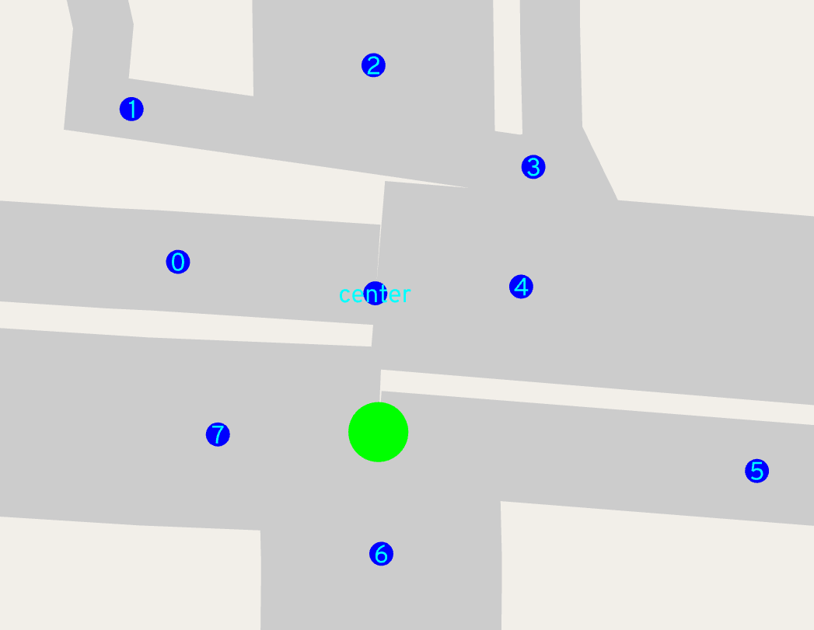</a>
  <figcaption>The center is the average of all the original intersection nodes from OSM. Since the first pass trimmed th roads back for each of these nodes, we can use that point to calculate an angle to the center and get a clockwise ordering.</figcaption>
</figure>

But let's imagine we didn't use that pre-trimmed point, and still used the point
farthest from the shared center, like we do for the first pass. Sometimes that
can break down!

<figure>
  <a href="sorting_inversion.png" target="_blank">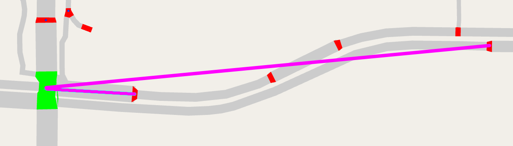</a>
  <figcaption>Two roads are on the east side of the green intersection. They start out roughly parallel, but curve and are split on the other end at different distances. The purple lines show the angle to the green intersection's center. The ordering of the two roads is switched if we use these purple lines to calculate angle!</figcaption>
</figure>

What happens when we get the ordering of roads wrong? The polygon will loop back
on itself, looking like a bowtie:

<figure>
  <a href="sorting_bowtie.png" target="_blank">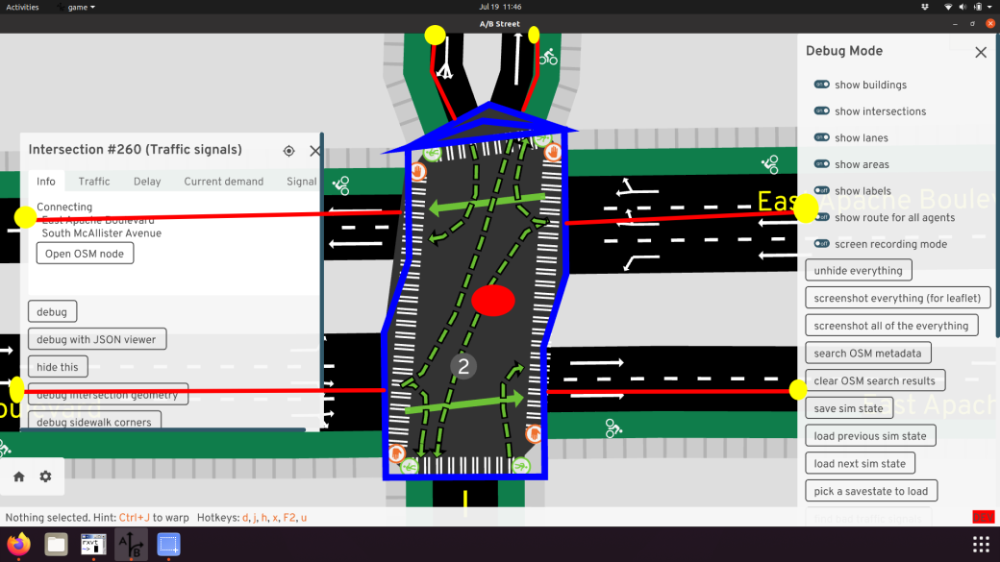</a>
</figure>

[This article](https://www.baeldung.com/cs/sort-points-clockwise) has a clever
idea to break ties using distance from the center.

### Finding the short roads

The algorithm described relies on knowing short roads to merge. Conveniently,
there's a proposed OSM tag
[junction=intersection](https://wiki.openstreetmap.org/wiki/Proposed_features/junction%3Dintersection)
that describes road segments that're physically located in the interior of
intersections. So far, I've been manually tagging this and using it as the
trigger to merge a junction. But of course, ideally heuristics would instead
discover these cases automatically.

The simplest start is to just define a threshold, like 5 meters, and try to
merge any road shorter than that. The road's original length could be used, or
-- perhaps more usefully -- we can first generate intersections normally and use
the trimmed road length. After merging a short road, perhaps some other ones
nearby change their trimmed length, so merging should happen in a fixed-point
loop, until no road has changed.

So far, I haven't made good progress with
[this heuristic](https://github.com/a-b-street/abstreet/blob/14ce21c80dc0d7f2b1ac69c988f10e2dd14f17e0/map_model/src/make/merge_intersections.rs).
Merging happens in too many places, or in a strange order, and causes assertion
failures. Much of the time, this exposes actual bugs, but exposing dozens at a
time is hard to handle, so that's why the slower approach of manually opting in
a few intersections to merging still remains.

In the spirit of a more gradual rollout of merging code, I've also attempted
heuristics just focused on common patterns of complex junctions with 2 or 4
pieces, resulting from one or two divided highways crossing. Sometimes just
looking for two or four traffic signal nodes close to each other reveals really
complex situations that break:

<figure>
  <a href="heuristic_loop101.png" target="_blank">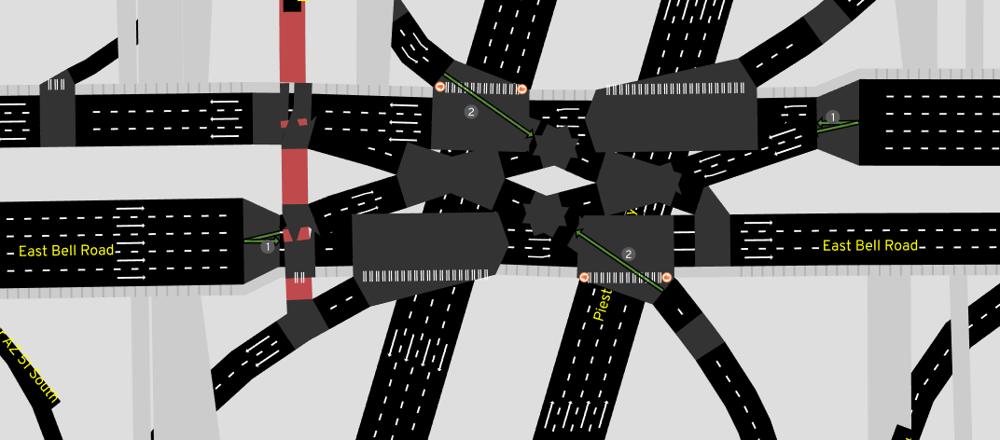</a>
</figure>

### Phantom collisions

There's a particularly insidious edge case not handled yet:

<figure>
  <a href="phantom_collision.gif" target="_blank">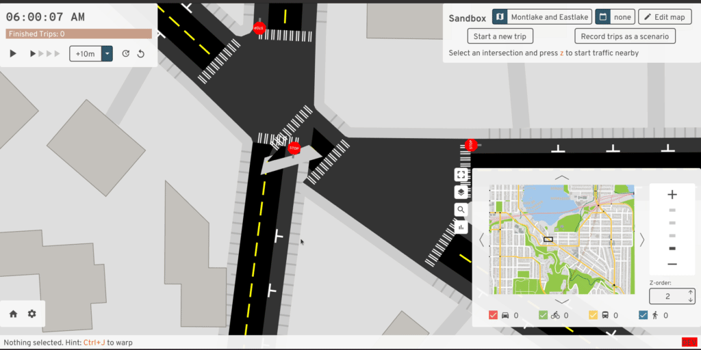</a>
  <figcaption>The south road is connected to the left intersection in OSM's graph. But based on the geometry inferred for the two separate intersections, this road actually collides with the right intersection as well.
</figure>

How could we handle this? Is it necessary to consider collisions between roads
one or two hops away in the graph, in case they might be thick enough to
interfere?

## Conclusion

Given how much time I've sunk into automatically generating decent geometry from
an OSM schema absolutely not meant for this, I hope you don't fault me for
wanting to try some radically different ideas. There've been some OSM proposals
over the years to just explicitly draw roads and intersections as areas -- the
[street area](https://wiki.openstreetmap.org/wiki/Proposed_features/Street_area)
and
[area:highway](https://wiki.openstreetmap.org/wiki/Proposed_features/area_highway/mapping_guidelines)
pages describe these ideas the best. These proposals don't seem to have caught
on, but I think they're worth an attempt.

I've also toyed around with designing a schema to map roads and intersections
from scratch, but that's an article to write on a rainier day...

## Appendices

### Related work

I've found a few other active projects aiming to render details about lanes:

- <https://github.com/enzet/map-machine>
- <http://blog.imagico.de/navigating-the-maze-part-1/> (and don't miss part 2!)
- <https://github.com/BjornRasmussen/Lanes> (there are some nice demos in the
  OSMUS Slack somewhere)
- [micro-map of Neukölln in Berlin](https://supaplexosm.github.io/strassenraumkarte-neukoelln/?map=micromap#20/52.48535/13.42666),
  see
  [this blog](https://supaplexosm.github.io/strassenraumkarte-neukoelln/posts/2021-07-18-strassenraumkarte)
  for an introduction

### Tricks and tooling

Iterating quickly on these algorithms and preventing regressions are often at
odds. These are some parts of my development workflow that help balance a bit.

First, how do you automatically test this? Expressing properties about the
output -- like no road and intersection polygons should overlap -- would be a
start, but it's a tough standard to reach. It's easy for a human to subjectively
judge output and spot regressions. So, screenshot diff-testing it is! For a
select few maps, I
[take a bunch of screenshots](https://github.com/a-b-street/abstreet/blob/master/widgetry/src/tools/screenshot.rs)
covering the whole map and store them as "golden-files." After importing new OSM
data or changing the code, I take more screenshots, then automatically compare
them with
[imagemagick's compare](https://github.com/a-b-street/abstreet/blob/master/game/compare_screencaps.sh)
tool and manually inspect any differences.

The
[RawMap editor](https://github.com/a-b-street/abstreet/tree/master/map_editor/)
serves as an interactive tool for quickly adjusting the input -- what if this
road center-line curved less sharply, what if the width implied by tags was a
little different, what if this road was marked for merging? But at the same
time, just previewing the intersection geometry doesn't reveal all problems --
sometimes the turns generated at a consolidated intersection are wrong, or the
traffic signal heuristic turns out poorly. The full A/B Street UI already has
tools to explore these things. So this UI also has a mode to load a second map
and quickly flip between the two:

<figure>
  <a href="compare_ui.gif" target="_blank">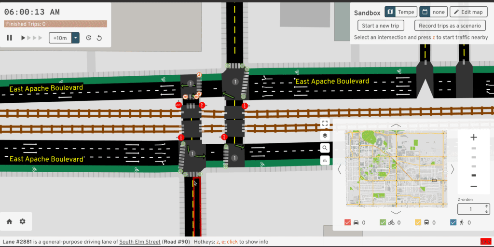</a>
</figure>

Something I've always wanted is an interactive debugger -- the ability to step
through the code, print things, and more importantly, dump some kind of extra
output files to visualize intermediate shifted polylines or something. I've
never figured out an IDE setup for this, but it'd be very worthwhile.

### Hall of Lovecraftian horrors

Here's my list of stress test cases. Avert your eyes...

<figure>
  
  <figcaption><a href="https://www.openstreetmap.org/node/3391701883" target="_blank">Montlake/520</a> in Seattle. I happened to live close to this intersection when I started A/B Street, so it holds a special place. And as of September 2021, it's been dramatically changed in real life and in OSM, so this rendering is now out-of-date and has probably blown up again.</figcaption>
</figure>

<figure>
  <a href="nickerson.png" target="_blank">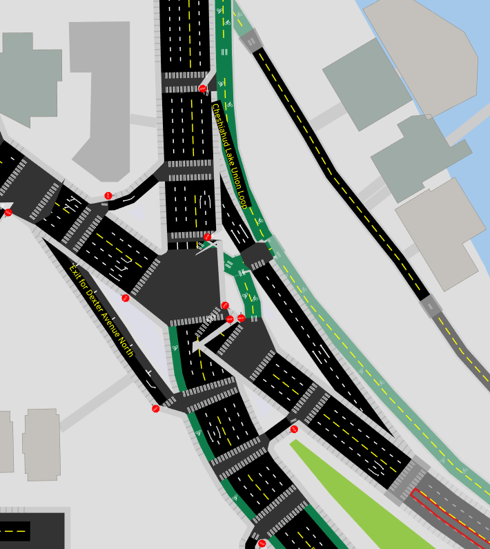</a>
  <figcaption>The confluence of <a href="https://www.openstreetmap.org/node/53128122" target="_blank">Nickerson, Dexter, Westlake, and the Fremont Bridge</a> in Seattle. We've got tiny road segments, a cycletrack that starts off parallel to the road but splits off, and a complete lack of 90 degree angles.</figcaption>
</figure>

<figure>
  <a href="triangle_doom.png" target="_blank">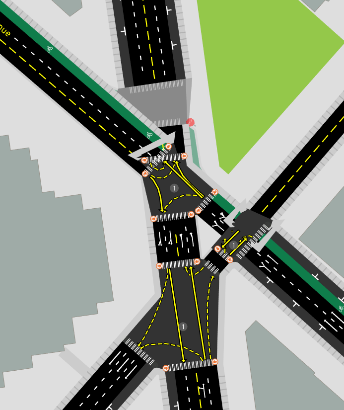</a>
  <figcaption>The triangle of doom: <a href="https://www.openstreetmap.org/node/1884382823" target="_blank">Lenora and Westlake</a> in Seattle. Try synchronizing the 3 traffic signals!</figcaption>
</figure>

<figure>
  <a href="dublin.png" target="_blank">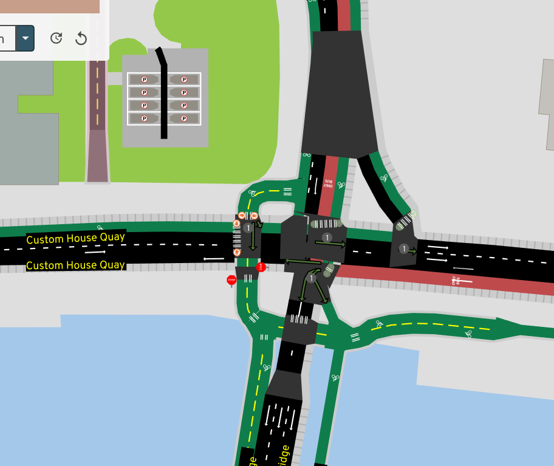</a>
  <figcaption>Let's not let the USA have all the fun. Here's <a href="https://www.openstreetmap.org/node/3594434240" target="_blank">Custom House Quay and the Talbot Memorial Bridge</a> in Dublin. A divided highway overlapping itself and some cycleways.</figcaption>
</figure>

<figure>
  <a href="taipei.png" target="_blank">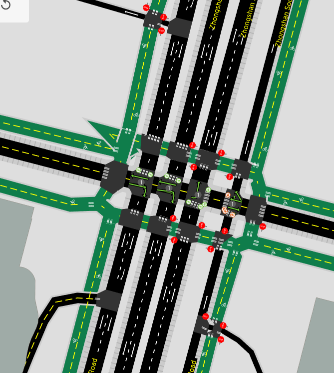</a>
  <figcaption>Loads of the junctions in <a href="https://www.openstreetmap.org/node/1505012053" target="_blank">
Taipei</a> look like this. Two parallel one-ways isn't hard enough; we need at least six.</figcaption>
</figure>

<figure>
  <a href="chorlton_traffic.jpeg" target="_blank">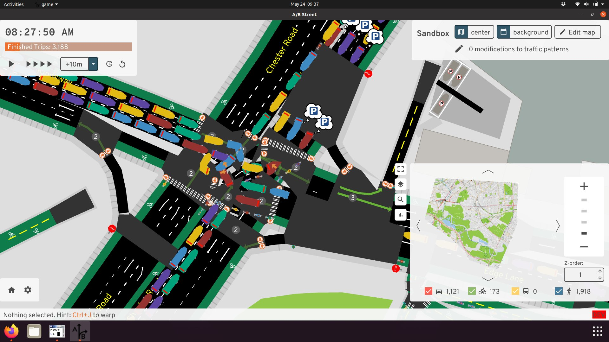</a>
  <figcaption>And how about <a href="https://www.openstreetmap.org/node/31287523" target="_blank">Chester Road and Kingsway</a> with some gridlocked traffic?</figcaption>
</figure>

<figure>
  <a href="loop101.png" target="_blank">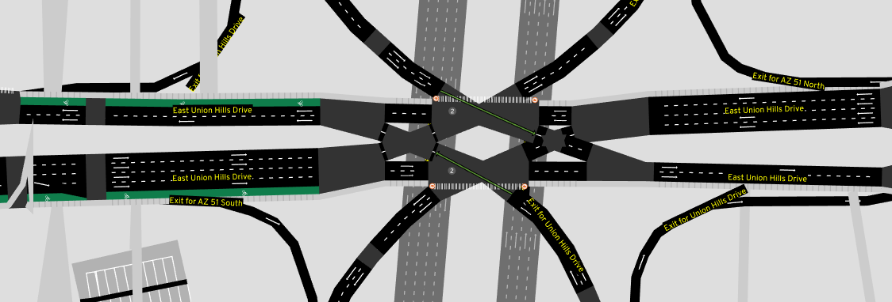</a>
  <figcaption>And finally, the eerie symmetry of <a href="https://www.openstreetmap.org/node/760159861" target="_blank">Arizona freeways</a>.</figcaption>
</figure>

### A radically simpler approach?

I think many people's first instinct to solve the problem of forming an
intersection polygon from thickened roads is to use boolean operations. Just
find the intersection between all of the road polygons. Or maybe, find the
intersection between any pair of road polygons, then union all of those pieces.

Early on, I tried some variations of this. One difficulty was a lack of a robust
boolean geometry library in Rust, but if bindings to a native GEOS library were
acceptable, maybe this was possible. But also, this simple idea doesn't work for
three-way intersections:

<figure>
  <a href="three_way_overlap.png" target="_blank">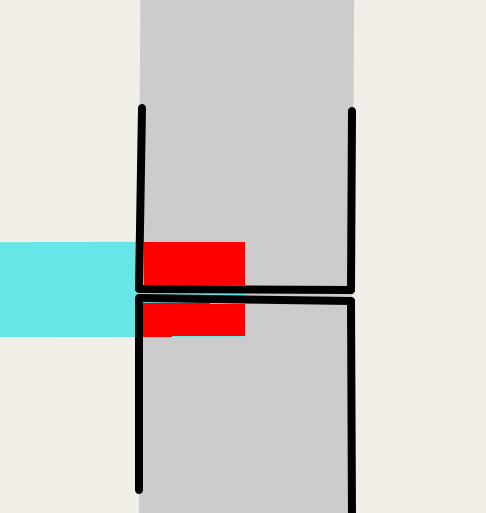</a>
  <figcaption>The horizontal road partly intersects the two
vertical roads (shown in red), but doesn't extend to cover enough of the
intersection.</figcaption>
</figure>

The two vertical road pieces don't even intersect at all, except right at their
boundary. We'd need to special-case that, at least.

### Other data sources

I've come across a few cities that seem to have a vector dataset describing road
polygons or curbs. I haven't tried working with any of these before, but it
would be a useful exercise to start with one of these as the base, and snap OSM
road segments to this to get metadata about lanes and connectivity, but not
geometry.

- [Seattle Streets Illustrated](https://streetsillustrated.seattle.gov/map/)
  includes some kind of CAD basemap that looks amazingly realistic
  - From some old emails with King County GIS, this is based on an impervious
    surface layer with a license preventing it from being released as public
    data
- Actually, <https://data.seattle.gov/dataset/Pavement-Edge-zip/gy82-cq84>
  appears to be the curbs for Seattle! Possibly the data is from 1999, updated
  maybe in 2011.
- <https://distanciamiento.inspide.com> appears to have detailed sidewalk
  polygons for Madrid

<figure>
  
  <figcaption>The Fremont bridge and Nickerson looks fantastic
in Seattle Streets Illustrated, but the data isn't public</figcaption>
</figure>

<figure>
  
  <figcaption>The pavement edge dataset is public, though, and seems
to be quite similar!</figcaption>
</figure>

<figure>
  
  <figcaption>Pullman, WA provided sidewalk polygons for mapping in OSM</figcaption>
</figure>

These vector datasets feel like some sort of holy grail, but all of the work
described in this article is still useful, because:

1.  Not every city has this kind of public data
2.  If road edits need to legitimately widen or shrink a road, it's not obvious
    how to modify these curbs. But then again, just rechannelizing lanes,
    subject to the area that's already been paved, is kind of the main type of
    edit in A/B Street...
