# Deep dive into devilish details: Intersection geometry

Some of the things in A/B Street that seem the simplest have taken me tremendous
effort. Determining the shape of roads and intersections is one of those
problems, so this article is a deep-dive into how it works and why it's so hard.

Note 1: There's no "related work" section here -- I haven't found many other
projects attempting something like this. I've seen a few research papers going
in this direction, but none of them pointed to any code to try. The approach
I'll describe has many flaws -- I'm not claiming this is a good solution, just
the one that A/B Street uses. If you see a way to improve anything here, let me
know about it! Even better, try it for real and send a PR -- there's plenty of
tooling to help you debug and visually diff against the existing implementation.
There should be a convenient button at the top-right of this page to suggest an
edit in Github.

Note 2: This article would be way more awesome with code and some interactive
demos to play around with each step. That level of ambition would prevent this
from ever being written, though! I'll link to the real code and am happy to
answer questions if anything's unclear.

Note 3: Apologies for the rough diagrams and lack of polish. I'm
time-constrained and communicating the ideas is my priority.

<!-- toc -->

## Background

Most street maps you'll find provide a simplified view of streets. Google Maps,
Apple Maps, and most OpenStreetMap renderers mostly just tell you the road's
name, color it by type (a highway, major arterial road, minor residential
street), take great liberties with the width, and don't explicitly distinguish
intersections from roads. These maps are used for navigation and drawing your
attention to nearby businesses, so this is quite a reasonable view.

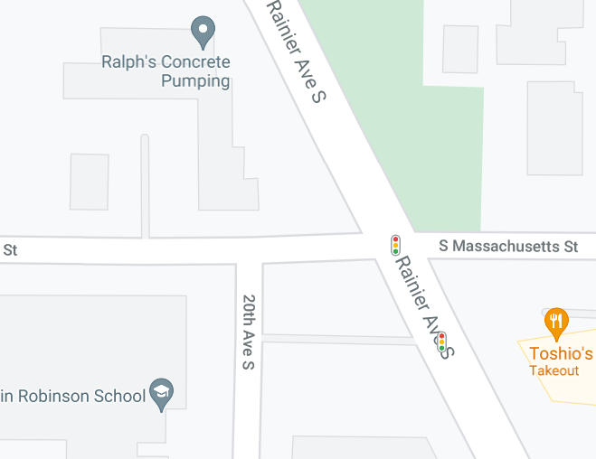 _From Google, it looks like Rainier is a much bigger
road than S Massachusetts_

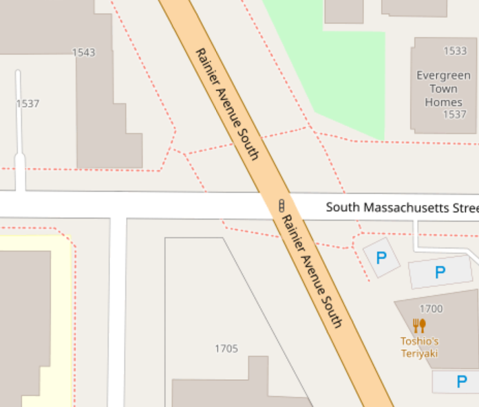 _The roads look about the same width in OSM_

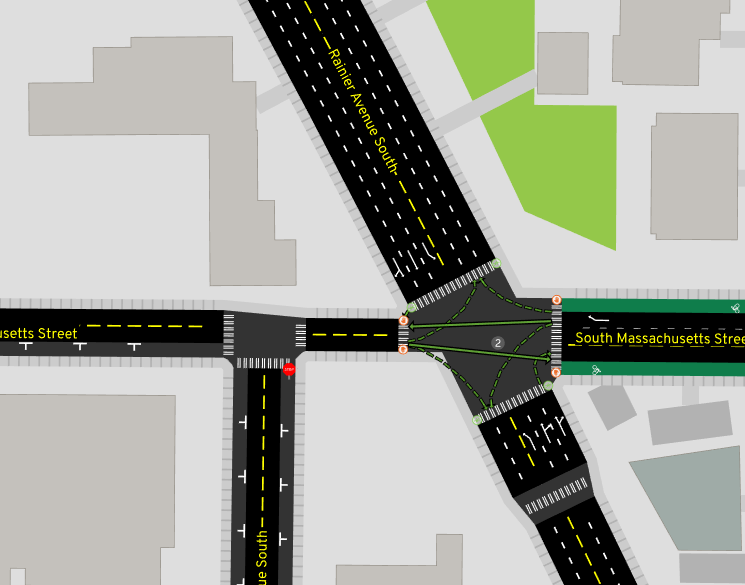 _A/B Street reveals the turn lanes and also some bike
lines on Massachusetts!_

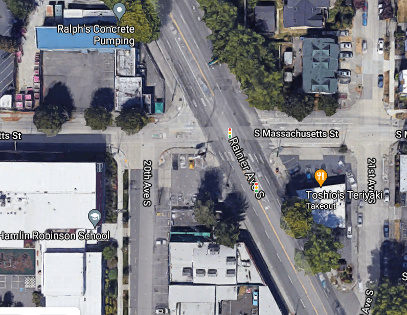 _Finally, Google's satellite imagery reveals the true
shape of the intersection, though it's a bit hard to tell with the tree cover.
And unless you zoom in, there's no way you'll spot the lane count or bike
lanes._

A/B Street is all about imagining how traffic moves through a city and exploring
the effects of redesigning streets. So of course, we need way more detail. To
imagine a bike lane down Eastlake Ave instead of street parking, we need to
first see how the street's space is allocated. To propose a more
pedestrian-friendly traffic signal crossing from Husky Stadium to the UW medical
building, we need to see that huge intersection.

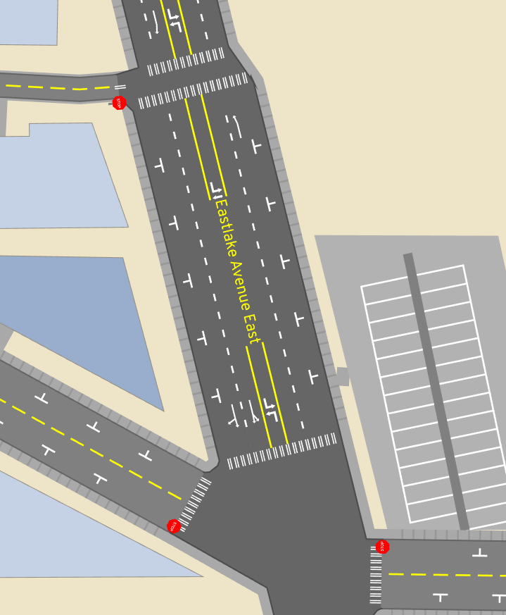 _Does Eastlake really need to dedicate 5 lanes to
moving cars and 2 to storing them?_

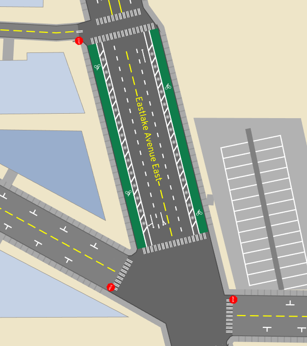 _Talking about Eastlake having a safe cycling route is
one thing, but isn't it much easier to imagin when you can just see it?_

At a high-level, we want a representation that:

1. Clearly communicates how a road is divided into different types of lanes
   (general purpose driving, turn lanes, bike lanes, bus-only lanes, street
   parking, sidewalks)
2. Represents the total road width, which tells us how we might change that lane
   configuration
3. Divides paved area into distinct roads and intersections. This division tells
   us where vehicles stop before entering an intersection, how pedestrians and
   vehicles are likely to move through the space, and what conflicts between
   them might occur.

We're constrained to publicly available, free data sources. Although some cities
have GIS departments with some datasets that might be helpful, we're pretty much
going with OpenStreetMap (OSM), which has decent coverage of most cities
worldwide.

### Desired output

Let's be a little more specific about the representation we want. If you imagine
a city as flat 2D space, roads and intersections occupy some portion of it.
(Let's ignore bridges and tunnels.)

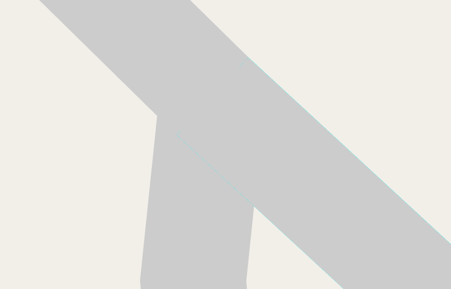 _Here's a three-way intersection at your typical Seattle
angle_

We want to partition this space into individual intersections and road segments.
Each road segment (just called "road" for simplicity) leads between exactly two
of those intersections. This partition shouldn't have any ambiguous overlap
between objects.

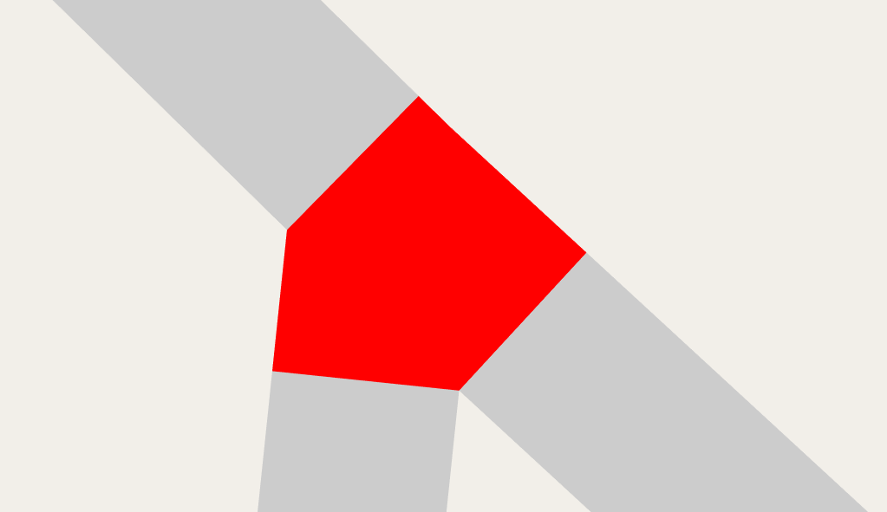 _The red part is what we'll deem the intersection. The grey
roads and the intersection now partition the space._

A simplifying assumption, mostly coming from OSM, is that roads can be
represented as a center-line and width, and individual lanes can be formed by
projecting that center-line left and right. This means when the road changes
width in the middle (like for pocket parking or to make room for a turn lane),
we have to model that transition as a small "degenerate" intersection, which
connects only those two roads.

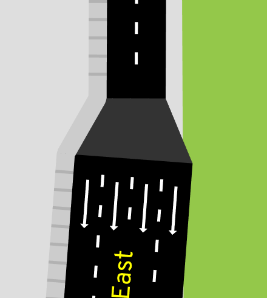 _Two lanes become four -- probably some turn lanes
appearing. The lighter grey is our intersection._

Another assumption taken by A/B Street is that roads hit intersections at a
perpendicular angle.

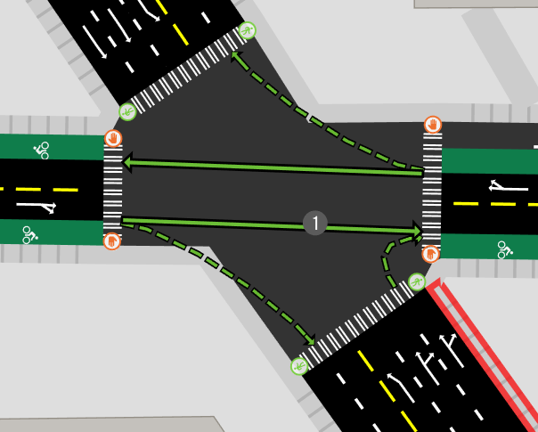 _Note how the intersection "eats into" Boren, the
diagonal road more than you might expect._

We use this division to determine where vehicles stop, and where a crosswalk
exists:

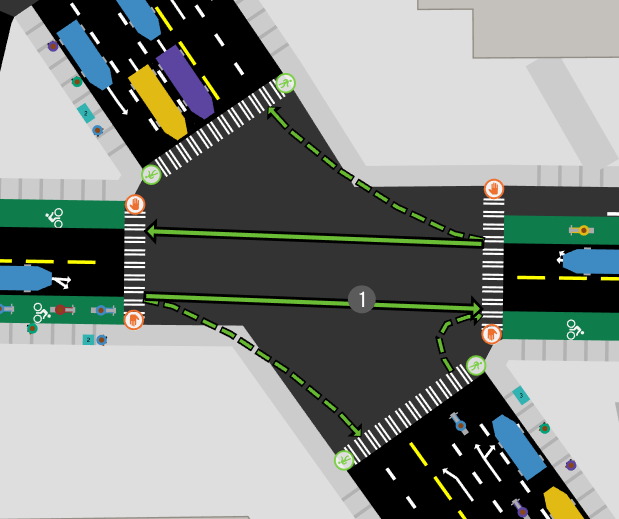 _Does it seem like vehicles have stopped too far away from
the intersection?_

Of course, this assumption isn't always true in reality:

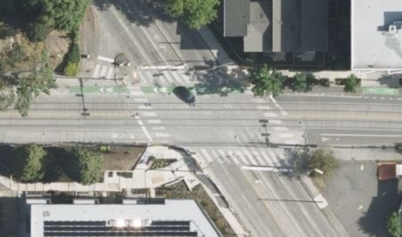 _The crosswalks across Boren are horizontal!_

If we allowed roads to hit intersections at non-perpendicular angles, but still
insisted that the stop position for each individual lane was perpendicular, it
might have a "jagged tooth" look:

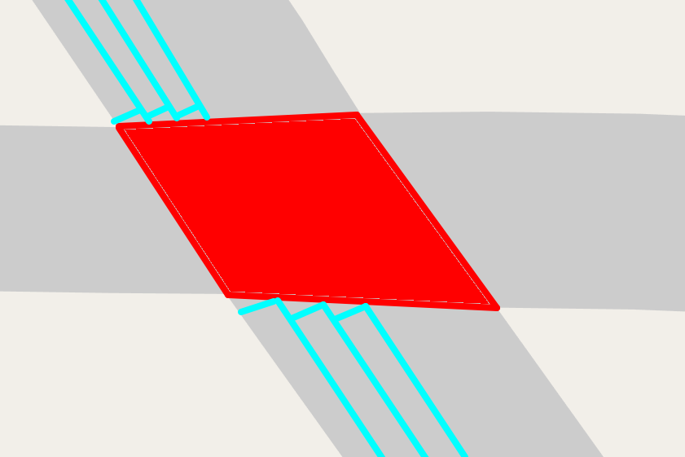 _The cyan lines show one way to represent adjacent lanes
that extend different lengths._

But for the sake of this article, these're the assumptions we're sticking with.
Pedestrian islands, slip lanes, gores, and medians are all real-world elements
that don't fit nicely in this model.

## Overview of the process

We'll now explore the steps to produce geometry for a single intersection and
its connected roads. The broad overview:

1. Pre-process OSM into road center-lines with attributes, with each road
   connecting just two intersections.
2. Thicken each road
3. Trim back the roads based on overlap
4. Produce the intersection polygon

Let's pick a particularly illustrative
[five-way intersection](https://www.openstreetmap.org/node/1705063811) as our
example.

## Part 1: Thickening the infinitesmal

OSM models roads as a center-line -- supposedly the physical center of the paved
area, not the solid or dashed yellow line (t least in the US) separating the two
directions of traffic. The schema, and how it gets mapped in practice, is fuzzy
when there are more lanes in one direction than the other or when roads join or
split up for logical routing, but... let's keep things simple to start.

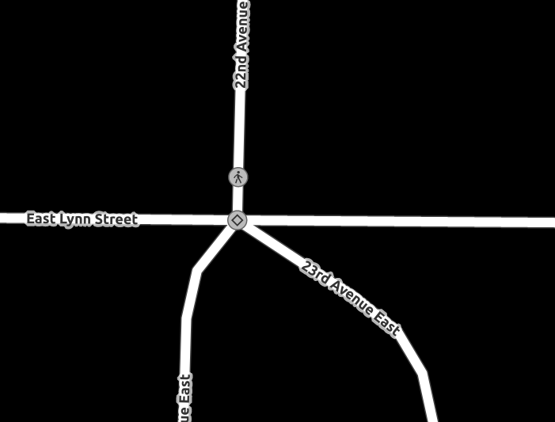 _5 roads meet at this intersection. The white lines
are OSM's center line._

OSM has a few tags (link) for explicitly mapping road width, but in practice
they're not used. Instead, we have a whole bunch of tags that describe the lane
configuration of the road. A/B Street interprets these and produces an ordered
list of lanes from the left side of the road to the right, guessing the
direction, width, and type of each lane. See the
[code here](https://github.com/dabreegster/abstreet/blob/master/map_model/src/make/initial/lane_specs.rs)
-- it's fairly lengthy, but has some intuitive unit tests. This interpretation
of tags is hard in practice because the schema is very confusing, there are
multiple ways of mapping the same thing, people make many mistakes in practice,
etc. <!-- TODO, list some examples like cycleway:left:separator:right. -->

 _A very simple example of OSM tags on the left, and
on the right, A/B Street's interpretation of each lane, ordered from the left
side of the road._

So for each road, we estimate the total width based on the lane tagging. Then we
project the center line to the left and right, giving us a thickened polygon for
the entire road:

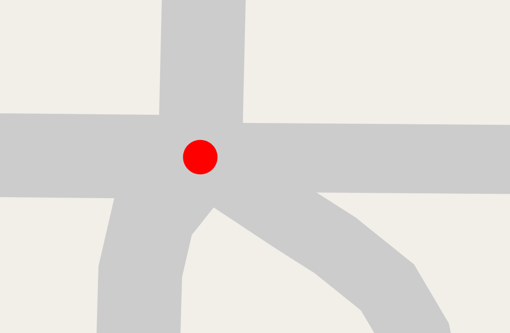 _All 5 of our roads, thickened based on the lane tagging.
The red dot is the position of the OSM node shared by these roads._

### Projecting a polyline

Before we move on, a quick primer on how to take a polyline (a list of ordered
points) and project it to the left or right. There are some better explanations
of this online, but I don't have them handy. I wouldn't call A/B Street's
[implementation](https://github.com/a-b-street/abstreet/blob/91c152c123924d7b8bfa14722d18c652d7e42966/geom/src/polyline.rs#L435)
fantastic, but it's there for reference.

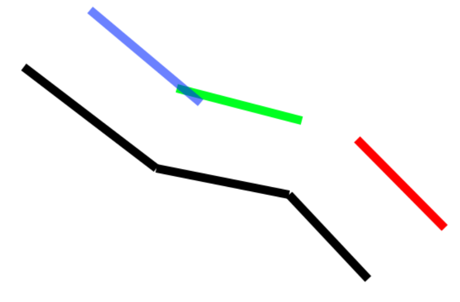

The original polyline is in black. If you can't tell from my quick drawing, it
consists of 3 line segments glued together. We want to shift it to the right
some distance. We start by taking each line segment and projecting it to the
right that distance. That operation is simple -- rotate the line's angle by 90
degrees, then project the line's endpoints that direction. The 3 projected line
segments are shown in blue, green, and red.

There are two types of problems we need to fix for the new polyline to be glued
together nicely. The blue and the green line segment intersect each other, so
we'll trim both segments to that common point:

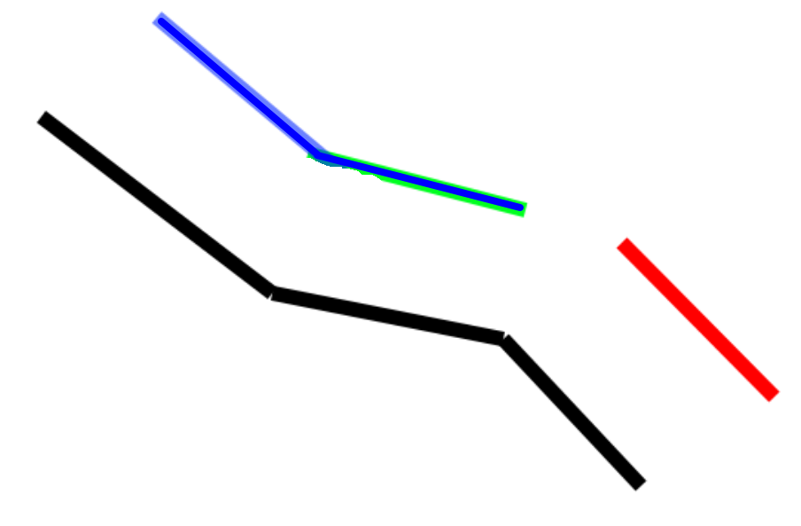 _Please forgive my horrid paint editor skills_

The green and the red line segments are far apart. Let's imagine they keep
extending until they do intersect. If I recall proper terminology, this is a
miter join:

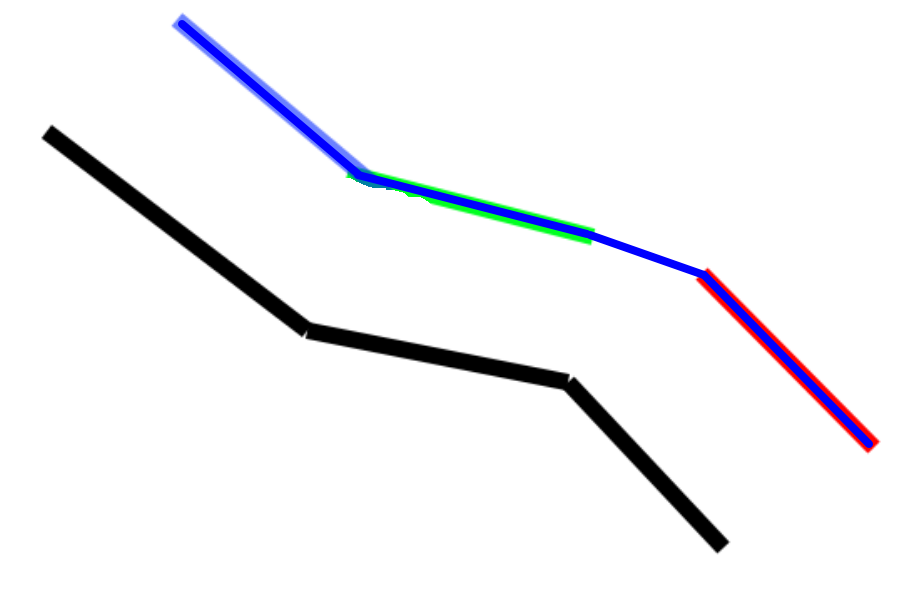

And that's it! Easy.

... Except not really. The real world of OSM center-lines has every imaginable
edge case. When a road is both thick and sharply angled enough, extending those
line segments until they meet works... but the hit might be very far away:

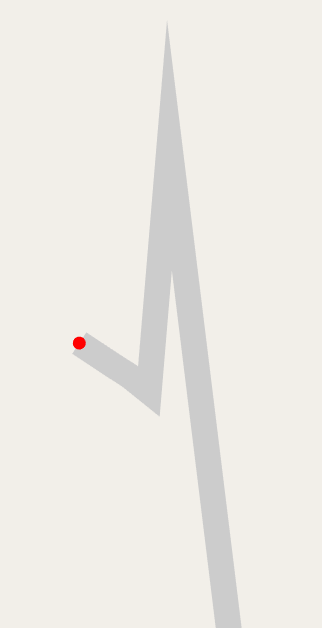

My workaround currently is to hardcode a maximum distance away from the original
line endpoints. If our miter cap reaches beyond that, just draw a straight line
between the two segments. I think this is known as a bevel join.

Just for fun, let's see what happens when a polyline doubles back on itself in
some less-than-realistic ways:

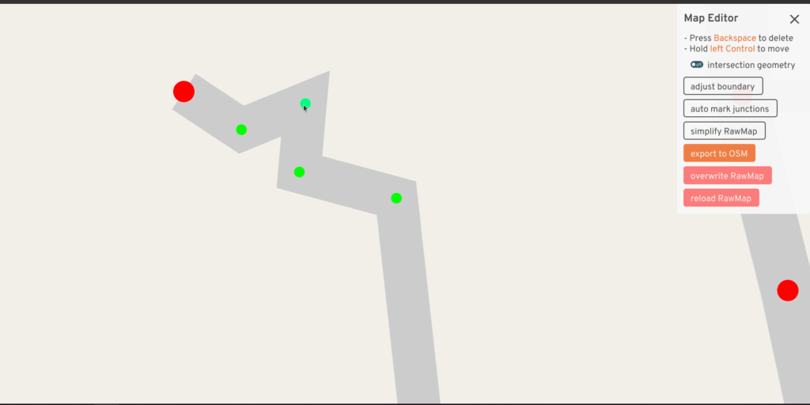

Truly Lovecraftian geometry. I don't think I often see points from OSM totally
out of order like this, but it happens sometimes and is immediately obvious.

## Part 2: Counting coup

For each road, we've got the original center from OSM and our calculated the
left and right side:

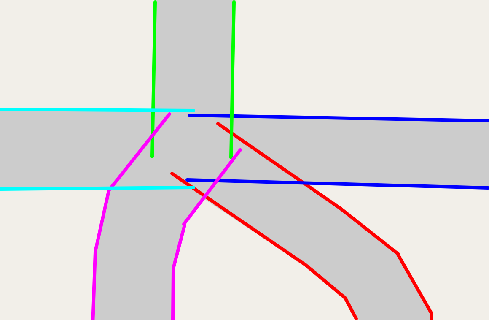 _The left and right sides of the 5 roads are shown -- not the
original centers. I manually traced this; slight errors are visible._

Now the magic happens. You'll notice that many of those polylines collide (For
sanity, let's call these "collisions" and not "intersections", since that term
is overloaded here!). Let's find every collision point:

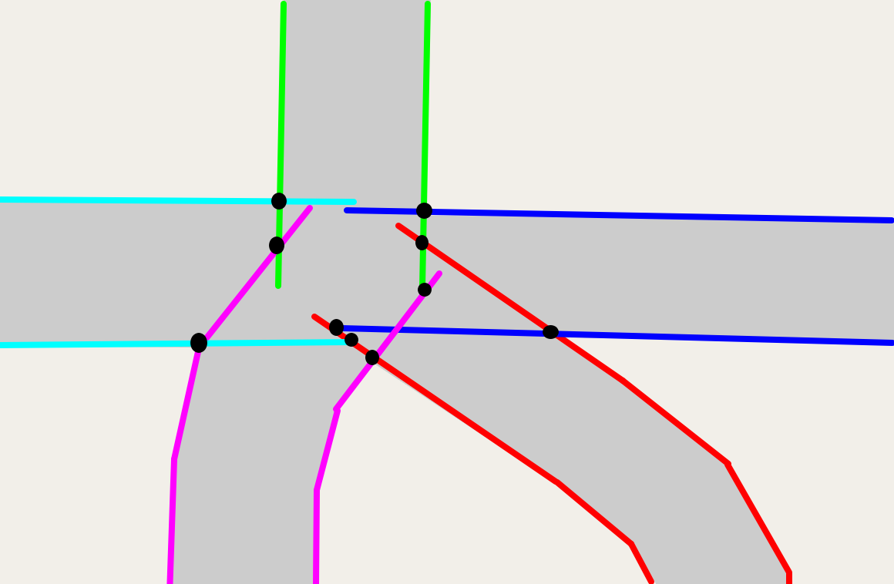 _Collisions drawn as black dots_

These collisions represent where two thickened roads overlap. So let's use them
to "trim back" the roads and avoid overlap. For each collision, we form an
infinitely long line perpendicular to the collision and find where it hits the
original center-line. We'll trim the road back to at least that point.

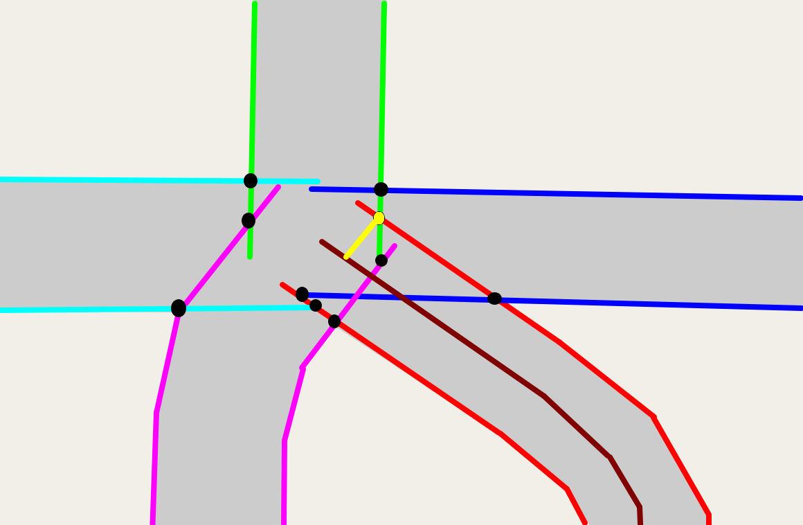 _The red road's original center is now shown, in a darker red.
The collision between the red and green road is shown, with a yellow line used
to find the position along the original center. We'll trim the center back to
this point, at least._

Because we want roads to meet intersections perpendiculously (I'm quite sure
that's the proper term), we want the left and right side of a road to line up.
There's probably a collision on a road's left and right side, and usually one of
them would cause the center-line to be trimmed back more than the other. We'll
always trim back as much as possible.

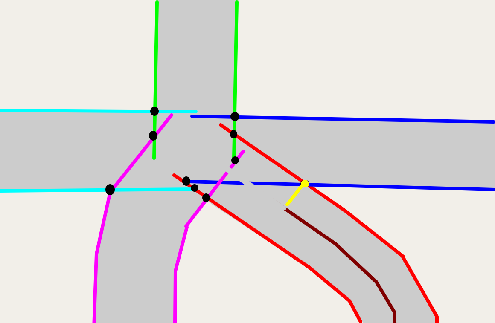 _The collision between the red and blue road is shown in
yellow. The corresponding position on the original red road's center line is
found, then trimmed back._

If we repeat this for every collision, eventually we wind up with:

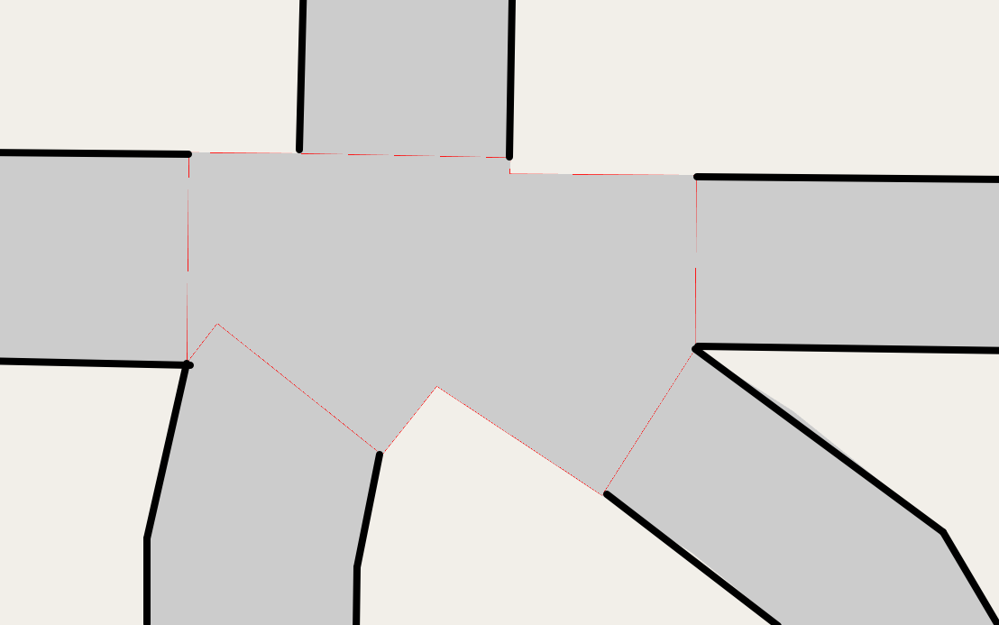 _All roads have been trimmed back, with their left and right
sides projected again_

Some questions to consider:

1. Why look for collisions between every pair of left/right lines? Couldn't we
   just use the "adjacent" pairs?

2. Is it ever possible for the line perpendicular to a collision to NOT hit the
   original center-line?

(As I'm reviewing my old code and writing this up, these're things I don't
remember, worth revisiting.)

## Part 3: The clockwise walk

We've now trimmed roads back to avoid overlapping each other. We just need to
generate the polygon for the intersection. As a first cut, let's take these
trimmed center-lines, calculate the left and right polylines again (since we've
changed the center line), and use the endpoints for the shape.

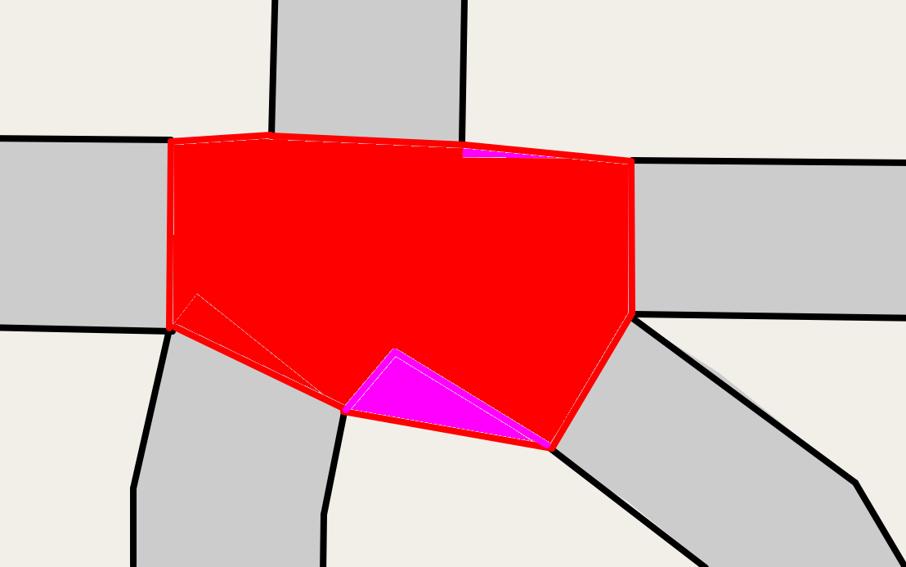 _The red polygon is the intersection shape formed from
these endpoints. The pink portions don't look right!_

Oops, the polygon covers a bit too much space! Cut red tape, queues, and split
ends, but not corners. What if we remember all of the collision points, and use
those too?

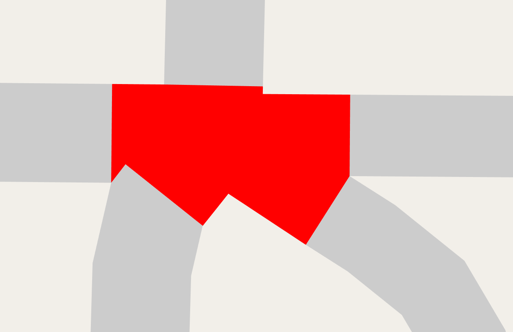

Much better.

### Sorting roads around a center

I snuck another fast one on ya. When we form a polygon from these left/right
endpoints and the original collision points, how do we put those points in the
correct order? Seemingly innocent question.

There are a few approaches that work fine for the simple cases. First, from OSM
we know the single point where the 5 road center lines meet. After we've
calculated the points for the intersection polygon, we can use that single
point, calculate the angle to each polygon point, and sort. That works fine.

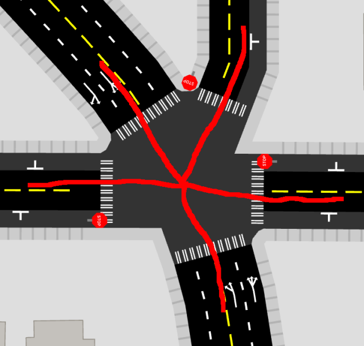 _The road center-lines all meet at one point, from
the original OSM data._

Foreshadowing: But soon, things won't be so simple.

## Interlude: problems so far

That wasn't actually so bad! The results are reasonable in many cases:

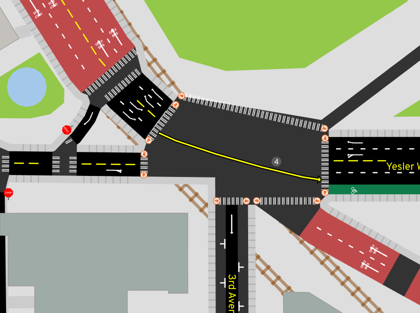 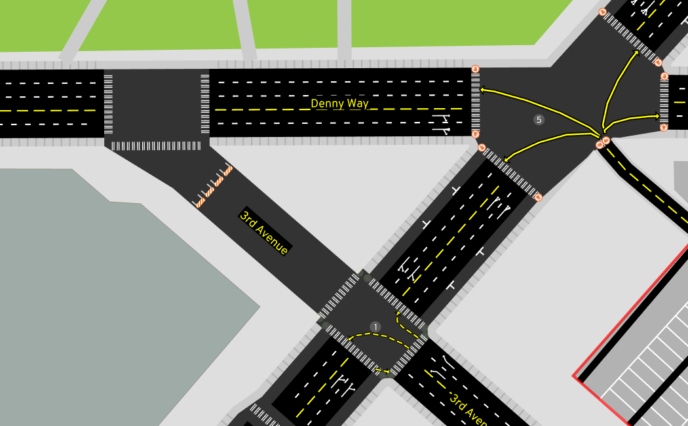 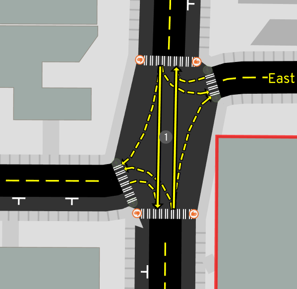

But what kind of things go wrong?

### Funky sidewalks

What's going on with the sidewalk in that last example?

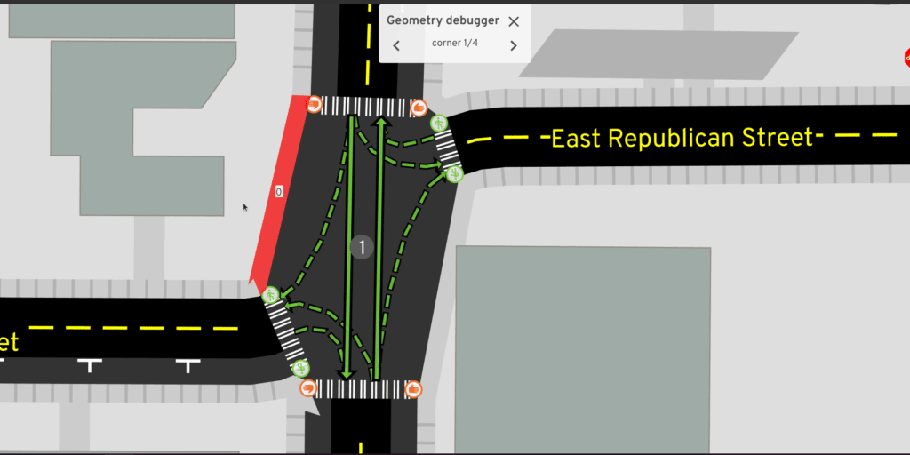

### Lovecraftian geometry

Sometimes followers of Cthulu edit OSM, I assume.

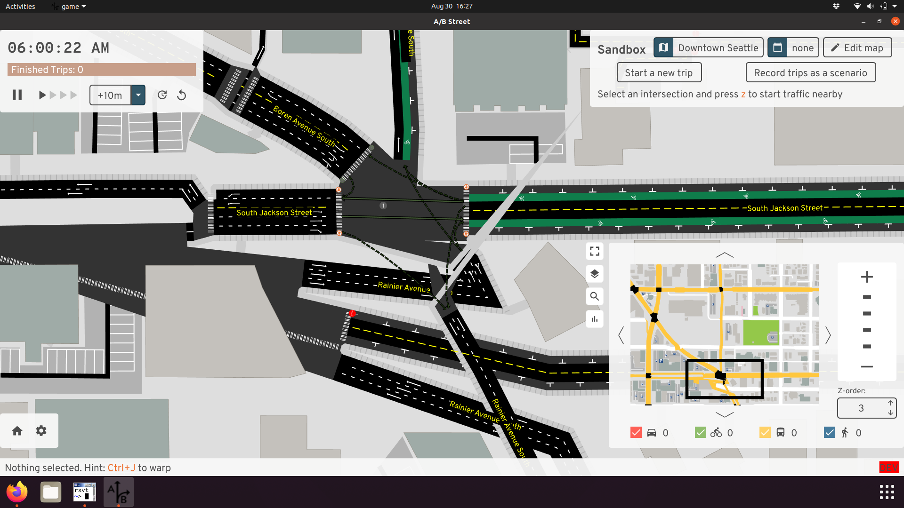 _What... is happening here?_

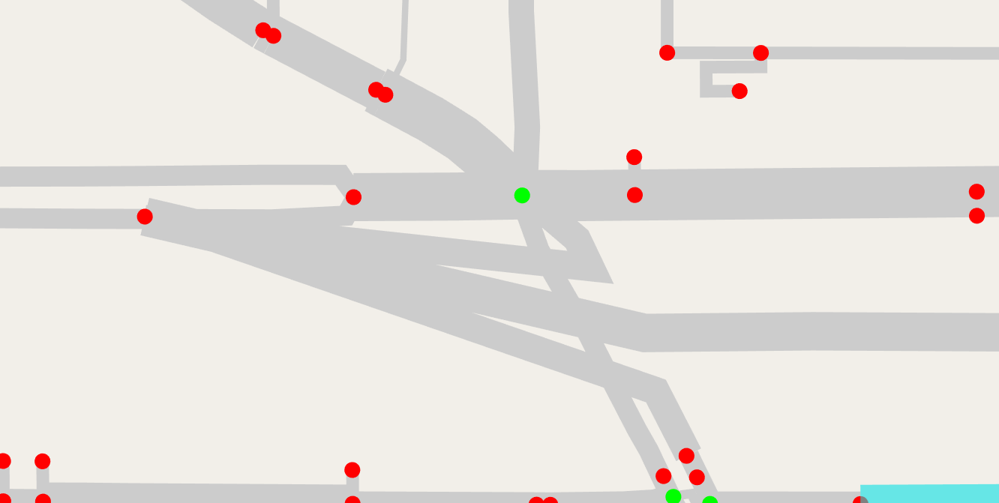 _Even the thickened roads, before calculating intersection
polygons, look broken._

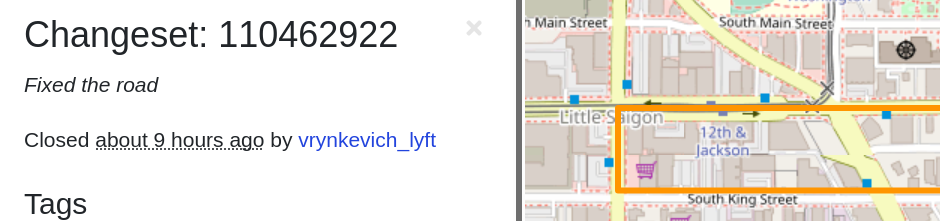 _Before I can investigate, somebody has already fixed the
problem upstream in OSM!_

<!-- I think there are cases where two thick roads overlap, but don't share an intersection. -->

### Bad OSM data

Often times, the upstream OSM data is just flat-out wrong. Center lines for
divided one-way roads are way too close to each other, so using the number of
lanes with a reasonable guess at width produces roads that overlap outside of
the intersection. This throws off everything we've done!

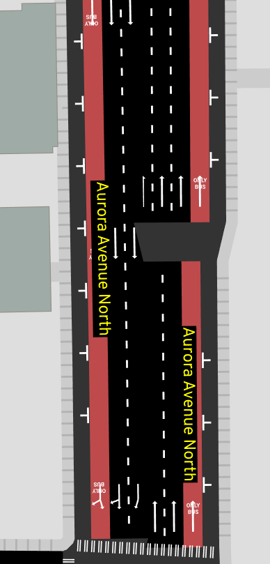

Another example is people tagging the lane count incorrectly. A common problem
when splitting a bidirectional road into two one-ways (which is what you're
supposed to do when there's physical separation like a median) is forgetting to
change the lane count. I don't have examples handy, because I've fixed every
case I've found.

An important lesson when trying to write algorithms using OSM data: there's a
balance between making your code robust to problems in the data, and trying to
fix everything upstream. I attempt a compromise. It's a virtuous cycle -- in
trying to use OSM data in this new way, I wind up fixing the data sometimes.

### Highway on/off-ramps

When three nearly parallel roads meet, our algorithm is a bit over-eager with
the size of the intersection:

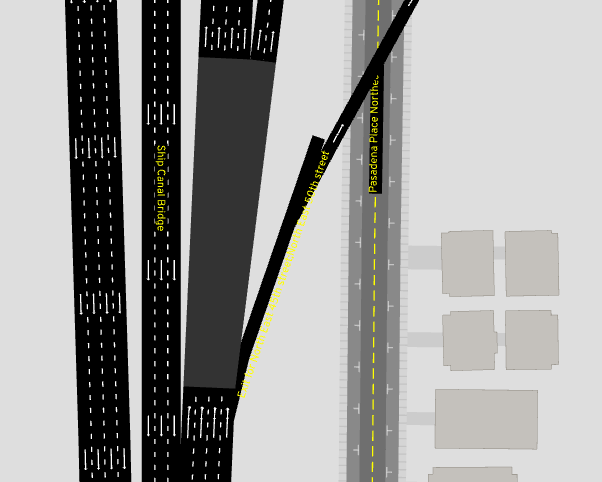

This case isn't even a real "intersection" -- a one-way highway has two
different off-ramps jut out. At some point, I had some scribbled diagrams in a
notebook somewhere from when I worked on this, but it's lost -- luckily the
[code for this case](https://github.com/a-b-street/abstreet/blob/e2fc59a31aa043a879a372b2350b1f42391ee740/map_model/src/make/initial/geometry.rs#L434)
is pretty simple. This produces much better results here:

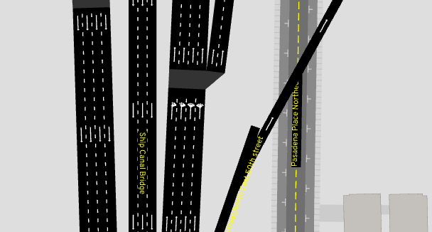

## Intersection consolidation

The skeptical reader has noticed the suspicious lack of complex intersections so
far. Time to dive into that.

### Where short roads conspire

In OSM, roads with opposite directions of traffic separated by any sort of
center median -- even if it's just a small raised curb -- are mapped as two
parallel one-way roads. These're also called divided highways or dual
carriageways. When these intersect, we wind up with lots of short "road
segments" and several intersections all clustered together:

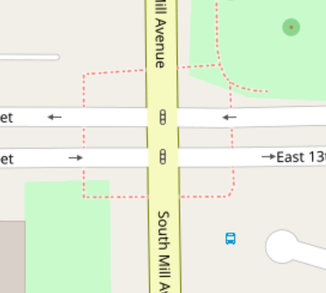 _The simplest case: the east/west road is a pair of
one-ways, and the north/south is a regular road without a median_

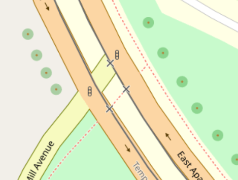 _In case you were hoping these situations always happened
at nice 90 degree angles, think again_

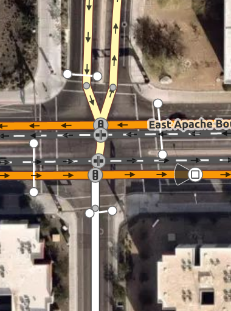 _Sometimes one dual carriageway joins back as a regular
bidirectional road just before intersecting another dual carriageway..._

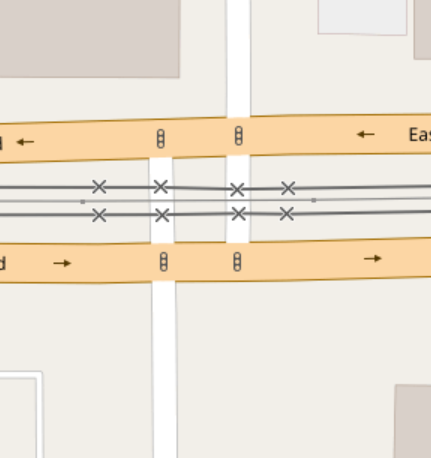 _Why not 4 parallel one-way roads? Can't forget
street cars!_

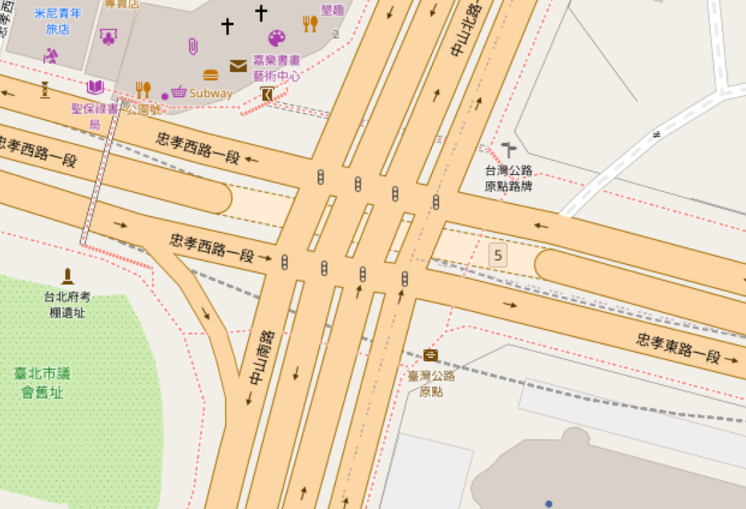 _And everytime I think I might've handled most cases,
I'm humbled by Taipei._

But wait, there's more. How about "dog-leg" intersections, where one road shifts
over slightly as it crosses another?

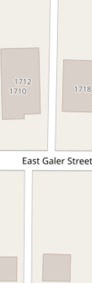 _The not-at-all elusive alley dog-leg_

But sometimes something looking like a dog-leg actually isn't -- if vehicles can
legitimately stop and queue in the middle of the "intersection", even if it's
only one or two of them, then I think that interior "road" deserves to remain
separate:

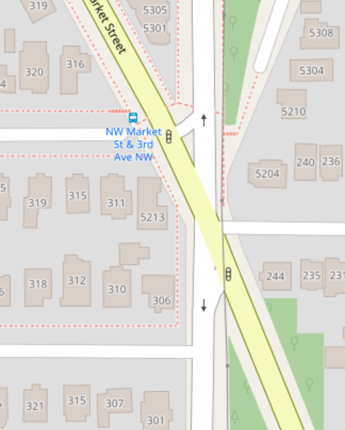

And then there's just the cases where I'm pretty sure civil engineers
anticipated me writing this algorithm, and found the most obnoxious angles for
roads to meet in order to maximize my pain:

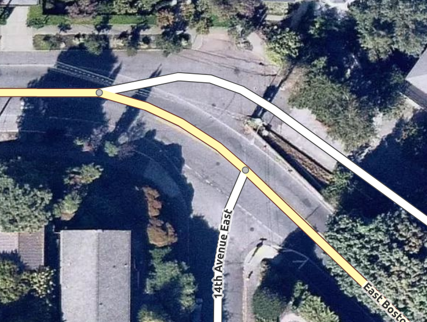

### Why we want to do something about it

So hold up, what's the problem? Some areas that people treat as one physical
intersection in reality are modelled in OSM as a cluster of intersections, with
lots of short "roads" linking them together. It's fine from a graph connectivity
and routing perspective. What could go wrong?

Well for starters, with the algorithm described so far that tries to render the
physical shape, it's completely visually incomprehensible:

 _The 4 "interior" intersections here even get stop signs
placed!_

These complicated intersections are often the ones that would be the most
interesting to study in A/B Street, but just try modifying lanes in these cases:

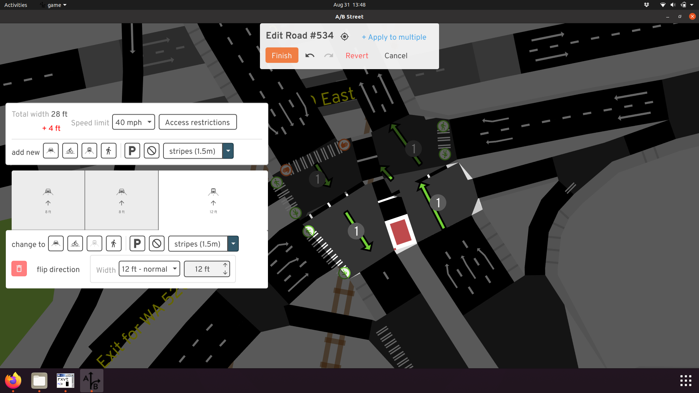 _Considering a bus lane for the 520 off-ramp at Montlake?_

Now throw traffic signals into the mix. A/B Street tries to simulate those, so
when we have a cluster of two or four of them super close, now we have to
somehow try to synchronize their timing. When somebody wants to edit them, now
they have to operate on all of them at once! We even extended the UI to handle
that, but it's quite a poor editing experience.

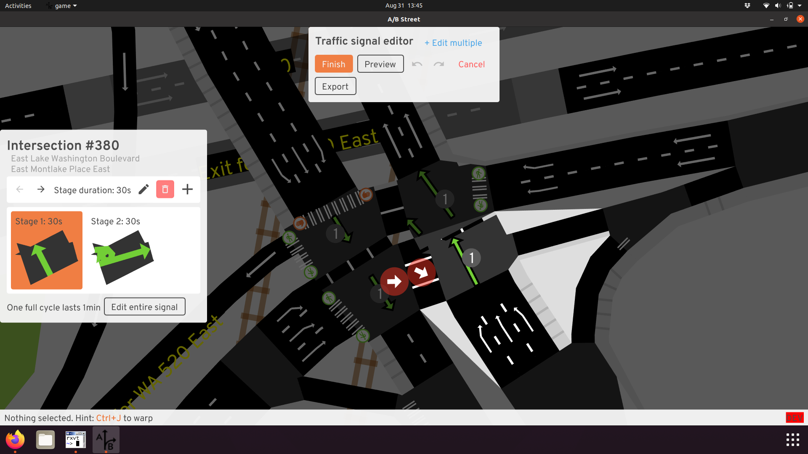 _Reasoning about 4 separate pieces of one traffic signal is
not pleasant_

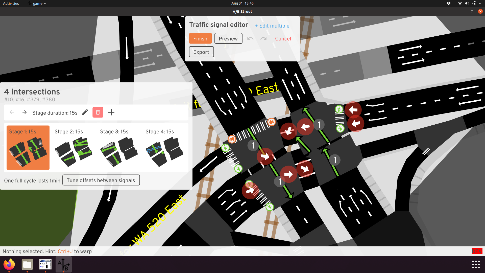 _We can do slightly better by editing all 4 at once, but
what do those movement arrows in the middle even mean? You have to reason about
where vehicles might've come from to even get there._

And finally, traffic simulation gets MUCH harder. A/B Street models vehicles as
having some length, meaning a vehicle's front can make it through one
intersection, but its tail gets stuck there:

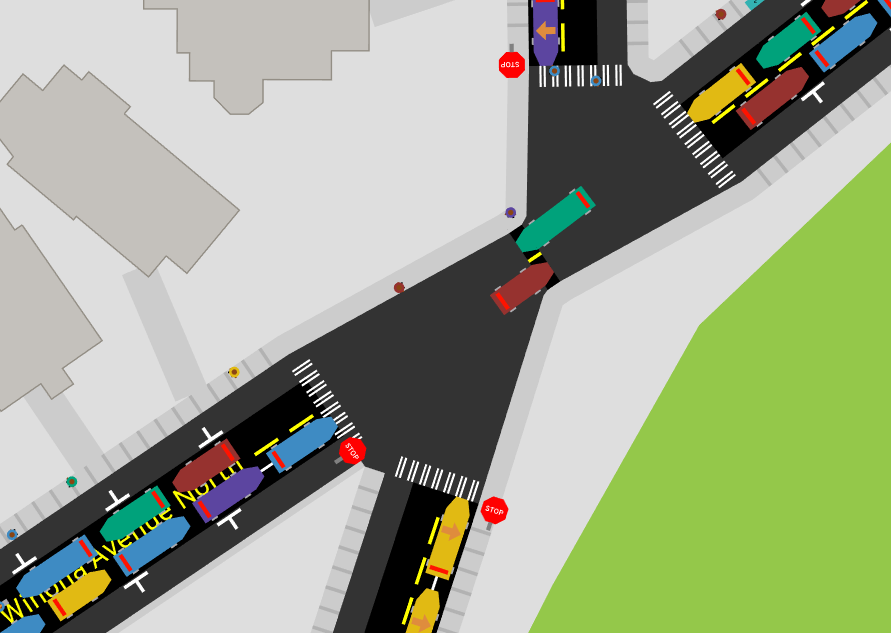 _These two cars are blocking all movements through the pair of
intersections_

At the simulation layer, vehicles moving through an intersection conflict with
each other very coarsely. If a vehicle is partially stuck in the intersection,
it prevents othr vehicles from starting potentially conflicting turns. So to
prevent this problem from happening, the simulation has complicated rules so
that vehicles do not "block the box" -- if they enter an intersection, they must
be guaranteed to fully exit and clear it, not get stuck somewhere in the middle.
These rules blow up in the presence of short roads like this. Lots of effort has
gone into workarounds at the simulation layer, but... just fixing the
representation in the map model seems much more desirable.

### Goal

In reality, many of these clusters of intersections and short roads are actually
just one "logical" intersection. If you consider where vehicles stop or where
crosswalks are placed, this can make this definition a little bit more clear,
but it's somewhat subjective. In A/B Street, we aim to "consolidate" this
cluster into just one intersection. Visually coherent geometry, reasoning about
a single traffic signal, and preventing vehicles from getting stuck in the
cluster are the goals.

Before we dive into the approach to consolidate, let's look at some success
stories.

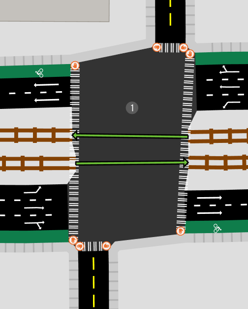 _A single intersection handles the 4 parallel OSM
ways._

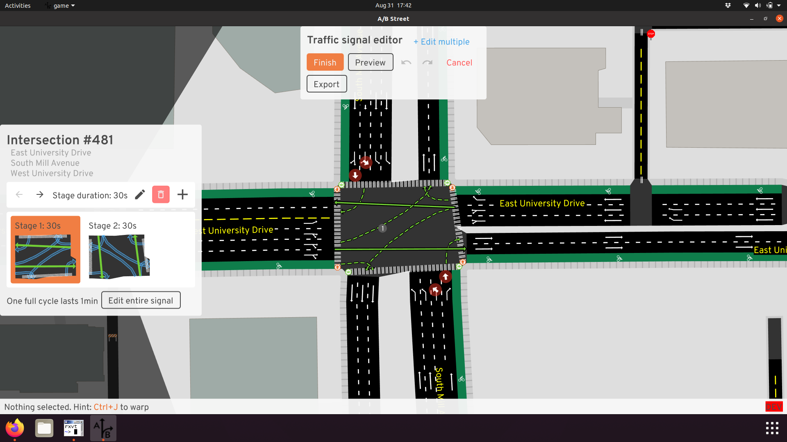 _You can now edit the signal timing as if this is just a
regular massive Arizona intersection._

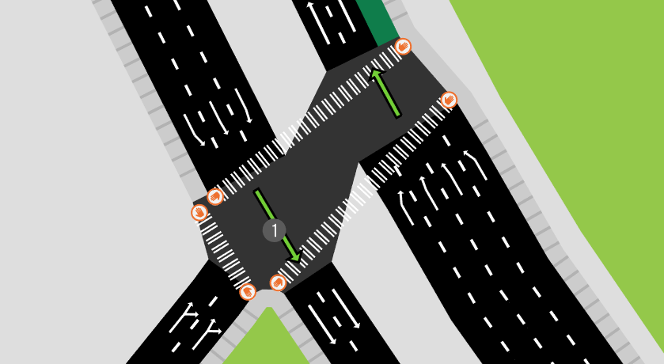 _The angled cut is a bit too aggressive and the crosswalk
"leaks" out, but this is a definite improvement._

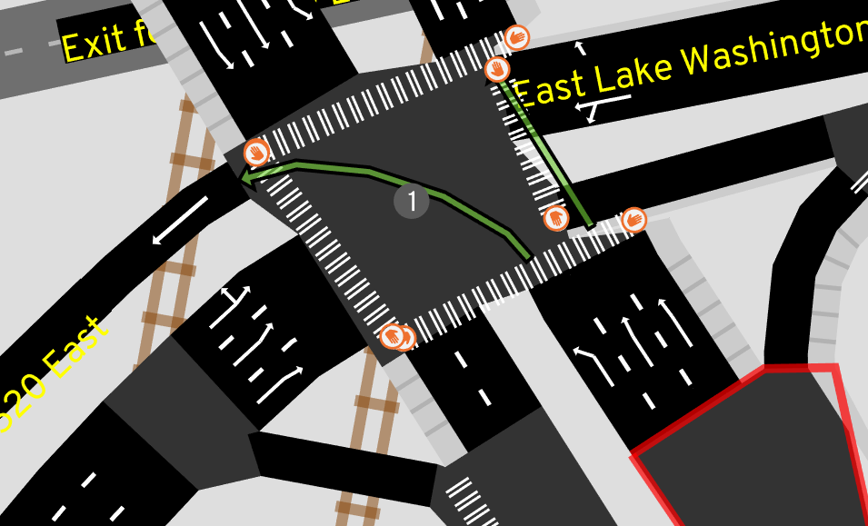 _Four intersections become one, again with a slight
geometric distortion_

### A solution: two passes

For some history getting to this point, check out
[previous attempts](https://github.com/a-b-street/abstreet/issues/654) and
[more before/after examples](https://github.com/a-b-street/abstreet/pull/710).

Consolidating a complex intersection happens in a few steps.

1.  Identify the short roads
2.  Run the regular algorithm for intersection geometry, and remember how much
    each road's center line gets trimmed back
3.  Remove the short road and fix up graph connectivity
4.  Use the "pre-trimmed" center line to project each surviving road to the left
    and right
5.  Assemble those points in order to create the consolidated intersection's
    polygon

Step 1 and 5 are covered in more detail in below sections.

For step 2, we start with the regular algorithm described so far, applied to
each intersection:

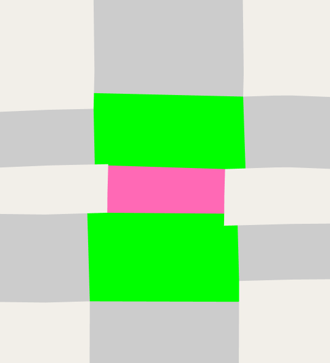 _The results of running the algorithm on the 2 green
intersections. The pink road in the middle is marked for merging._

Then we delete the short road. The
[details](https://github.com/a-b-street/abstreet/blob/c5671557defbd80ce749b8fa7faf7c166b3d23dd/map_model/src/raw.rs#L300)
of how this is done are particular to A/B Street's intermediate representation
of a map model. Graph connectivity and all sorts of turn restrictions must be
preserved. But geometrically, it just looks like this:

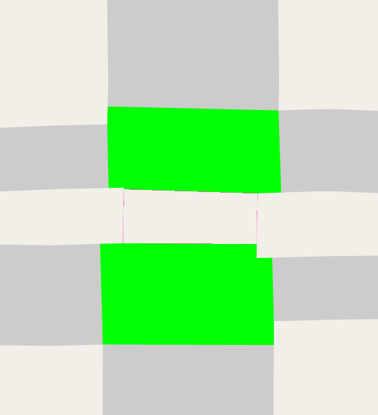

Then we run step 4, finding the left and right side of each surviving road:

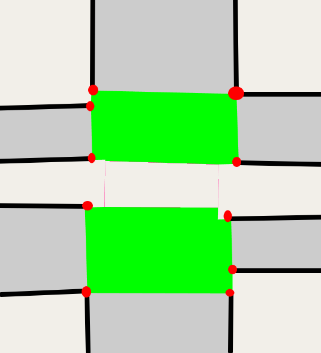 _Black lines show the left and right side of each road.
The red dots are the endpoints of each line._

Now if we just use those red dots, we can create the final polygon for this
consolidated intersection.

### Sorting revisited

To assemble the endpoints into a polygon, we need to know what order they go in.
If you recall from an earlier section, we used the original shared point from
OSM to do this:

But now things are less clear -- we have multiple shared points, from before
consolidation. As a first pass, maybe we can just average all of the points,
call that the "center," calculate the angle to each point, and order clockwise.

(diagram)

Before trimming, how do you do this? The point farthest away? A point a fixed
few meters away?

For consolidated intersections, probably use the pre-trimmed point

Example Tempe intersection with light rail that blows it up. Center vs
polylabel.

### Finding the short roads

I've been tagging junction=intersection manually upstream to opt them in slowly.

Tried some approaches that look for all short road (pre trimmed or post?).
Usually breaks.

Targeted heuristics for 2 and 4-clusters of tsigs.

Examples in Loop 101 -- it gets crazy.

Focusing on tsig clusters for now, since they cause the most problems to traffic
sim, but very much ongoing work.

## Conclusion

Given how much time I've sunk into trying to automatically generate decent
geometry from an OSM schema absolutely not meant for this, I hope you don't
fault me for wanting to try some radically different ideas, like mapping from
scratch. There are some intersections just not worth trying to squeeze into
OSM's model. Maybe in some future, I'll explore something very different. Or
play around with some of the proposals to tag OSM junction areas.

## Appendices

### Tricks and tooling

- screenshot diff as a regression test!
- back and forth on RawMap editor and marking stuff in the main game. fast
  reimports. be able to adjust road centers in rawmap, quickly toggle shorties
  on or off, preview geometry.
- how to debug? this is wedged in the middle of an import process, should we
  emit extra "side output" files to visualize later? Some kind of step-through
  debugger, live edit code would be fantastic.

### Hall of Lovecraftian horrors / the stress tests

montlake/520

roundabouts

south of fremont bridge

### Radically simpler approach?

Why not just thicken roads, calc bool overlap? robust bool-op library, and also
three-ways

why not map manually? OSM sort of has schema. maybe infer for most but not all.

### Other data sources

I've come across a few cities that seem to have a vector dataset describing road
polygons or curbs. I haven't tried working with any of these before, but it
would be a useful exercise to start with one of these as the base, and snap OSM
road segments to this to get metadata about lanes and connectivity, but not
geometry.

- [Seattle Streets Illustrated](https://streetsillustrated.seattle.gov/map/)
  includes some kind of CAD basemap that looks amazingly realistic
  - From some old emails with King County GIS, this is based on an impervious
    surface layer with a license preventing it from being released as public
    data
- Actually, <https://data.seattle.gov/dataset/Pavement-Edge-zip/gy82-cq84>
  appears to be the curbs for Seattle! Possibly the data is from 1999, updated
  maybe in 2011.
- <https://distanciamiento.inspide.com> appears to have detailed sidewalk
  polygons for Madrid

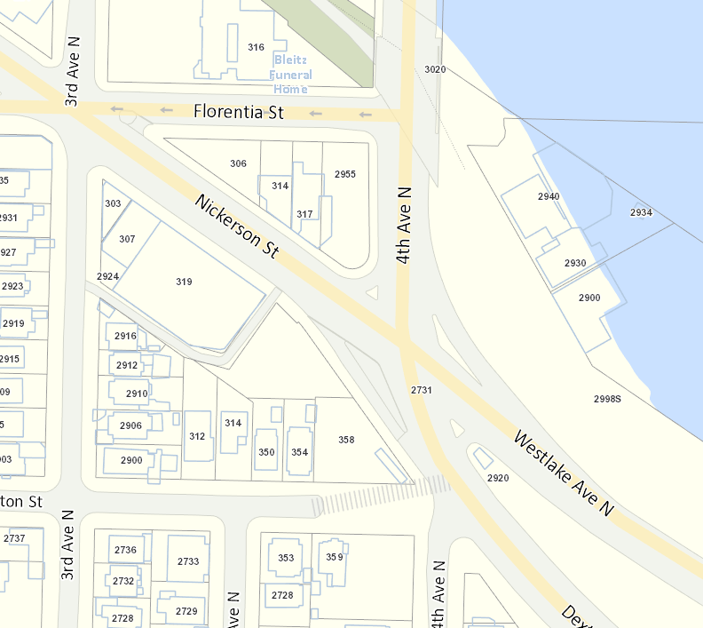 _The Fremont bridge and Nickerson looks fantastic
in Seattle Streets Illustrated, but the data isn't public_

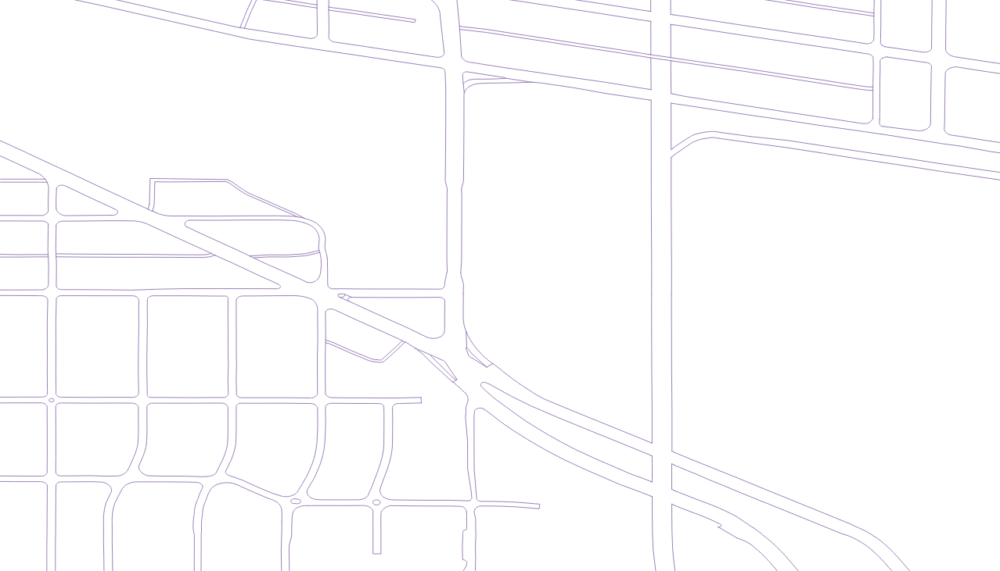 _The pavement edge dataset is public, though, and seems
to be quite similar!_

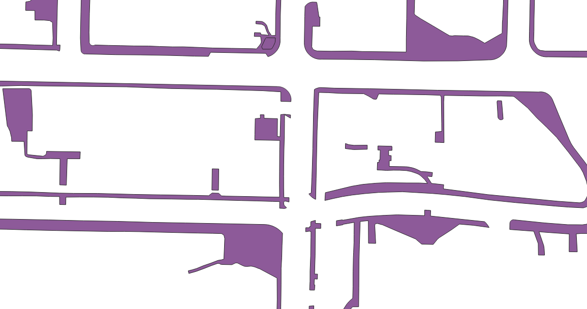 _Pullman, WA provided sidewalk polygons for mapping in OSM_

These vector datasets feel like some sort of holy grail, but all of the work
described in this article is still useful, because:

1.  Not every city has this kind of public data
2.  If road edits need to legitimately widen or shrink a road, it's not obvious
    how to modify these curbs. But then again, just rechannelizing lanes,
    subject to the area that's already been paved, is kind of the main type of
    edit in A/B Street...
