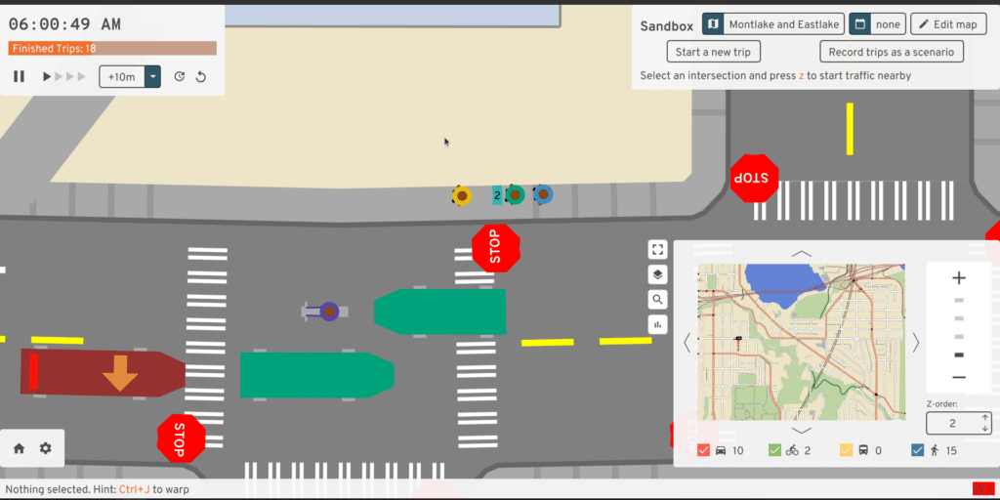

# Discrete event traffic simulation, laggy heads, and ghosts

A/B Street's traffic simulation isn't based on any research papers or existing
systems, so this article aims to motivate and explain how it works. This article
focuses on how the different agents (drivers, bicyclists, and pedestrians) move
around. If you're wondering how we figure out where these agents should go or
what time they decide to take trips, go read about
[travel demand models](../travel_demand.md).

I'm not aiming to survey how other traffic simulation models work here. In
short, some focus on "macroscopic" patterns, like the volume of traffic along a
particular highway over time. A/B Street is more on the "microscopic" side,
modeling individual agents making decisions over time. Many such models use
"discrete-time" simulation, where every agent senses and reacts to the world
every time-step (0.1 seconds or so). A/B Street actually started with this --
see the [appendix](#appendix-discrete-time-simulation) for more background. But
early on, I switched to a discrete-event simulation instead. So, let's jump into
that!

Note: I'll provide references to the current implementation. Someday I'll write
that article describing how to build a traffic simulation from scratch...

<!-- toc -->

## Starting simple: Pedestrians

Imagine a simple movement model for pedestrians. Usually they exist at some
point along a sidewalk and can move in one direction or the other. At
intersections, different sidewalks are connected by crosswalks, and pedestrians
can also move bidirectionally on those, after waiting for the right time to
cross.

 _Sidewalks shown in blue, connected by pink crosswalks and
also cyan connections.Everything is bidirectional._

We'll make a few assumptions about pedestrians. They follow the sidewalks and
crosswalks perfectly, never deciding to honor their inner Pythagorean. They
travel at a fixed speed and change that speed instantly -- no smooth
acceleration. That fixed speed could depend on both their preferred walking
speed and on the current sidewalk's elevation gain. These poor robotic
pedestrians never stop to smell the flowers, write an angry neighborly note, or
pet a pupper -- they just walk, or wait. Online dating is also so pervasive in
this simulation that pedestrians ghost -- through each other, that is. There are
more interesting models of pedestrian movement like the
[social force model](https://en.wikipedia.org/wiki/Crowd_simulation) where
people change speeds in crowds, but A/B Street is focused on sad American cities
where you don't really see many people walking in one place. So there's no
collision between pedestrians at all; they just pass through each other,
temporarily losing their individuality for rendering purposes:

_[This is what it's like when people collide](https://www.youtube.com/watch?v=lsV500W4BHU)_

In the world of discrete timesteps, you could imagine each pedestrian has very
simple logic. At any moment, they just continue walking one direction or the
other at their fixed speed along a sidewalk or crosswalk. Or they pause at the
end of a sidewalk, awaiting their turn at a stop sign or traffic signal.

### Discrete events

Don't the constant updates every time-step seem wasteful? Most of the time, a
pedestrian is in a steady-state -- walking or waiting. Since they walk at a
fixed speed, we can just linearly interpolate their exact position at any moment
in time if we want to draw them.

Instead of looping through every agent every time-step, in a discrete-event
system, we just have one giant
[priority queue of events](https://github.com/a-b-street/abstreet/blob/master/sim/src/scheduler.rs),
scheduled to happen at some time in the future. Each agent remains in a certain
state for a period of time, and schedules an event to transition themselves to a
different state.

In the case of pedestrians, this works like this:

1.  A pedestrian begins at 30 meters distance along their first sidewalk. They
    want to walk forwards on the sidewalk, so they calculate the distance to the
    end of the sidewalk -- say another 70 meters -- and divide that by their
    preferred speed, scheduling an event an appropriate amount of time later --
    say 10 seconds.
2.  For the next 10 seconds, that pedestrian is in the `Crossing` state, which
    has a `DistanceInterval` stating that they're moving on a certain sidewalk
    from 30 to 70 meters. The `TimeInterval` says that this state is occuring
    from time 0 to 10 seconds. We can linearly interpolate to find their
    position for drawing.
3.  At 10 seconds, the scheduler wakes up the pedestrian. They're now at the end
    of the sidewalk, so they look at the intersection and ask to cross. There's
    a traffic signal, and the almighty hand says NOPE, so they hand over control
    to the intersection and just mark themselves as `WaitingToTurn` state. No
    events are scheduled to update them.
4.  But the intersection remembers the list of waiting agents. Some time later,
    the light changes, and the intersection "wakes up" all of the agents who now
    have a green.
5.  Our pedestrian calculates a new `Crossing` state for the crosswalk. This
    state too happens over some distance and time interval.
6.  At the end of the crosswalk, the pedestrian immediately enters another
    `Crossing` state for the next sidewalk.

We can visualize this with a finite-state machine diagram:

Code references
[here](https://github.com/a-b-street/abstreet/blob/master/sim/src/mechanics/walking.rs).

## Vehicles

Discrete events are obviously much simpler for pedestrians, but there were some
pretty drastic assumptions there that won't work for vehicles. It takes a few
more tricks for A/B Street to model cars, bikes, and buses (I'll just use
"vehicle" from here on.)

First let's understand what vehicles can do. They travel in one direction along
individual lanes, and they queue behind each other -- no ghosting. At
intersections, they wait as needed, then move along a "turn," destined for a
target lane. There are two major differences from reality that we'll take as
assumptions.

First, vehicles instantly change speeds -- no smooth acceleration from rest, or
modeling of safe stoping distance. So if a vehicle starts at the beginning of an
empty lane, they instantly jump from rest to the maximum speed limit for that
road. They travel at that maximum speed limit until the moment their front
bumper strikes the boundary between road and intersection, then they stop
immediately. This doesn't model highway driving at all, where things like jam
waves are interesting to study and require more realistic kinematics and a model
of driver reaction time. But A/B Street is focused on in-city movement, and the
essence of scarcity I want to model is capacity on lanes and contention at
intersections. What happens in between isn't as important. I think you'll find
that the overall traffic patterns emerging in A/B Street still look compellingly
realistic.

*A perfect stop from 70mph.*

The second article of funny business is lane-changing. Let's assume that
vehicles don't change lanes in the middle of a road. Instead, vehicles shift
left and right while moving through intersections. So if somebody needs to use a
left turn lane, then at the intersection one road back, they'll choose to slide
over during their turn. Any conflicting movements with other vehicles is handled
at the intersection already.

*On a two lane road, a vehicle changes lanes in the south intersection, then makes a left turn at the north intersection. Don't try this at home!*

This also means there's no over-taking. If a car gets stuck behind a bike moving
slowly uphill, so be it.

*A car patiently follows a bike. In reality, they would likely over-take here.*

We'll try to relax this second assumption later.

### The state machine

So let's figure out how to model these vehicles. The approach used by
pedestrians, with `Crossing` and `WaitingToAdvance` states doesn't quite work,
because nothing would stop vehicles from plowing into each other. So let's
introduce a third state -- `Queued`. When a vehicle enters a new lane, it enters
the `Crossing` state as usual, calculating the "best-case" time to cross the
entire length of the lane at the max speed limit. This assumes nobody's in the
way! But when this state ends, we can only transition the vehicle to the
`WaitingToAdvance` state if they're the "lead" vehicle in the current lane's
queue. If they have a "leader" vehicle, then they enter the `Queued` state and
register as a "follower" of this "leader" in the queue.

*Both the cyan and green car are in the Crossing state.*

*The green car has reached the intersection and is WaitingToAdvance, but the cyan car is still Crossing.*

*The cyan car caught up and is now Queued.*

Note that somebody might enter `Queued` well before they're near the intersection, like if they're following a slower vehicle. `Queued` just means the faster vehicle has already spent the "best-case" time to cross the road at the full speed limit.

*The cyan car is already Queued, but its leader, the green vehicle, is still Crossing.*

When the vehicle at the very front of a lane enters the intersection and fully vacates
their old lane, then they "wake up" their follower. Since the `Queued` follower has been following along as closely as possible, they instantly transition to `WaitingToAdvance`, since we know they're at the end of the lane. "Fully vacating" the lane means the back of the vehicle clears the lane; see the [section below](#laggy-heads).

We can again understand all of this with a finite-state machine:

Code references [here](https://github.com/a-b-street/abstreet/blob/master/sim/src/mechanics/car.rs) and [here](https://github.com/a-b-street/abstreet/blob/master/sim/src/mechanics/driving.rs).

### Exact positions

Most of the time, we don't care exactly where on a lane some vehicle is. But we
do need to know for drawing and for a few cases during simulation, such as
determining when a bus is lined up with a bus stop in the middle of a lane.

To calculate exact positions, we walk along each lane's queue from front to
back. The key idea is that leaders bound the position of followers, and we can
"lazily evaluate" the position of followers. This means that calculating one
vehicle's position costs as much as calculating the entire queue's in the worst
case, but that's usually fine -- for drawing, we want everyone anyway.

The process is simple. We use each vehicle's state to determine the possible
position of their front bumper. `WaitingToAdvance` means the vehicle is at the
very end of the lane. For vehicles still `Crossing`, we linearly interpolate the
time and distance intervals. Then as we walk from front to back, we maintain a
"bound" for the next vehicle's position. This is based on the front position of
the current vehicle, plus the vehicle's length and a fixed following distance
(which, note, is not based on speed).

Let's walk through the example above, from front (the left side) to back. The yellow car is `WaitingToAdvance` at the intersection, so their front position **(1)** is the full length of the lane. Based on the length of that car and a following distance of 1 meter, the bound imposed by this first car is at **(2)** -- nobody following could possibly be beyond this position.

The second vehicle in the queue is the bike. Based on their `Crossing` state, which says they're crossing from 0 meters along the lane to the full length of it from 30 seconds to 90 seconds, we linearly interpolate and get their front position **(3)**. This position is smaller than the bound of **(2)**, so no adjustment is needed.

The third vehicle is the red car. Based on their `Crossing` state, optimistically they would be at position **(4a)** by this time. But since they're following the bike, then they're bound by position **(4)**, so that's where this algorithm places them. The bound for the next vehicle is then **(4)** plus the vehicle's length and a following buffer, giving us **(5)**. The final vehicle hasn't reached that position yet based on its `Crossing` state, so it's unaffected by that bound and is just at **(6)**.

Code [here](https://github.com/a-b-street/abstreet/blob/master/sim/src/mechanics/queue.rs).

### Laggy heads

Vehicles aren't infinitesmal dots; they have a length, so each one has a front and back. This means we have to be a little careful about defining when a vehicle has left a lane and its follower should be considered the "first" in the queue:

*The front of the yellow car is in the intersection and thus out of the queue. But its back is still in the lane, so the bike can't truly be at the front of the queue yet.*

To model this, every lane's queue may have a "laggy head." (Naming things is hard...) The head of this queue may be the bike, but because the yellow car is still the laggy head, the bike remains `Queued`. When the yellow car enters the intersection, we need to determine when its back will clear the lane, letting the bike wind up at the very front. Optimistically we assume the yellow car will travel through the turn as fast as possible, so we can calculate the time to cross the car's length, and schedule a check there. When that check happens, we calculate the exact position of the yellow car -- maybe it's queued behind other vehicles making the same turn, or blocked by other vehicles in its target queue. If it's advanced far enough, then we unregister the yellow car as a laggy head and wake up the bike, who changes from `Queued` to `WaitingToAdvance`. If the yellow car's back end is still sticking out into the lane, then we schedule another check a fixed 0.1 seconds. This retry policy is quite aggressive and will slow down the simulation as traffic jams start to form.

This logic to determine when a vehicle's back has fully cleared a lane is unfortunately complicated by the presence of short roads and turns, a currently unsolved problem in the underlying map model. A long vehicle like a bus may partly be overlapping several lanes and turns at a time, meaning we have to carefully calculate when the back of the bus has cleared each piece.

### Performance

It's been a very long time since I've measured the performance of this discrete-event simulation, so these numbers are very out-of-date:

One of the reasons the simulation is more performant than discrete time-steps is by how much time the simulation advances between updates. With discrete time, it's always a fixed amount -- 0.1 seconds usually. With discrete events, it depnds when the next event is scheduled -- the later that event occurs, the faster the overall simulation proceeds. On a nearly empty map with really long roads, a single agent only needs a few updates to complete its trip -- very loosely, an update at the beginning and end of each lane and turn in its path. As more vehicles queue along the same lane at the same time, we increase the number of updates to process all of them, but it's still less than updating every agent every 0.1 seconds.

There are a few big opportunities to improve performance, by requiring less updates when vehicles are stuck waiting at intersections or stuck behind laggy heads. From some [older investigation](https://github.com/a-b-street/abstreet/issues/368#issuecomment-728289865), it's clear that a huge amount of processing is spent on agents trying to start a turn and on checks that a laggy head has cleared a queue.

## Lane-changing

<!-- https://github.com/a-b-street/abstreet/pull/682 -->

Lane-changing (LCing) deserves special mention. A/B Street cheats by not
allowing it on lanes themselves. Instead, at intersections, cars can perform
turns that shift them over any number of lanes. These LCing turns conflict with
other turns appropriately, so the contention is still modeled. Why do it this
way? In a
[previous project](http://apps.cs.utexas.edu/tech_reports/reports/tr/TR-2157.pdf),
I tried opportunistic LCing. If a car had room to warp to the equivalent
distance on the adjacent lane without causing a crash, it would start LCing,
then take a fixed time to slide over, blocking both lanes throughout. This meant
cars often failed to LC when they needed to, forcing them to reroute, botching
their trip times. In many cases the cars would be permanently stuck, because
pathfinding would return paths requiring LCing that couldn't be pulled off in
practice due to really short roads. Why not try making the car slow down if
needed? Eventually it might have to stop, which could lead to unrealistic
gridlock. This LCing model was using a detailed discrete-time model with cars
accelerating properly; maybe it's easier with A/B Street's simplified movement
model.

Currently in A/B Street, cars will pick the least backed-up lane when there's a
choice. They make this decision once when they reach the front of a queue; look
for `opportunistically_lanechange` in `router.rs`. The decision could be
improved.

## Intersections

<!-- maybe move all this to gridlock article -->

I need to flesh this section out. See `mechanics/intersections.rs` for how stop
signs and traffic signals work. Two things I need to fix before making this
section interesting:

- Only wake up relevant agents when a previous agent finishes a turn.
- Don't let an agent start a low-priority turn (like an unprotected left) if
  it'll force a high-priority vehicle approaching to wait. The approaching
  vehicle is still in the Crossing state, so we need to notify intersections
  ahead of time of intended turns and an ETA.

One contributor to permanent gridlock is cars and bikes being stuck in an
intersection, preventing conflicting turns from being performed. To help avoid
this, one of the last checks that stop signs and traffic signals perform before
accepting a new turn request is that the target lane has enough space for the
new vehicle. This is "reserved" space, not necessarily currently occupied by
vehicles in that lane. This accounts for other vehicles performing a turn bound
for that lane. See `try_to_reserve_entry` in `mechanics/queue.rs`. When a car
completely leaves a lane (determined by the "laggy head" described above), this
space is freed, and blocked cars are woken up.

## Appendix: discrete-time simulation

A/B Street's first traffic model was discrete-time, meaning that every agent
reacted to the world every 0.1s. Cars had a more realistic kinematics model,
accelerating to change speed and gradually come to a halt. Cars did a worst-case
estimation of how far ahead they need to lookahead in order to satisfy different
constraints:

- Don't exceed any speed limits
- Don't hit the lead vehicle (which might suddenly slam on its brakes)
- Stop at the end of a lane, unless the intersection says to go

<!-- why was lookahead hard: short lanes? -->

After fighting with this approach for a long time, I eventually scrapped it in
favor of the simpler discrete-event model because:

- It's fundamentally slow; there's lots of busy work where cars in freeflow with
  nothing blocking them or stopped in a long queue constantly check to see if
  anything has changed.
- Figuring out the acceleration to apply for the next 0.1s in order to satisfy
  all of the constraints is really complicated. Floating point inaccuracies
  cause ugly edge cases with speeds that wind up slightly negative and with cars
  coming to a complete stop slightly past the end of a lane. I wound up storing
  the "intent" of an action to auto-correct these errors.
- The realism of having cars accelerate smoothly didn't add value to the core
  idea in A/B Street, which is to model points of contention like parking
  capacity and intersections. (This is the same reason why I don't model bike
  racks for parking bikes -- in Seattle, it's never hard to find something to
  lock to -- this would be very different if Copenhagen was the target.)
  Additionally, the kinematics model made silly assumptions about driving anyway
  -- cars would smash on their accelerators and brakes as hard as possible
  within all of the constraints.

<!-- following papers is hard. diffeq's, no advice how to deal with real geometry or do LCing.. slow down to shift? -->
