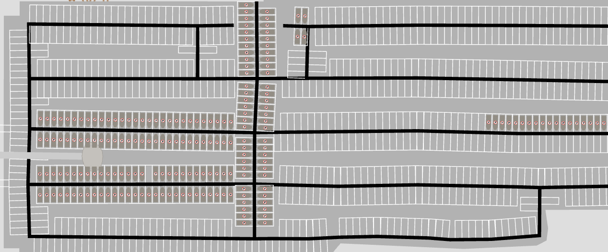
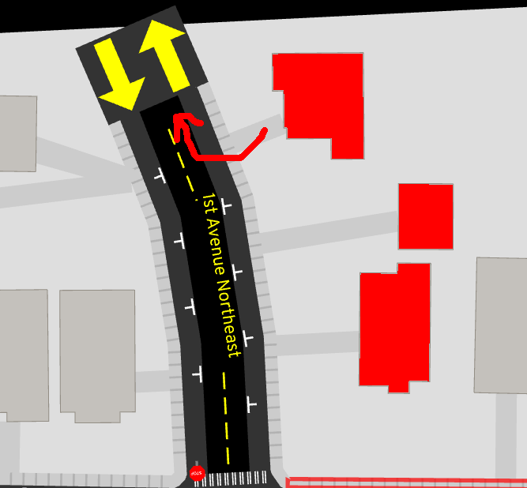
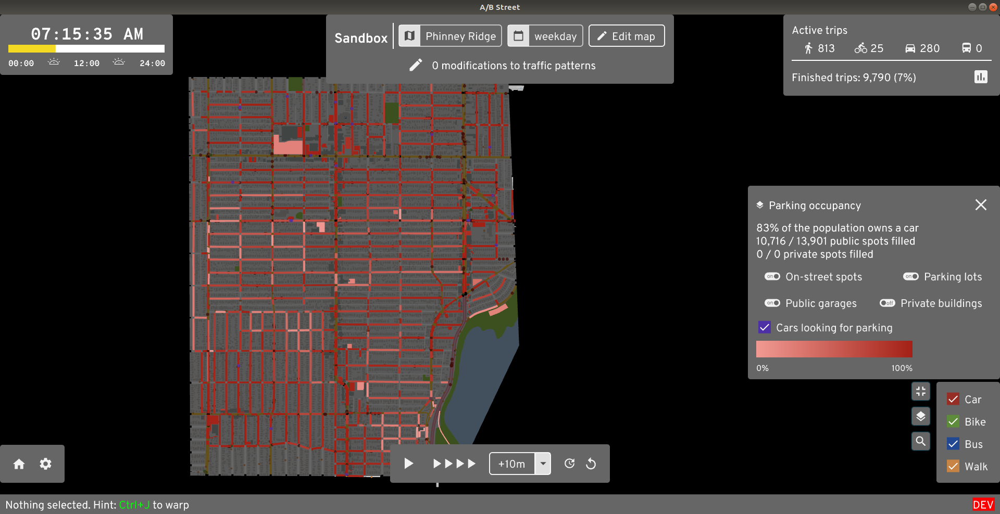
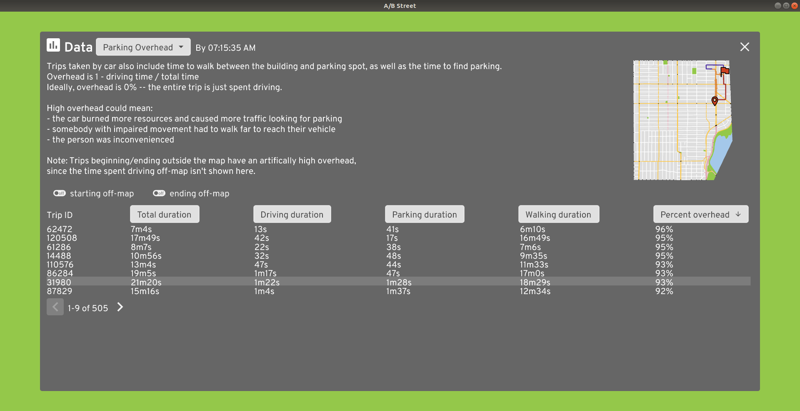

# Parking

In some areas, lots of traffic is caused by people circling around the block in
search of parking. And often, a great deal of space in a city is spent on street
parking, surface lots, and garages. So, A/B Street attempts to model parking as
a step at the beginning and end of every driving trip.

## Types of parking

Every parking spot can be categorized as public or private. Anybody can use
public spots, but only trips beginning or ending at a particular building can
use private spots inside of it. There's no modeling yet of time limits or fees.

On-street parking acts as one lane of the road. The full length of the lane gets
divided up into spots with a per-city configurable length, called
`street_parking_spot_length`, with a default of 8 meters. This is the only type
of parking that players can edit in-game, by changing lane types. Street parking
is always public.

Parking lots are also always public. OSM includes the service "aisles" running
through the lot, and A/B Street automatically packs in individual spots, winding
up with an estimate of the capacity.

Off-street parking is part of a building. Physically this could mean a parking
garage, a small private lot behind some apartments, or a few spots in a carport
and driveway -- there's no distinction in A/B Street. Off-street parking can be
public or private.

## Data sources

On-street parking comes from OSM, using the
[parking:lane](https://wiki.openstreetmap.org/wiki/Key:parking:lane) tags. This
field is rarely mapped; see [here](../../software/parking_mapper.md) to help
with that. Different cities can optionally configure some percentage of
residential roads to automatically infer a parking lane or two.

Parking lots only come from OSM. Individual spots and capacity is almost never
mapped, so A/B Street doesn't use that data.

Public off-street parking is only configured for Seattle right now, and comes
from
[this dataset](https://data-seattlecitygis.opendata.arcgis.com/datasets/public-garages-or-parking-lots).

I've yet to find any data that would help estimate private off-street parking.
For now, this is per-city configuration, called `FixedPerBldg`. We could
definitely do better by estimating building size. There's an exception for two
Seattle maps currently -- the number of off-street spots is set to equal the
number of driving trips that originate from that building over the course of the
entire day. This is also unrealistic, but was some attempt at improving those
two maps.

## Simulation

This seems like a good place to preface that A/B Street doesn't have any kind of
car-sharing, ride-share, or even multiple people in one car yet.

### Seeding cars

See
[seed_parked_cars](https://github.com/a-b-street/abstreet/blob/master/sim/src/make/scenario.rs)
for reference.

When a simulation starts at midnight, where are cars initially placed? That
process first figures out how many cars are needed per building through the day.
If 100 driving trips originate from that building, you might think the building
needs 100 cars nearby. But many of these trips might actually arrive at the
building earlier using a car, in which case, when the same person later departs,
they'll take their car.

After this count per building is produced, we place each car as close as
possible to its building, only going far away as we run out of capacity. We
always prefer seeding a car inside a building than on the street or in a lot.
The list of cars to seed is shuffled, so that roughly helps with fairness -- we
don't fill in all of one building's cars first, then go the next -- that would
arbitrarily place one building's cars closer.

There's also a detail in this randomization process about the available spots.
The consequence is this: when a player makes a few changes to the amount of
street parking in an area, the effects shouldn't percolate everywhere and change
how cars are seeded far away -- unless the change adds/removes so much capacity
that the effect really would spill out that far.

### How people pick a spot

When a car gets to the last lane before its target building, it starts looks for
a free spot. If there's one on the current lane, it goes for it. If not, it uses
a breadth-first search, using distance, to explore from its current lane until
it finds a free spot. To avoid many cars in one area all contending for the same
spot, the distance used in the search has some randomized scaling applied.
Omnisciently knowing where free spots are located far away isn't realistic, but
attempting some kind of human-realistic random walk seems even harder to get
right.

### Infinite parking

If you pass `--infinite_parking` on the command line, every building gets
unlimited public spots. This effectively removes the effects of parking from the
model, since driving trips can always begin or end at their precise building
(except for blackhole cases). This is useful if a particular map has poor
parking data and you need to get comparative results about speeding up some
trips. Often the A/B testing is extremely sensitive, because a parking space
close to someone's destination is filled up quickly, slowing down the trip.

### Blackholes

Vehicles don't know how to turn left (or right for UK folks) from a driveway
yet. This means that some buildings and street parking lanes near map boundaries
might not be reachable from most of the map. Consequently, even though there
might be parking there, the simulation ignores it, because it's "blackholed".

## Data viz

There are 3 tools in the game that'll help you understand the effects of how
parking is modeled.

The parking occupancy layer shows where parking spots are currently available.

The parking efficiency layer shows how far away from their destination somebody
was forced to park. If you see lots of dark red dots, then people wound up
parking somewhere, then walking a long way to actually get to their building.
This is probably unrealistic, likely due to bad guesses about capacity in
different areas.

The parking overhead dashboard looks at every driving trip that included a
parking phase. It measures how much of the total trip time was spent actually
driving, vs looking for parking and covering any remaining distance by foot.
