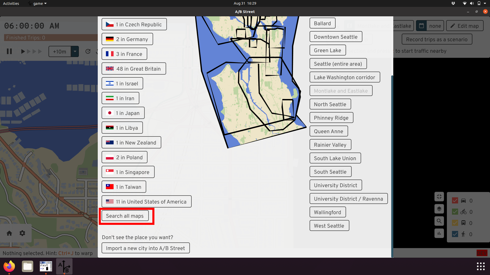
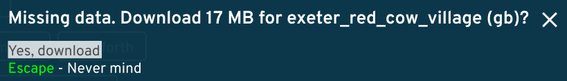
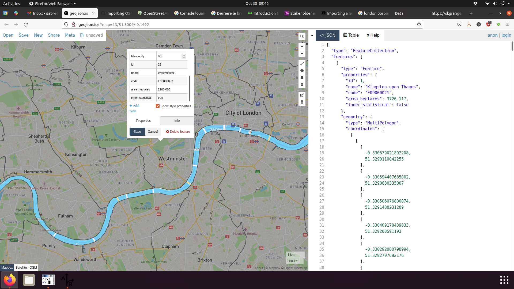
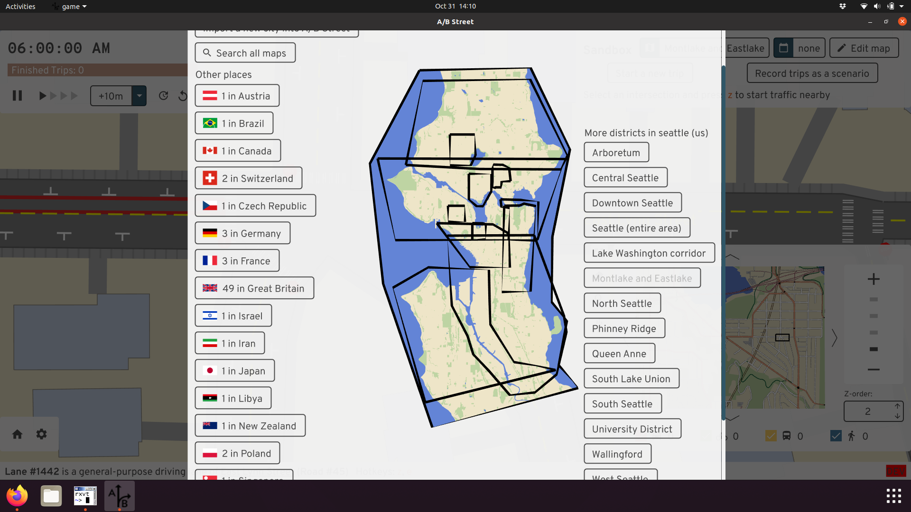
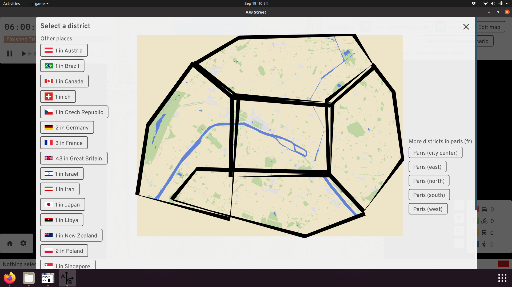

# Importing a new city into A/B Street

If you get stuck, please email <dabreegster@gmail.com> or
[file a Github issue](https://github.com/a-b-street/abstreet/issues/). I promise
quick turnaround time. All you need to do is send the boundary of the area you
want, drawn with [geojson.io](http://geojson.io).

## The easy method

This only works in the [downloaded version](index.md), not on web.

1.  Click the map name in sandbox mode to change your location.
2.  Click "import a new city"
3.  Follow the instructions. That's it!

This may take a few minutes, depending on download speed. Be sure to use the
polygon tool to draw an area, not the polyline tool.

## If the city has already been imported

A/B Street includes many cities already. Once you're running the game (natively
or on the web), click on the Sandbox option, then check the top for a button to
change the map:

You can browse through a list of cities per country, or use a text search:

You may need to download data for that city:

You should be able to open the map. In this case above, the map data was saved
as `data/system/gb/exeter_red_cow_village/maps/center.bin`.

## How to pick boundaries

How do you decide what part of a city to import? It can be tempting to use
pre-existing administrative boundaries. There are a few problems:

1.  Official boundaries might exclude something relevant to transportation in
    the area. For example, London boroughs don't cover the River Thames or its
    bridges! Or if you're studying low-traffic neighborhoods, an area near the
    border of two boroughs might not include enough surrounding context.

2.  File size is hard to tune. You have to play around with this to make the
    resulting area large enough to be useful, but the map file small enough to
    comfortably load. About 50MB uncompressed (usually 20MB gzipped) is a good
    target.

3.  You might have to adjust the boundary to exclude the coastline and ocean,
    due to [a bug](https://github.com/dabreegster/abstreet/issues/32).

You can create multiple districts covering a city. The districts can partially
overlap, and you don't have to cover everything. It's totally dependent on what
you want to study. The current Seattle boundaries are just based on different
projects we've worked on:

You can also just make best geographic guesses like in Paris:

The more maps configured to always be imported, the slower my development
workflow gets when working on map importer code. So I'd also request you don't
go overboard and ask for lots of areas, unless you're going to actively work on
some advocacy or research across multiple A/B Street releases. You can always
import an area yourself in the UI.

## Advanced: Using the command-line

The process above using the UI just calls a tool to do all of the work. If you
want, you can just call that tool from the command line. First save a GeoJSON
file with your boundary. Then...

Using a .zip release:
`./cli one-step-import --geojson-path=boundary.geojson --map-name=prague`

Building from source:
`cargo run --release --bin cli -- one-step-import --geojson-path=boundary.geojson --map-name=prague`

The new map is located in the country with code "zz" (this isn't a real
country), in the "oneshot" city. This is stored in
`data/system/zz/oneshot/maps`.

## Advanced: Adding the city to A/B street permanently

The easiest method is to just ask Dustin to do this. The full process:

1.  Make sure you can run `import.sh` -- see
    [the instructions](../tech/dev/index.md#building-map-data). You'll need
    Rust, osmconvert, gdal, etc.

2.  Create a new directory: `mkdir importer/config/xy/your_city`, where `xy` is
    a lowercase two letter country code from
    <https://en.wikipedia.org/wiki/ISO_3166-1_alpha-2>

3.  Use [geojson.io](http://geojson.io/) or
    [geoman.io](https://geoman.io/geojson-editor) to draw a boundary around the
    region you want to simulate and save the geojson locally.

4.  Use `cargo run --release --bin cli -- geojson-to-osmosis boundary.geojson`
    to convert that geojson to the
    [Osmosis format](https://wiki.openstreetmap.org/wiki/Osmosis/Polygon_Filter_File_Format)
    required by osmconvert. This tool writes one file per feature in the input,
    so you'd then
    `mv boundary0.poly importer/config/xy/your_city/region_name.poly`, repeating
    if you drew multiple polygons.

5.  Edit `importer/src/map_config.rs` if needed. If you're the first to import a
    new country, you may need to configure left-handed drivng, for example.

6.  Run the import: `./import.sh --city=xy/your_city --raw --map`

7.  Update `.gitignore`, following `tel_aviv` as an example. Keep sorted!

8.  Fill out `nice_map_name` in `map_gui/src/tools/mod.rs`.

Send a PR with your changes! I'll generate everything and make it work with
`updater`, so most people don't have to build everything from scratch.

Also, you can divide the city into multiple regions, repeating step 4 and
declaring more polygon boundaries. The boundaries may overlap each other, and
they don't have to cover all of the space. Picking good boundaries may take
trial-and-error; the goal is to keep the resulting map file size small, so that
it loads quickly, while capturing all of the area needed to simulate something
interesting. This is easiest when you have some local knowledge of the area, and
at least a vague goal in mind for what you want to study.

## Advanced: Importing a .osm file directly

This section assumes you're comfortable working on a command line. If you have a
.osm XML file, you can import it directly by running
`cargo run --release --bin cli -- oneshot-import /path/to/extract.osm`. If
you're running from a .zip release and not building from source, replace the
first part with `./cli oneshot-import`.

Assuming this succeeds, it'll create a file in the
`data/system/zz/oneshot/maps/` directory. In the UI, you can open the "zz"
country to find it.

If you save a .osm file from JOSM, you might get an error importing related to
`convert_osm/src/clip.rs`. If so, delete the `<bounds>` element from the top of
the .osm file and try again.

If you follow this process, the resulting map won't have any border
intersections, which will break parts of the simulation:

You can fix this by creating the Osmosis .poly file and passing
`--clip-path=/path/to/clip.poly` to the import command.

One use case for following this section is to temporarily work around
[broken intersection geometry](https://github.com/a-b-street/abstreet/issues/654).
The process is:

1.  Edit the problematic area in JOSM, recreating a complicated intersection in
    a simpler way.
2.  Save the .osm file locally
3.  Run the importer
4.  Try in A/B Street

You probably don't want to upload the changeset to OSM, unless it's actually
mis-tagged. Usually the problem is how A/B Street tries to interpret what's in
OSM. Ideally we could also follow this process using the ID editor, but it can't
currently
[manage changeset files fully](https://github.com/openstreetmap/iD/issues/7109).

## Next steps

OpenStreetMap isn't the only data source we need. If you look at the import
pipeline for Seattle, you'll see many more sources for parking, GTFS bus
schedules, person/trip demand data for scenarios, etc. Most of these aren't
standard between cities. If you want to make your city more realistic, we'll
have to import more data. Get in touch.

You may notice issues with OSM data while using A/B Street. Some of these are
bugs in A/B Street itself, but others are incorrectly tagged lanes. Some
resources for fixing OSM:

- <https://learnosm.org>
- <https://wiki.openstreetmap.org/wiki/StreetComplete>
- [Mapping parking](../software/parking_mapper.md)
